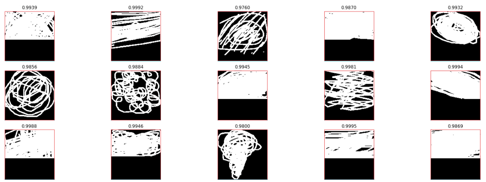

<center>

</center>

这个比赛于12.05早上结束，最终结果是排在69/1316、铜牌，离银牌区差4名，还是比较遗憾的。不过这是我第一次花大量时间和精力在图像分类问题上，能拿到牌还算满意。


<!-- more -->


这篇博客主要记录我在这次比赛过程中学到的一些东西，由于是第一次花精力认真做图像类的比赛所以学到的东西还是很多的。最后再会总结一下排在前列的大佬们在讨论区分享的他们的方案，留作日后参考。

# 1. 赛题简述
## 1.1 数据集
还记得前段时间很火的微信小程序“猜画小歌”吗，[这个比赛](https://www.kaggle.com/c/quickdraw-doodle-recognition)的数据就来自这个小程序的网页版[Quick, Draw!](https://quickdraw.withgoogle.com/)，游戏提示用户绘制描绘特定类别的涂鸦，例如“香蕉”，“桌子”等，所以Google通过这个小游戏收集了来自世界各地的涂鸦数据, 数据集所有信息都可见此数据集的[官方仓库](https://github.com/googlecreativelab/quickdraw-dataset#the-raw-moderated-dataset)。本次比赛使用了340类一共约五千万个样本。

主办方给了两个版本的训练集，raw 和 simplified，都是以csv文件的形式给出的。raw版本就是原始收集到的数据各字段如下所示:

| Key          | Type                   | Description                                  |
| ------------ | -----------------------| -------------------------------------------- |
| key_id       | 64-bit unsigned integer| 独一无二的样本ID     |
| word         | string                 | 样本所属类别    |
| recognized   | bool               | 样本是否被游戏识别 |
| timestamp    | datetime             | 样本创建时间                |
| countrycode  | string                 | player所在国家代码([ISO 3166-1 alpha-2](https://en.wikipedia.org/wiki/ISO_3166-1_alpha-2))|
| drawing      | string                 | 涂鸦数据信息 |  

其中drawing字段就是涂鸦数据，包含坐标和时间信息，示例如下:
```
[ 
  [  // First stroke 
    [x0, x1, x2, x3, ...],
    [y0, y1, y2, y3, ...],
    [t0, t1, t2, t3, ...]
  ],
  [  // Second stroke
    [x0, x1, x2, x3, ...],
    [y0, y1, y2, y3, ...],
    [t0, t1, t2, t3, ...]
  ],
  ... // Additional strokes
]
```

raw版本的数据集很大而且很多冗余信息，所以大多数选手(包括我)都是用的simplified版本作为主要训练集，simplified数据集去掉了时间信息和冗余的坐标信息(比如两点确定一条线段，那么线段中间的点就是冗余的)并将坐标进行了scale，具体处理方式如下:   
* scaled 的坐标数据进行了左上对齐，最小值为0最大值为255.
* 进行了重采样使坐标都是0-255的整数.
* 去除冗余坐标使用的是Ramer–Douglas–Peucker算法，epsilon设为2.0；

simplified数据集示例如下图所示:
<center>
    
    <br>
    <div style="border-bottom: 1px solid #d9d9d9;
    display: inline-block;
    color: #999;">图1.1</div>
</center>

更多信息可见此数据集的[官方仓库](https://github.com/googlecreativelab/quickdraw-dataset#the-raw-moderated-dataset)，这里就不赘述了。

## 1.2 赛题任务
本题的任务就是预测测试集涂鸦属于哪个类别，是一个单分类问题。此题的难度在于，由于训练数据来自游戏本身，涂鸦样本可能不完整而且可能与标签不符，噪声比较多，如图1.2所示([图片来源](https://www.kaggle.com/gaborfodor/un-recognized-drawings/output))。选手需要构建一个识别器，可以有效地从这些噪声数据中学习得到模型。
<center>
    
    <br>
    <div style="border-bottom: 1px solid #d9d9d9;
    display: inline-block;
    color: #999;">图1.2</div>
</center>

上图就是训练集中属于“蚊子”类别的数据示例，绿色是被标记为"可识别"的样本，红色是被标记为"不可识别"的样本，可以看到不管是可识别还是不可识别的样本，都存在噪声的情况。

## 1.3 评价指标
虽然是一个单分类问题，但是对于每一个样本，我们需要提交最有可能的3个预测结果(按可能性从大到小排)，评价指标是Mean Average Precision @ 3 (MAP@3):
$$
\text{MAP@3} = \frac { 1 } { U } \sum _ { u = 1 } ^ { U } \sum _ { k = 1 } ^ { m i n ( n , 3 ) } P ( k )
$$
其中 $U$ 是测试集样本总数，$n$ 是每个样本的预测值总数，$P(k)$ 是前 $k$ 个结果中准确率, 具体可参见[这个kernel](https://www.kaggle.com/wendykan/map-k-demo)，另外计算代码可参考[这里](https://github.com/benhamner/Metrics/blob/master/Python/ml_metrics/average_precision.py)。简单点讲，在提交的三个预测结果中，真实结果越靠前分数就越高。


# 2. 方案
可见此题的数据是序列数据，所以最先想到可以用RNN，当然把数据渲染成图片也可以用CNN。根据我的实际实验，RNN的效果并不好（应该是我网络结构没设计好，讨论区有人提到用RNN也可以达到不错的效果），所以就采用了CNN相关模型。

## 2.1 数据相关
### 2.1.1 打乱原始文件
题目给的数据是每一类一个csv文件，一共有340类，每一类有十多万个样本，即使是使用simplified数据集，总的csv文件大小也达到了20G+的级别，所以一次性读进内存肯定是不行的。
我首先采用了[这个kernel](https://www.kaggle.com/gaborfodor/shuffle-csvs)将340个csv文件混合在一起然后再随机分成100份分别存储，这样每一份里面的每一个样本的类别都是随机的。思路就是根据key_id的值产生一个0-99的伪随机数cv，然后cv就觉定当前样本应该放在哪个文件，最后再将每个文件里的样本顺序打乱。其核心代码如下:

(1) 决定某个样本应该存放在哪个文件:
``` python
for y, cat in tqdm(enumerate(categories)): # 共340个类别
    df = s.read_training_csv(cat) # df就为当前类别的csv
    df['y'] = y # y为 0~339 的数字，相当于对类别进行了LabelEncode
    df['cv'] = (df.key_id // 10 ** 7) % NCSVS  # NCSVS = 100, cv决定了应该放在哪一个文件中
    for k in range(NCSVS):
        filename = INPUT_PATH + '/shuffled_csv/train_%d_%d.csv'%(k+1, NCSVS)
        chunk = df[df.cv == k] # 得到df中cv=k的样本，应该存放在当前文件中
        chunk = chunk.drop(['key_id'], axis=1)
        if y == 0: # 新建文件
            chunk.to_csv(filename, index=False)
        else: # mode='a': 附加写 方式打开文件
            chunk.to_csv(filename, mode='a', header=False, index=False) 
``` 
(2) 将每个文件中的样本顺序打乱:
``` python
for k in tqdm(range(NCSVS)):
    filename = INPUT_PATH + '/shuffled_csv/train_%d_%d.csv'%(k+1, NCSVS)
    if os.path.exists(filename):
        df = pd.read_csv(filename)
        df['rnd'] = np.random.rand(len(df)) # 给每个样本一个随机数
        df = df.sort_values(by='rnd').drop('rnd', axis=1)
        df.to_csv(filename + '.gz', compression='gzip', index=False) # 以压缩的方式存储csv
        os.remove(filename)
```
这样处理后，原始simplified数据集中340个共20G+的csv文件被处理成100个csv共7G+，而且每个文件里的样本不是属于同一类而是随机的，这就方便后续的数据读取了。

### 2.1.2 多进程读取
经过2.1.1处理后的数据就可以很方便地直接用了，我们可以考虑并行读取使读取更快:
``` python 
def read_one_df_file(df_file):
    """定义一个读取一个csv的函数，这个函数会当做参数传入下面的并行处理的函数"""
    unused_cols = ["countrycode", "recognized", "timestamp", "cv"]
    name = df_file.split('_')[-2]
    print('%s ' % (name), end = ' ', flush=True)
    df = pd.read_csv(df_file)
    drop_cols = [col for col in unused_cols if col in df.columns]
    if len(drop_cols) > 0:
        df = df.drop(drop_cols, axis=1)
    return df


def multi_thread_read_df_files(df_files, processes=32):
    """并行读取多个csv并组成一个大的bigdf"""
    start = dt.datetime.now()
    pool = Pool(processes=processes) # from multiprocessing import Pool
    dfs = pool.map(read_one_df_file, df_files)
    pool.close()
    pool.join()
    end = dt.datetime.now()
    print("\nTotal time:", (end - start).seconds, "seconds")
    
    big_df = pd.concat(dfs, ignore_index=False, sort=False)
    big_df.reset_index(drop=True, inplace=True)
    
    return big_df
```
多进程的学习可参考[此处](https://morvanzhou.github.io/tutorials/python-basic/multiprocessing/5-pool/)。

## 2.1.3 outliers
由图1.2知训练数据中有很多噪声，如何衡量噪声并去除这些噪声数据（outliers）呢？
kernel [sketch entropy](https://www.kaggle.com/sorokin/sketch-entropy)提出用熵（entropy）来找出这些outliers, 即把entropy低于和高于某阈值的样本视为outliers。

先来看看如何计算entropy：
``` python
def entropy_it(x):
    counts = np.bincount(x) # 计算x中 0-255这些数字的出现次数
    p = counts[counts > 0] / float(len(x)) # 归一化成概率
    # compute Shannon entropy in bits
    return -np.sum(p * np.log2(p))
```
直观理解，如果一张图片上的信息很少例如像素值几乎完全一样，那么归一化后的概率p就几乎是一个one hot的向量，这样 `-np.sum(p * np.log2(p))` 就几乎得0；相反地，如果图片上的信息很丰富，像素分布比较均匀，那么p就是一个每个元素几乎都相等的向量，这样算出来的entropy就比较大。

例如训练集样本entropy低于和高于99%样本的示例分别如下：
<center>
    
    
    <br>
    <div style="border-bottom: 1px solid #d9d9d9;
    display: inline-block;
    color: #999;">图2.1</div>
</center>

但是我最终并没有考虑按照此方法去掉这些“outliers”，主要是出于以下考虑：
* 训练集很大，接近五千万，所以数据噪声对模型的影响应该有限；
* 按照此方法可得出测试集中也有一些噪声；
* 按照此方法得出的不一定就是噪声，例如图2.1第一排第一个应该是‘雨滴’，最后一排第三个应该是‘龙卷风’。

这个kernel的作者也在讨论中提到：
> Be careful, do not remove unusual samples from training. In my recipe I use a curriculum learning, i.e. increase the amount of outliers at each new epoch.


# 3. top方案总结
## 3.1 1st place solution
第一名的方案由现在排在所有kaggle用户第五的超级大佬[Pavel Pleskov](https://www.kaggle.com/ppleskov)贡献，原文见[此处](https://www.kaggle.com/c/quickdraw-doodle-recognition/discussion/73738)。
### CNN
刚开始，为了寻找最优的basemodel，Pavel训练了很多分类模型：resnet18, resnet34, resnet50, resnet101, resnet152, resnext50, resnext101, densenet121, densenet201, vgg11, pnasnet, incresnet, polynet, nasnetmobile, senet154, seresnet50, seresnext50, seresnext101。
此外，数据预处理尝试了1个和3个通道的输入、image size从112逐渐增大到256。
大约40个模型中，最优的模型得到了0.946的分数，这个单一模型就可以拿到金牌了。
> 可以看到，这种类型的比赛如果前期能花大量时间尝试不同的模型，那基本就能保证奖牌了，甚至金牌。


