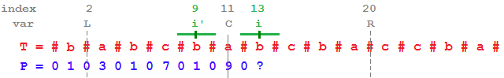

# 1. 问题描述
Given a string s, find the longest palindromic substring in s. You may assume that the maximum length of s is 1000.
给定一个字符串s，找出s中的最长回文子串。s的长度不超过1000.

<!-- more -->

Example 1:
>Input: "babad"
Output: "bab"
Note: "aba" is also a valid answer.

Example 2:
> Input: "cbbd"
Output: "bb"

# 2. 题解
## 2.1 暴力法
### 2.1.1 思路
暴力穷举所有子字符串的可能，然后依次按位判断其是否是回文。虽然其时间复杂度很高，但它对空间的要求很低。
### 2.1.2 复杂度
空间复杂度显然为 $O(1)$ ；
穷举所有字符串复杂度为 $O(n^2)$ ，再加上判断是否是回文的，所以总的时间复杂度为 $O(n^3)$ 。

### 2.1.3 代码
代码就不给了，给了你也不会看😀

## 2.2 动态规划
### 2.2.1 思路
我们知道，当某个字符串是回文的时候，在它两边同时增加一个相同字符后肯定依然是回文的，例如 bccb -> abccba。基于这个特点，我们可以将暴力法中的判断是否为回文这一步用动态规划解决。

具体的，我们可以先把所有长度为1的子字符串计算出来，这些必定是回文的；然后计算出所有长度为2的子字符串并判断是否为回文。到长度为3的时候，我们就可以利用上次的计算结果：如果中心对称的短字符串不是回文，那长字符串也不是，如果短字符串是回文，那就要看长字符串两头是否一样。这样，一直到长度最大的子字符串，我们就把整个字符串集穷举完了。在这个过程中用一个 n x n 的二维bool型数组`isOK`记录是否会回文，其中n是字符串s的长度，`isOK[i][j] == true`就表示子串`s[i...j]`是回文的。

### 2.2.2 复杂度
由于要申请一个二维数组`isOK`, 所以空间复杂度为 $O(n^2)$ ;
由于使用动态规划，时间复杂度从暴力法的 $O(n^3)$ 减少到 $O(n^2)$。
实测:
> Runtime: 244 ms, faster than 14.67% of C++ online submissions for Longest Palindromic Substring.

### 2.2.3 代码
``` C++
class Solution {
public:
    string longestPalindrome(string s) {
        if(!s.size()) return "";
        vector<vector<bool>>isOK(s.size(), vector<bool>(s.size(), false));
        string res = "";
        for(int len = 1; len <= s.size(); len++){ // len代表子串长度
            for(int start = 0; start + len <= s.size(); start++){ // start代表子串起始位置
                if(len == 1) isOK[start][start] = true;
                else if(len == 2) isOK[start][start + 1] = (s[start] == s[start + 1]);
                else isOK[start][start + len - 1] = isOK[start + 1][start + len - 2] \
                    && s[start] == s[start + len - 1];
                
                // 更新结果
                if(isOK[start][start + len - 1] && len > res.size())
                    res = s.substr(start, len);
            } 
        } 
        return res;
    }
};
```

## 2.3 中心扩散法
### 2.3.1 思路
上面讲的动态规划虽然优化了时间，但也浪费了很多空间。实际上我们并不需要一直存储所有子字符串的回文情况，我们需要知道的只是中心对称的较小一层是否是回文。所以如果我们从小到大连续以某点为个中心的所有子字符串进行计算，就能省略这个空间。 
需要注意的是，由于中心对称有两种情况:
1. 长度为奇数，则以中心字母对称；
2. 长度为偶数，则以两个字母中间为对称。

所以我们要分别计算这两种对称情况。

### 2.3.2 复杂度
相较于2.2的动态规划，空间复杂度缩小为 $O(1)$；
时间复杂度一样，都是 $O(n^2)$。
实测:
> Runtime: 20 ms, faster than 57.88% of C++ online submissions for Longest Palindromic Substring.

### 2.3.3 代码
``` C++
class Solution {
public:
    string longestPalindrome(string s) {
        if(!s.size()) return "";
        string res = s.substr(0, 1); 
        for(int mid = 0; mid < s.size(); mid++){ // mid为中心字母或者对称轴的前一个字母的下标
            // mid为中心字母下标，即子串长度为奇数
            for(int half_len = 1; mid + half_len < s.size() && mid - half_len >= 0; half_len++){
                if(s[mid + half_len] != s[mid - half_len]) break;
                if(2 * half_len + 1 > res.size())
                    res = s.substr(mid - half_len, 2*half_len + 1);
            }
            
            // mid为对称轴的前一个字母，即子串长度为偶数
            for(int half_len = 1; mid + half_len < s.size() && mid - half_len >= -1; half_len++){
                if(s[mid + half_len] != s[mid - half_len + 1]) break;
                if(2 * half_len > res.size())
                    res = s.substr(mid - half_len + 1, 2 * half_len);
            }
        }
        return res;
    }
};
```
## 2.4 马拉车(Manacher)算法
下面要出场的就是大名鼎鼎的马拉车算法了，前面介绍的算法最快也不过 $O(n^2)$ 的时间复杂度，而马拉车的时间复杂度为逆天的 $O(n)$ 😨，是此题最理想的复杂度了。
> 本节主要参考[LeetCode对此算法的详细解释。](https://articles.leetcode.com/longest-palindromic-substring-part-ii/)

### 2.4.1 思路
首先，为了避免2.3那样将子串分为长度为奇数和偶数两种情况，我们先将字符串简单处理一下, 在s中的每个字符两边插入一个字符“#”得到字符串(在具体实现中，为了避免越界检查，通常还会在首尾额外插入两个与所有可能的字符都不同的字符如^、$),例如：
> s = abaaba  ---插入字符-->  T = #a#b#a#a#b#a#

为了找到最长的回文子串，我们先计算出以每个字符为中心的最长回文子串，然后比较之后找出最长的。我们使用数组P来保存以T中每个字符为中心的最长回文子串的半径(既长度的一半)。紧接着上面的例子:
> T : # a # b # a # a # b # a #
P : 0 1 0 3 0 1 6 1 0 3 0 1 0

通过数组P，找到其中最大的数字6，我们可以马上得出最长的回文字符串就是s本身`abaaba`，即**问题转换为如何高效地求解数组P**。

我们仔细观察一下上面这个特殊的例子，我们会发现不仅T是对称的，就连P都是对称的，由于我们的目的就是计算出P的所有元素值，那么如果P是对称的，岂不是可以大大减少计算量！马拉车算法就是基于这样一个想法展开的。

为了详细介绍马拉车算法，我们来看一个稍微复杂的例子`s = babcbabcbaccba`:
<center>
    
</center>

如上图所示,假设已经完成了P数组的部分数值的计算，当前需要计算的是`P[i]`。我们**引入变量 R，表示当前访问到的所有回文子串中所能触及的最右一个字符的位置**。另外还要记录下R对应的回文串的对称轴所在的位置，记为C。另外也可推断出该回文串的左边位置L。图中的实线即表示C，两条虚线(L和R)分别表示以C为中心的回文串的边界。现在需要计算的是 `P[i]` 的值，图中 i' 表示的是 i 关于 C 对称的点。那么问题来了，怎么高效地算出`P[i]`。

当前 i 的值是 13，我们需要得到`P[13]`的值，我们首先看下 i 关于 C对称的 `i' = 9`的值。
<center>
    
</center>

如上图所示，两条绿色实线覆盖的区域分表表示的是 以 i' 和 i 为中心的最长回文子串。我们已经知道了 `P[i'] = 1`, 那么由于回文子串的对称性(即上图L\~C和C\~R对应的子串是关于C对称的)，我们可以推断出 `P[i] = p[i'] = 1`。实际上，C之后的三个元素都遵循了这种对称性（既 `P[12] = P[10] = 0, P[13] = P[9] =1, P[14] = P[8] = 0`)。

<center>
    
</center>

如上图所示，现在我们到了 `i = 15` 这个点，i 关于 C对称的点是 `i' = 7`, 那么这里 `P[15] = P[7] = 7` 还会不会成立呢？

很显然是不成立的，我们凭肉眼观察可知 `p[15] = 5` 而 `P[7] = 7`。这是为什么呢？
<center>
    
</center>

上图中，绿色实线表示的是以C为中心的最长回文子串所覆盖的区域，红色实线表示的是与绿色区域不匹配的部分，左边的红色实线是以`T[i']`为中心的最长回文子串所覆盖区域超出绿色实线的部分。右边的红色实线是以`T[i]`为中心的最长回文子串所覆盖区域超出绿色实线的部分。而绿色的虚线部分则是分别以`T[i]`和`T[i']`为中心最长回文子串与绿色实线部分的重叠部分。

从图中我们可以明显的看出被两条绿色实线所覆盖的区域中，C两边的子串是完全相同的。同时绿色虚线的那部分也是关于中心对称的。当 `i = 12,13,14` 即 `i' = 10,9,8` 时，以`T[i']`为中心的最大回文子串全落在了L和R之间，这就使得我们能够使用LR的对称性直接得出关于`T[i]`对称的最大回文子串；但当 `i' = 7` 即 `P[i'] = 7`，此时以`T[i']`为中心的最长回文子串超出了以C为中心的最长回文子串的左边界(图中L左边红色实线)，正是因为这个原因，此时无法再按照对称性直接得出 `P[i]` 的值了，但是可以推出 `P[i] >= 5`。

现在我们知道的是`P[i] >= 5`, 为了找出`P[i]`最终的值，我们只有继续以`P[i]`为中心向两边扩展进行比较，在这个例子中`P[21] != P[1]`,那么我们最终推断是`P[i] = 5`。

总结一下，在每一步中，都存在两种可能:
1. `R > i`，也就是刚刚我们讨论的情况，此时又细分为两种情况:
(1) 若 `P[i'] < R – i`, 则令 `P[i] = P[i']`;
(2) 否则， 先令`P[i] = P[i']`，再以i为中心扩展回文串并`P[i]++`，直到左右两边字符不同或者到达边界。并更新变量R、C。
2. `R <= i`，即i移动到R右边了，此时也应该以i为中心扩展回文串。类似情况1(2),只是`P[i]`初始为0。

### 2.4.2 复杂度
空间复杂度显然是O(n).
下面讨论一下时间复杂度，虽然代码中存在两个循环for和while，但是需要注意是：
* 当R不需要进行扩展时，不会进入while循环；
* R需要进行扩展时，会进入while循环，但整个算法过程while**一共**循环最多n次，即R从0不断扩展到n。

由此可见，马拉车算法是线性的时间复杂度，即O(n)。

亲测:
> Runtime: 8 ms, faster than 88.39% of C++ online submissions for Longest Palindromic Substring.

### 2.5.1 代码
``` C++
class Solution {
private:
    // 将字符串S转换成T，例如S = "abba", T = "^#a#b#b#a#$".
    // ^ 和 $ 是为了避免越界检查
    string preProcess(string s) {
        int n = s.size();
        if (n == 0) return "^$";
        string t = "^";
        for (int i = 0; i < n; i++)
            t += "#" + s.substr(i, 1);
      
        t += "#$";
        return t;
    }
    
public:
    string longestPalindrome(string s) {
        string T = preProcess(s);
        int n = T.size();
        vector<int>P(n);
        int C = 0, R = 0;
        for (int i = 1; i < n-1; i++) {
            int i_mirror = 2 * C - i; // i' = C - (i-C)

            P[i] = (R > i) ? min(R - i, P[i_mirror]) : 0;

            // 尝试扩展以i为中心的回文串
            while (T[i + 1 + P[i]] == T[i - 1 - P[i]]) P[i]++;
 
            // 如果以i为中心的回文串的右边界超过了R，则应该更新R和C
            if (i + P[i] > R) {
                C = i;
                R = i + P[i];
            }
        }

        // 找出P中最大的元素
        int maxLen = 0;
        int centerIndex = 0;
        for (int i = 1; i < n-1; i++) { //注意跳过首尾
            if (P[i] > maxLen) {
            maxLen = P[i];
            centerIndex = i;
            }
        }

        return s.substr((centerIndex - 1 - maxLen)/2, maxLen); // 减一是因为去掉第一个字符^
    }
};
```


