

<!-- more -->

# 1. 背景

在广告系统pCVR建模场景下，转化行为发生在点击后一段不确定的时刻，所以需要等待一段时间才能确定某条尚未转化的负样本是否真正不会转化。然而，系统竞价环境实时变化导致我们对模型的时效性有较高的要求，希望样本能够尽快入模型学习。所以很多时候我们宁愿使用部分label有错的样本，导致模型有所低估，也不愿放弃最新的训练样本。因此，延迟反馈建模是pCVR领域的重点问题之一，其关键就是如何充分利用这部分label未知的数据，且减少其对模型的负面影响。

下面左展示的是公共数据集criteo的延迟反馈累积分布情况（大致符合指数分布），13%的转化在点击的2周之后才发生。右图为相比于参考天此后每天新增推广计划的比例，26天后新的推广计划比例超过了10%。

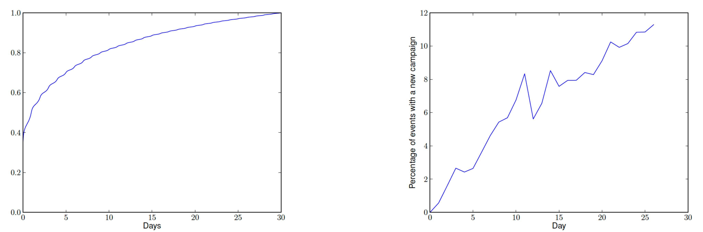

# 2. 方法概览

为了解决延迟反馈问题，业内主要有三类解决办法。

1. 建模延迟时间分布
既然转化存在延迟，那就考虑新增一个辅助任务用于建模这个延迟时间。例如DFM中假设转化延迟符合指数分布，通过新增一个辅助模型来拟合这个指数分布。这类方法的缺点是，直接在有偏训练数据上进行训练，没有对后面转正的延迟反馈正样本进行利用。

2. 重要性采样（Importance Sampling）
基于流式训练，设计不同的样本回补机并通过重要性采样(Importance Sampling/IS)进行样本分布纠偏。具体的，先等待一定的时间窗口（这个等待时间可以是0，即初始时都是负样本例如FNW；也可以大于0如ES-DFM），然后当发现样本最终转化时，回补一条正样本。最后基于重要度权重方法在观测的有偏样本上学习无偏CVR模型；

3. 多臂老虎机（Multi-armed Bandit）
多臂老虎机问题是概率论中一个经典问题，设想一个赌徒面前有N个老虎机，事先他不知道每台老虎机的真实盈利情况，他如何根据每次玩老虎机的结果来选择下次拉哪台或者是否停止赌博，以最大化自己的总收益。多臂老虎机常被用来解决EE(Exploration and Exploitation, 探索和利用)问题，也有一些工作用来解决延迟反馈问题。

总得来说，前两类方法原理比较直观简单，工业界采用较多。尤其是第二类基于重要性采样的方法，完美契合了工业界的在线学习范式。

<table>
    <tr>
        <th>方法分类</th><th>优缺点</th><th>具体方法名</th><th>背书</th><th>核心思想</th>
    </tr>
    <tr>
        <td rowspan="3">建模延迟时间分布</td><td rowspan="3">优点：实现简单 缺点：没有对后面转正的样本进行利用</td><td>DFM</td><td>Criteo, KDD 2014</td><td>假设转化延迟符合指数分布</td>
    </tr>
    <tr>
        <td>NoDeF</td><td>Cyberagent, 2018</td><td>用多个核函数的加权和来拟合复杂的延迟分布</td>
    </tr>
    <tr>
        <td>ESDF</td><td>阿里，2020</td><td>将时间分布进行分桶（softmax多分类），EM优化</td>
    </tr>
    <tr>
        <td rowspan="5">重要性采样</td><td rowspan="5">优点：考虑了延迟反馈的正样本 缺点：工程实现略复杂</td><td>FSIW</td><td>Cyberagent, WWW 2020</td><td>设置足够长的归因窗口；无回补机制</td>
    </tr>
    <tr>
        <td>FNW/FNC</td><td>Twitter, Resys 2019</td><td>等待窗口=0，一开始都当做负样本，正样本会回补进模型</td>
    </tr>
    <tr>
        <td>ES-DFM</td><td>阿里, AAAI 2021</td><td>等待窗口>0，强调假负样本的重要性，会回补延迟回流正样本</td>
    </tr>
    <tr>
        <td>DEFER</td><td>阿里, KDD 2021</td><td>等待窗口>0，所有样本都会入两遍模型，确保观测特征分布和实际特征分布相同</td>
    </tr>
    <tr>
        <td>DEFUSE</td><td>阿里, WWW 2022</td><td></td>
    </tr>
</table>

# 3. 方法详情

## 3.1 建模延迟时间分布

这类方法的核心思想是：通过显示建模一个成交是否可能发生在观测窗口外的概率 $p(d > w_0 | y=1)$ 来实现基于观测分布的label纠偏，即

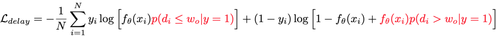

但由于对于延迟成交的样本只能通过联合建模来推断而无法在成交时进行回补作为确定性的正反馈，效果提升有限；优点是实现简单。

### 3.1.1 DFM（KDD 2014, Criteo）

论文链接：[Modeling Delayed Feedback in Display Advertising](http://citeseerx.ist.psu.edu/viewdoc/download?doi=10.1.1.650.6087&rep=rep1&type=pdf)

DFM（Delay Feedback Model）是延迟反馈建模的经典解法之一，既然样本当前的label和时间有关，则把时间作为变量引入到模型里。
首先，作如下定义（后面的方法一般也遵循这个定义）：

| 变量名 | 含义 | 
| :----:| :---- | 
| X | 输入特征 | 
| C | 该样本最终是否会转化，C=1则最终转化 | 
| Y | 观测（使用）时该样本是否转化，Y=1则C=1，Y=0则C不一定为0 | 
| D | delay time，转化延迟时间（转化时间 - 点击时间），非负 | 
| E | elapsed time，观测延迟时间（观测时间 - 点击时间），我们有理由假设E和C、D是独立的 | 

对于最终是否转化，DFM采用的是标准的逻辑回归模型，即

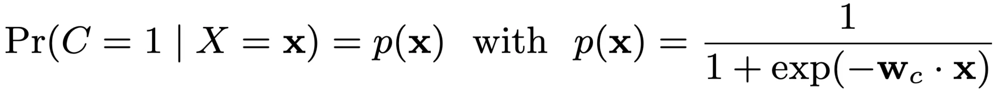

实践中，我们也可以采用复杂的NN模型，总之就是输出一个是否转化的概率。

重点来了，DFM假设转化延迟时间服从指数分布（exponential distribution），概率密度为

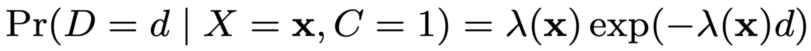

其中 $\lambda(x)$ 为一个结果大于0的映射，原论文中 $\lambda(x) = \text{exp}(w_d \cdot x)$，其中 $w_d$ 是可学习模型参数，实践中也可以采用复杂的NN模型，保证输出大于0即可。

我们需要做的，就是建模观测标签Y与真实标签C的关系：

|  事实 | 数学描述 |  备注 | 
| :----:| :---- |  :---- | 
| $Y=1 \Rightarrow C=1$ | 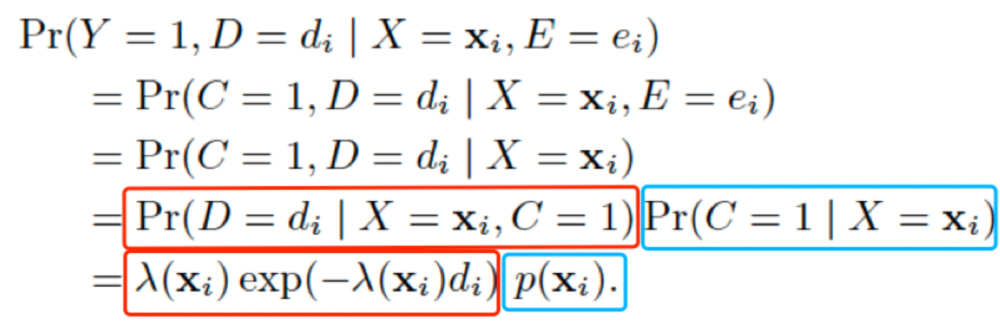| |
| $Y=0 \Leftrightarrow C=0 \text{ or } E < D$ | 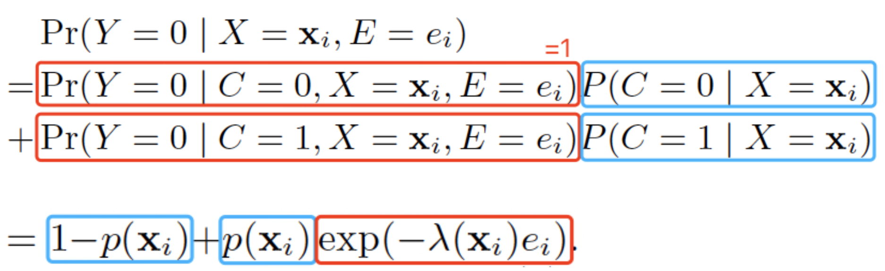 | 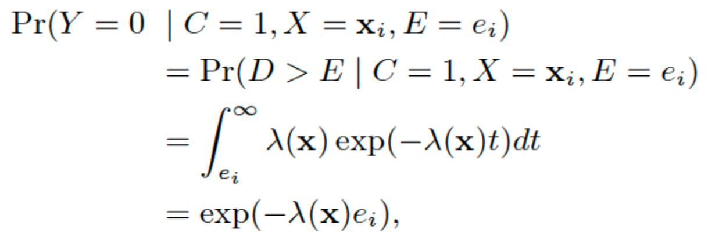  |

即最终的负对数似然损失函数为：

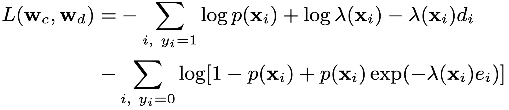

DFM的方法简单，且效果已经在实践中被多次验证，另外其定义的数据格式和推导框架也被后续的很多方法沿用。
DFM的缺点是对转化延迟服从指数分布的假设太强了，不一定符合实际的复杂场景。另外，延迟反馈的样本，如果后来转化了，新样本没有再次进入到模型（即存在正样本丢失）。

### 3.1.2 NoDeF（2014, Cyberagent）
论文链接：[A Nonparametric Delayed Feedback Model for Conversion Rate Prediction](https://arxiv.org/abs/1802.00255)

业务场景是多样的，DFM的指数分布假设太强，而NoDeF（Nonparametric Delayed Feedback Model）通过用多个核函数的加权和来拟合复杂的延迟时间分布。

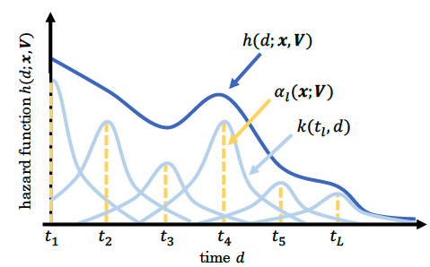

如上图所示，实际的延迟分布可能是多个简单分布的的累加。因此NoDeF将延迟分布定义为：

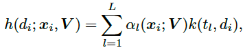

其中k为输出大于0的核函数，如高斯核函数。
所以简单来讲，NoDeF相比于DFM的变化就是延迟预估模型变复杂了。

### 3.1.3 ESDF（AAAI 2021, 阿里）
论文链接：[Delayed Feedback Modeling for the Entire Space Conversion Rate Prediction](https://arxiv.org/abs/2011.11826)

本文提出的ESDF用来解决CVR预估的三个难题：1）数据稀疏；2）样本选择性偏差；3）延迟反馈。延迟反馈建模部分采用的也是建模延迟时间分布，只是对时间进行了分桶，采用softmax多分类。另外不用等待足够长窗口，而是通过EM算法来预估最终是否转化。

####  3.1.3.1 核心思想
借鉴ESMM，采用全空间建模的思想，引入曝光数据，同时建模CTR和CVR，解决数据稀疏和样本选择性偏差问题。同时，引入延迟反馈塔，预估延迟时间分桶，用来解决延迟反馈问题。

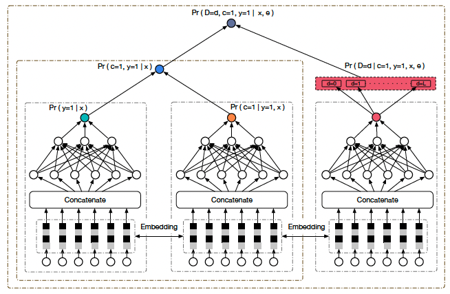

ESDF整体结构如上图所示，其中的符号含义和DFM大致相同，不同点为：

| 变量名 | 含义 | 
| :----:| :---- | 
| Y | 样本是否发生**点击**, DFM中Y表示观测时是否转化| 
| Z | 观测（使用）时该样本是否转化 | 

所以pCVR预估模型为：

$$
pCVR = P(C=1|Y=1,X=x) = \frac{P(C=1,Y=1|X=x)}{P(Y=1|X=x)} = \frac{pCTCVR}{pCTR}
$$

结构图中前两个塔就是分别用来预估pCTR和pCVR，二者相乘就为pCTCVR。

####  3.1.3.2 延迟反馈建模

以天为单位，将延迟时间分桶为T+2个：[0, 1, ..., T, T+1]，若点击后延迟时间在0到T则将样本分入第0到T的对应分桶中；若延迟时间大于等于T+1天，则全分到最后一个分桶（实际应用中这里的分桶不一定按天，可以根据转化量进行合适分桶）。延迟反馈塔负责预估延迟时间落在哪一个桶，即softmax多分类。

所有的训练样本可以分为三个集合：1）点击且观测到转化；2）点击但未观测到转化；3未点击。下面分别计算三类样本的概率：

1. **点击且观测到转化（Z=1,Y=1）**

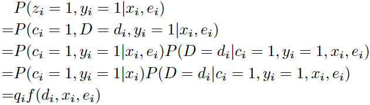

上式中 $q_i = P(c_i=1,y_i=1|x_i)$ 表示点击转化率pCTCVR，$f(d_i,x_i,e_i) = P(D=d_i|c_i=1,y_i=1,x_i,e_i)$ 表示延迟时间分桶落在第 $d_i$ 个桶的概率，即softmax输出向量第 $d_i$ 个值。

2. **点击但未观测到转化（Z=0,Y=1）**
可分为最终不会转化（C=0）和最终会发生转化（C=1）两类，即

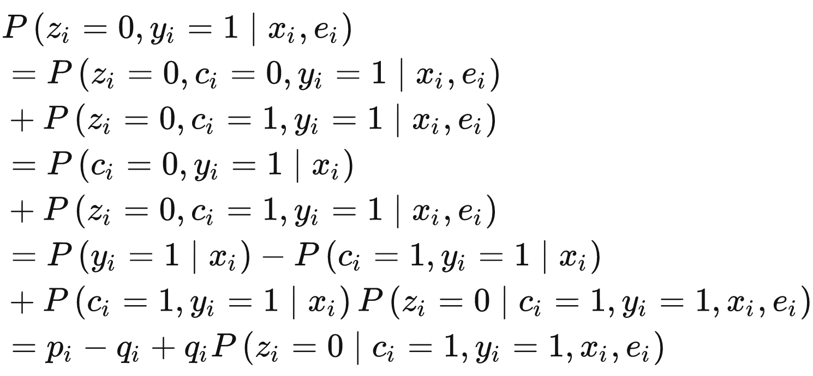

其中 $p_i=P(y_i=1|x_i)$表示pCTR。拆解来看，最后一行 $p_i-q_i$ 表示最终不会发生转化（C=0）的概率；最后一行最后一项表示会发生转化（C=1）但未被观察到的概率，可以计算为延迟时间落在观测时间之后分桶内的概率之和，即：

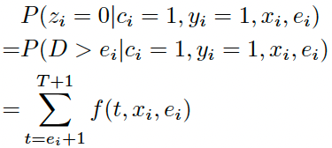

3. **未点击（Z=0,Y=0）**

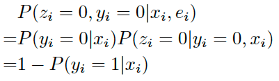

上式中 $P(y_i=1|x_i)$ 可用 $p_i$ 表示，代表pCTR。

综上所述，最终似然函数为：

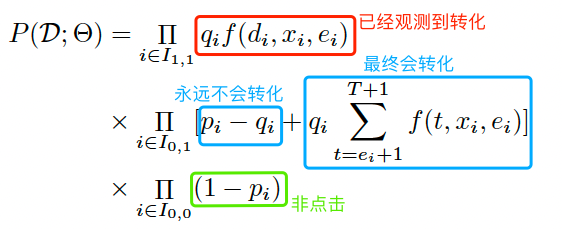

####  3.1.3.3 EM优化
实践中，由于无法知道点击但当前未转化的样本最后到底会不会转化（C=1还是0），因此考虑用EM算法。在Expectation步，用当前的模型对C进行预估；在Maximization步，根据预估的C，最大化似然函数优化模型。

1. Expectation步
令$w_i$为样本 i 最终会转化的期望，那么对于第1类已经观察到转化的样本来说 $w_i=1$，对于第3类未点击样本来说$w_i=0$。对于第2类点击但未观察到转化的样本：

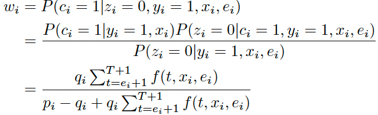

2. Maximization步
这一步最大化似然函数来优化模型。对于第1类和3类样本，直接对似然函数取对数

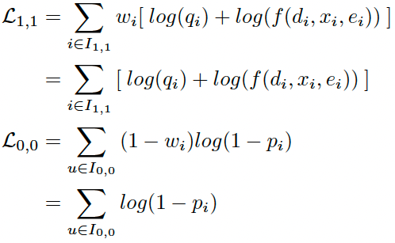

对于第2类样本，需要划分为C=1和C=0，即

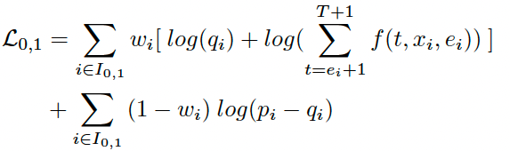

## 3.2 重要性采样

### 3.2.1 基本原理
重要度采样是通过从一个数据分布的采样，估算另一个数据分布的方法，如根据观测的有偏分布估算真实的无偏分布。

假设我们要计算 $f(x)$ 在分布 $p(x)$ 下的期望，即 
$$
\mathbb{E}_p[f(x)]=\int_x p(x)f(x)dx
$$ 
但 $p(x)$ 是未知的，要怎么办呢？假设我们已知另一个分布 $b(x)$（注：即观测分布，有的论文用$q(x)$表示）， $f(x)$ 在分布 $b(x)$ 下的期望可以通过从分布 $b(x)$ 中采样 $\{x_1, x_2, ..., x_N\}$ 来估算，即
$$
\mathbb{E}_b[f(x)]=\int_x b(x)f(x)dx \approx \frac{1}{N} \sum_{i=1}^N f(x_i)
$$

基于这个思路，我们对第一个式子中的 $p(x)$ 等价替换成 $b(x) \frac{p(x)}{b(x)}$，即

$$
\mathbb{E}_p[f(x)]=\int_x b(x) \frac{p(x)}{b(x)} f(x)dx
$$ 

这个式子我们可以看作是函数 $ \frac{p(x)}{b(x)} f(x) $ 在已知分布 $b(x)$ 下的期望。所以我们可以在分布 $b(x)$ 下采样得到 $\{x_1, x_2, ..., x_N\}$ 来估算这个期望，即

$$
\mathbb{E}_p[f(x)]=  \mathbb{E}_b[\frac{p(x)}{b(x)} f(x)] \approx \frac{1}{N} \sum_{i=1}^N \frac{p(x_i)}{b(x_i)} f(x_i)
$$ 

这里 $\frac{p(x_i)}{b(x_i)}$ 就是重要性权重。

利用重要性采样解决延迟反馈的出发点就是，对每个样本对应的损失赋予一个重要性权重，用来将观测标签分布"纠正"成真实标签分布。对于一个在真实数据分布为 $p$ 上的二分类问题，我们有交叉熵损失如下

$$
L(\theta)=-\mathbb{E}_p[\log f_{\theta}(y|x)]
$$

设观测到的有偏分布为 $b$ 以及其采样 $\{(x_1,y_1), (x_2,y_2), ..., (x_N,y_N)\}$，则有
$$
\mathbb{E}_p[\log f_{\theta}(y|x)] = \mathbb{E}_b[\frac{p(x,y)}{b(x,y)}   \log f_{\theta}(y|x)] \approx \frac{1}{N} \sum_{i=1}^N w(x_i,y_i)\log f_{\theta}(y_i|x_i) 
$$

其中 $w(x,y)=\frac{p(x,y)}{b(x,y)}$ 即重要性权重，如果我们能保证或者直接假设**观测到的特征分布和真实特征分布相同**，即 $p(x)=b(x)$，则有$w(x,y)=\frac{p(y|x)}{b(y|x)}$ ，代入上式得到基于重要性采样的交叉熵损失函数为

$$
\begin{aligned}
L(\theta) &\approx -\frac{1}{N} \sum_{i=1}^N \frac{p(y_i|x_i)}{b(y_i|x_i)}\log f_{\theta}(y_i|x_i) \\
&= -\frac{1}{N} \sum_{i=1}^N \{ y_i \frac{p(y_i=1|x_i)}{b(y_i=1|x_i)} \log f_{\theta}(y_i=1|x_i) + (1-y_i) \frac{p(y_i=0|x_i)}{b(y_i=0|x_i)} \log f_{\theta}(y_i=0|x_i) \}
\end{aligned}
$$

目前基于重要度采样的方法，如FNW/FNC、FSIW、ES-DFM、DEFER等，本质区别就在于基于不同假设对这个重要度权重的不同求解，实践中这个重要性权重一般由单独的网络输出计算而来，且**不参与梯度回传**。

### 3.2.2 FSIW（WWW 2020, Cyberagent）
论文链接：[A Feedback Shift Correction in Predicting Conversion Rates under Delayed Feedback](https://arxiv.org/pdf/2002.02068.pdf)
核心思想：设置足够长的归因窗口（无回补机制）
首先定义一些符号，X、C、Y、D、E的含义和前面DFM定义相同，新增一个符合S表示训练数据中的label是否正确（注意一旦Y和C确定了，那S也就确定了）。FSIW（Feedback Shift Importance Weighting）基于下面的假设：

| 含义 | 公式描述 | 
| :----| :---- | 
| 正例：最终会转化且在收集时被正确标记 | $ P(Y=1 \vert X=x)=P(C=1  \vert X=x)P(S=1  \vert C=1,X=x)$ | 
| 负例：最终未转化或者最终会转化但在收集时被错误标记 | $ P(Y=0 \vert X=x)=P(C=0  \vert X=x) + P(S=0,C=1 \vert X=x)$ | 

基于此，可推导得到重要性权重
$$
\begin{aligned}
\frac{P(C=1|X=x)}{P(Y=1|X=x)} &= \frac{1}{P(S=1|C=1,X=x)} \\
\frac{P(C=0|X=x)}{P(Y=0|X=x)} &= 1 - \frac{P(S=0,C=1|X=x)}{P(Y=0|X=x)}
\end{aligned}
$$

所以问题转化为求解一个实际为正的样本被正确标记的概率 $P(S=1|C=1,X=x)$ 和一个观测为负的样本为真负样本的概率 $1 - \frac{P(S=0,C=1|X=x)}{P(Y=0|X=x)}$。论文的具体做法是：人工构造数据集，设定一个**足够长的归因窗口**，使得 Y = C，在这个数据集里设定新的观测时间E，然后把该数据集分为Y=C=1和Y=C=0两部分，对于Y=1的数据集，当观测时间内发生了转化，则S=1，否则S=0，训练一个模型，则可以估计 $P(S=1|C=1,X=x)$。同理在Y=0的数据集里训练里另一个模型，估计 $1 - \frac{P(S=0,C=1|X=x)}{P(Y=0|X=x)}$。

优缺点：FSIW算法首次尝试了基于重要度采样理论进行损失函数修改的方法，可以应用在任何模型上，但没有考虑对延迟反馈的样本回流后的使用（这在工业界很常见），导致丢失了部分正样本，而且在训练权重预测模型时，需要一个较长的归因窗口，时效性较差。

### 3.2.3 FNW/FNC（Resys 2019, Twitter）
论文链接：[Addressing Delayed Feedback for Continuous Training with Neural Networks in CTR prediction](https://arxiv.org/pdf/1907.06558.pdf)

FNW（Fake Negative Weighted）的假设是：对任何样本均令其最开始为负（无论观测时是否为正），正样本则后面变为正（即所有正样本会被重复使用一次）。所以我们有如下有偏分布 $b$ 和真实分布 $p$ 的关系：

| 含义 | 公式描述 | 
| :----| :---- | 
| 有偏分布的负样本包括真实分布的所有样本| $ b(x \vert y=0)=p(x) $ | 
| 有偏分布的正样本和真实分布的正样本是一样的 | $ b(x \vert y=1)=p(x \vert y=1) $ | 

进一步的（推导见原论文公式8），我们可推出有偏label和无偏label的关系如下

$$
\begin{aligned}
b(y=1|x) &= \frac{p(y{=}1|x)}{1{+}p(y{=}1|x)} \\ 
b(y=0|x) &= \frac{1}{1{+}p(y{=}1|x)} 
\end{aligned}
$$

即可得到重要性权重，代入到上面的交叉熵损失函数中，有

$$
\begin{aligned}
{\mathcal L}_{I S}(\theta) &= -\sum_{x,y} \{ b(y=1|x)(1+p(y=1|x))\log f_{\theta}(x) \\ 
& + b(y=0|x)p(y=0|x)(1+p(y=1|x)) \log f_{\theta}(y=0|x) \}
\end{aligned}
$$

所以我们对正样本赋予了 $1+p(y=1|x)$ 的权重，对负样本赋予了 $p(y=0|x)(1+p(y=1|x)$ 的权重。但是有个问题，真实分布 $p$ 是无法观测到的，因此我们可以用模型输出来替代这个 $p$（注意不参与梯度回传）。
FNC（Fake negative calibration）做法更简单粗暴一些，直接基于观测分布 $b$ 来训练模型，然后根据前面推导出的有偏label和无偏label的关系对最终输出做下校准：
$$
p(y=1|x) = \frac{b(y=1|x)}{1-b(y=1|x)}
$$

本算法优点是考虑了延迟反馈的样本回流后再次处理（即不会丢正样本）；但将每个样本一开始都标记成负例，大量的假负例可能会对模型产生较大的副作用。

### 3.2.4 ES-DFM（AAAI 2021, 阿里）
论文链接：[Capturing Delayed Feedback in Conversion Rate Prediction via Elapsed-Time Sampling](https://arxiv.org/pdf/2012.03245.pdf)

前面两种方法，FNW设定等待窗口时间为零，数据收集后被立即使用，保证了时效性，但这和真实分布差异较大；而FSIW则需要设置一个足够长的归因窗口（且无回补机制），保证了数据的正确性，但是很难保证时效性。ES-DFM（Elapsed-Time Sampling Delayed Feedback Model）的核心思想设置一个合适的等待窗口，并认为假负样本很重要，转正后需要回补进模型，在正确性与时效性之间进行折中。
设观测分布为 $q$，真实分布为 $p$，转化延迟时间为 $h$（DFM论文中用D表示），观测延迟时间为 $e$，则有
| 含义 | 公式描述 | 
| :----| :---- | 
| 观测的正样本 = 延迟时间小于观测时间的正样本 | $ q(y=1 \vert x) = p(y=1 \vert x)p(h \leq e \vert x,y=1) $ | 
| 观测的负样本 = 真负样本 + 假负样本| $ q(y=0 \vert x) = p(y=0 \vert x) +  p(y=1 \vert x)p(h > e \vert x,y=1) $ | 

考虑到转化数据很珍贵，对模型学习来说很重要，因此当一个假负样本后面转正时，还会入一次模型，所以总的观测样本集合中包含了两遍假负样本，所以上面两式需调整归一化成（下式省去了 $x$）

$$
q(y=0)=\frac{p(y=0)+p(y=1)p(h>e|y=1)}{1+p(y=1)p(h>e|y=1)} 
$$

$$
q(y=1)=\frac{p(y=1)}{1+p(y=1)p(h>e|y=1)} 
$$

可推导得到重要度权重为

$$
\begin{aligned}
\frac{p(y=0|x)}{q(y=0|x)} &= [1 + p_{dp}(x)]p_{rn}(x) \\
\frac{p(y=1|x)}{q(y=1|x)} &= 1 + p_{dp}(x)
\end{aligned}
$$

其中
| 含义 | 公式描述 | 
| :----| :---- | 
| delayed positive（假负样本）的概率| $ p_{dp} = p(y=1 \vert x) p(h>e \vert x)$ | 
| real negative（真负样本）的概率 | $ p_{rn} =\frac{p(y=0 \vert x)}{p(y=0 \vert x) + p(y=1 \vert x)p(h>e \vert x)} $ | 

实践中，和FSIW类似，$p_{dp}$ 和 $p_{rn}$ 用两个二分类模型拟合。然后代入到重要性权重二分类交叉熵损失函数有
$$
L = - \sum_{(x_i,y_i)  \sim q(x,y)} \{ y_i [1 + p_{dp}(x_i)] \log f_{\theta}(x_i) + (1-y_i) [1 + p_{dp}(x_i)]p_{rn}(x_i) \log (1-f_{\theta}(x_i)) \}
$$

ES-DFM认为假负样本非常重要，转正时需要再次入模型，一定程度减少了假负样本对模型的影响，但假负样本入两遍模型和重要度采样算法的基本假设 $p(x)=q(x)$ 是矛盾的。

### 3.2.4 DEFER（KDD 2021, 阿里）
论文链接：[Real Negatives Matter: Continuous Training with Real Negatives for Delayed Feedback Modeling](https://arxiv.org/pdf/2104.14121.pdf)

如下图（a）所示，ES-DFM中假负样本入两遍模型，这导致基于重要度采样的算法的前提假设 $p(x)=q(x)$ 不再成立。而DEFER（DElayed FEedback modeling with Real negatives）认为real negatives（真负样本）也很重要，也需要再次入模型，即DEFER对所有样本均重复处理，确保 $p(x)=q(x)$ 成立，如下图（b）所示。

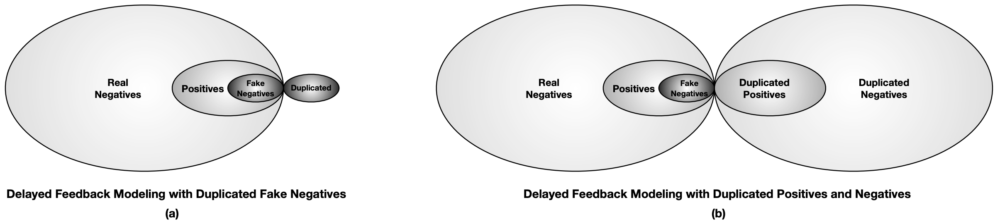

由上图（b）可知：
- 观测到的负样本 = Real_Neg + Fake_Neg + Duplicate_Neg = 2*Real_Neg + Fake_Neg
- 观测到的正样本 = Pos + Duplicated_Pos = Pos + Pos + Fake_Neg = 2*Pos + Fake_Neg

所以观测分布中负样本的概率为：
$$
q(x,y=0) = p(x,y=0) + \frac{1}{2} p(x,y=1,z>w_1)
$$

其中 $z$ 表示转化延迟时间， $w_1$ 表示等待窗口。进一步，我们有

$$
\begin{aligned}
q(y=0|x) &= \frac{q(x,y=0)}{q(x)} \\
&= \frac{p(x,y=0) +\frac{1}{2} \cdot p(x,y=1,z>w_1) }{p(x)} \\
&= p(y=0|x) + \frac{1}{2} \cdot p_{dp}(x)
\end{aligned}
$$

这里的 $p_{dp}$ 即延迟正样本的概率。所以正负样本的重要度权重为：

$$
\begin{aligned}
\frac{p(y=0|x)}{q(y=0|x)} = \frac{p(y=0|x)}{p(y=0|x) + \frac{1}{2} \cdot p_{dp}(x)} \\
\frac{p(y=1|x)}{q(y=1|x)} = \frac{p(y=1|x)}{p(y=1|x) - \frac{1}{2} \cdot p_{dp}(x)}
\end{aligned}
$$

接下来就和前面方法类似了，用转化率模型输出去替代 $p(y=1|x)$，并单独用一个分类器拟合延迟正样本的概率 $p_{dp}(x)$。即最终的交叉熵损失函数为

$$
L = - \sum_{(x_i,y_i) \sim q(x,y)} \{ y_i \frac{f_{\theta}(x_i)}{f_{\theta}(x_i) - \frac{1}{2} \cdot p_{dp}(x)} \log f_{\theta}(x_i) + (1-y_i) \frac{1-f_{\theta}(x_i)}{1-f_{\theta}(x_i) + \frac{1}{2} \cdot p_{dp}(x)}\log (1-f_{\theta}(x_i)) \}
$$

DEFER从根本上解决了分布偏差问题的方法，缺点就是训练样本总量翻倍了。

#### 3.2.4.1 Offline DEFER
前面介绍的几个方法主要都是针对流式训练，DEFER论文还介绍了离线训练如何应对延迟反馈问题。其基本思想是考虑不同延迟时间的样本进行分别建模。

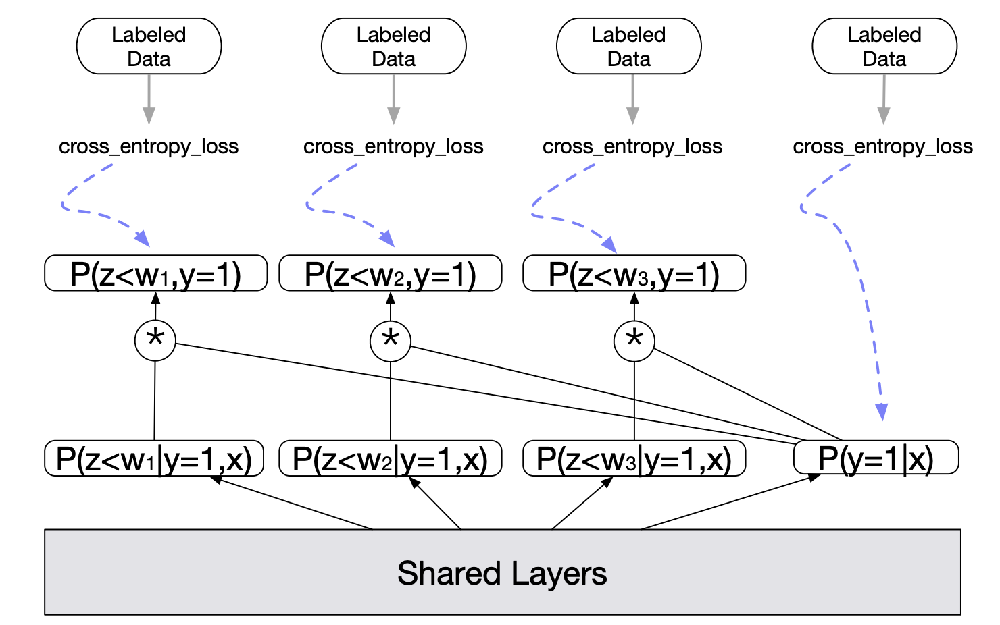

如上图所示，$z$ 是转化延迟，$w_n$ 是等待时间，底层是共享的，最右侧的 $p(y=1|x)$ 塔输出模型对于转化率的预测，其余的塔输出的是在不同等待时间之内转化的概率，表达为 $p(z<w_n, y=1|x) = p(z<w_n | y=1,x) * p(y=1|x) $。每个塔的输出都会与其对应的label计算交叉熵损失，最终损失为所有之和，即

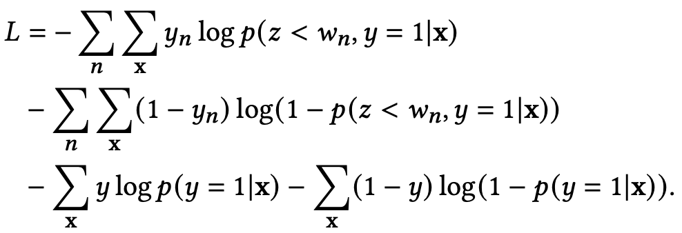

其中 $y_n$ 表示的是样本在 $w_n$ 内是否转化，而 $y$ 表示的是样本最终是否转化。另外，等待时间小于塔所所对应的等待时间的样本不会用于该塔的训练。当然所有的样本都可以用于最终转化塔的训练。原文中的例子是：假设归因窗口是七天，我们设置了四个塔，分别对应等待时间为一天、三天、五天以及最终是否转化，那么一个四天前的样本只能用于一天、三天以及最终转化这三个塔的训练，五天塔的参数应该在此过程中被冻结，这是因为该样本的等待时间为四天，我们尚不能确定它在等待时间为五天时的标签。

### 3.2.5 DEFUSE（WWW 2022, 阿里）
论文链接：[Asymptotically Unbiased Estimation for Delayed Feedback Modeling via Label Correction](https://arxiv.org/pdf/2202.06472.pdf)

淘宝搜索广告团队对前面的几种基于重要度采样进行样本纠偏的方法做了比较详细的分析讨论，指出了其中的不足，并提出了一种更加严谨的方法：DEFUSE（DElayed Feedback modeling with UnbiaSed Estimation）。

#### 3.2.5.1 现有方法及不足 
如下图所示，是各个方法采用的回补机制。

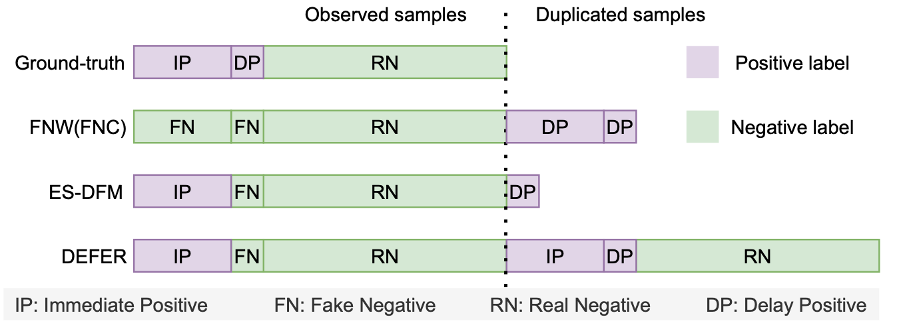

由上图可知，
- FNC/FNW的等待窗口=0，所有样本一开始都是负样本，后面会回补延迟正样本；
- ES-DFM的等待窗口>0，对于在等待窗口外才转正的样本会进行回补；
- DEFFER对等待窗口内的处理和ES-DFM一致，只是ES-DFM只回补延迟正样本，而DEFER在完整归因周期结束后，会将所有样本以真实label重新下发，以确保样本在特征空间上与真实分布保持一致。

作者认为上述方法存在一个问题是：在重要度权重的推导中，大家都假设了在真实分布 $p(x,y)$ 与观测分布 $q(x,y)$ 的转化中，只存在概率空间上每一个点 $<x,y>$ 在概率密度上的变化而不存在 $<x,y>$ 在取值空间上的变化。然而在样本回补机制中，FN到DP的变化与回补过程中必然涉及label的更新。严格来讲，如果以 $y$ 表示真实label，以 $v$ 表示观测label，即真实分布为 $p(x, y)$ 观测分布为 $q(x, v)$，则两者的关系应该表示为：

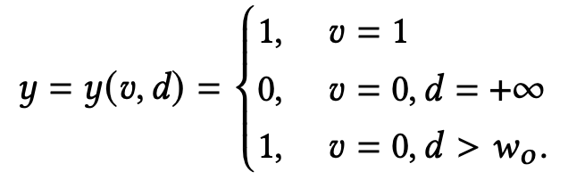

即前面的方法都将应该表示成  $\frac {p(d>w_o,y=1|x)}{q(v=0|x)} $的假负样本FN等同于真负样本RN处理。

#### 3.2.5.2 DEFUSE方法

与以往基于IS的方法主要侧重样本回补机制的设计不同，DEFUSE力求改进IS应用中损失函数中importance weight的推导，以实现对CVR的无偏估计。

DEFUSE用 $y(v,d)$ 来更加严谨地刻画真实label $y$ 和观测label $v$ 之间的差异，将前面重要度采样推导的损失函数改写成

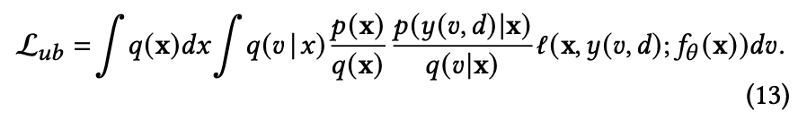

上式与传统基于重要度采样建模方法的差别主要体现在：

1）没有像其他方法那样假设（或者例如DEFER使用精心设计的回补机制来保证）观测特征分布和真实特征分布相同，即$p(x) = q(x)$；

2）$y = y(v,d)$

又由于 $y$ 和 $v$ 均是离散变量，可以将样本划分为以下四个部分：

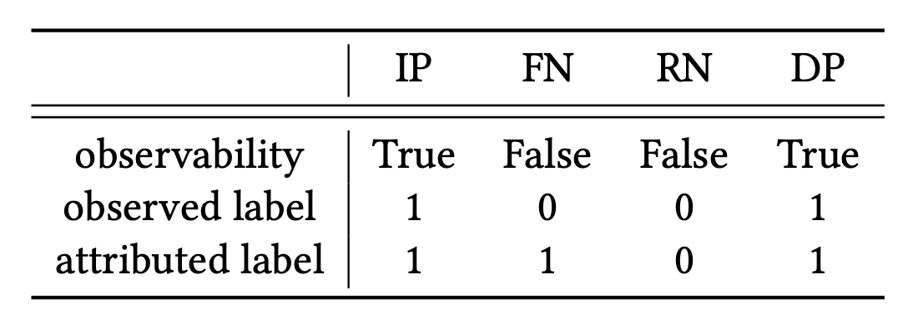

因此将积分形式的(13)式改写成

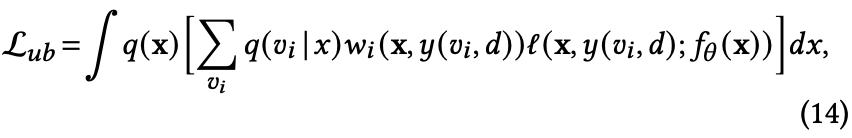

其中 $w_i = \frac{p(x, y(v_i,d))}{q(x,v_i)}$ 且 $i \in \{IP, FN, RN, DP\} $ 表示四种不同类型的样本。

四类样本中，IP、DP均可直接观测到，并根据延迟时间 $d$ 与观测窗口 $w_o$ 的大小关系进行区分，只有RN与FN无法通过观测数据直接区分。为了解决这一问题，引入隐变量 $z$ 来刻画一个观测到的负样本是否为假负样本FN，从而区分RN与FN，这样(14)式等价于：

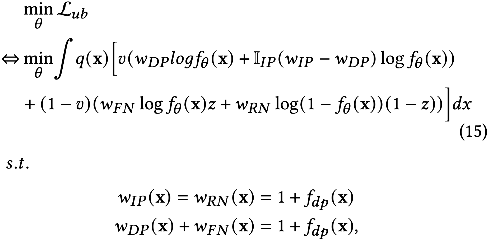

其中，$w_{IP}(x), w_{FN}(x), w_{RN}(x), w_{DP}(x)$ 即四类样本对应的importance weight。

上式的具体证明可参见原论文附录，核心步骤为：

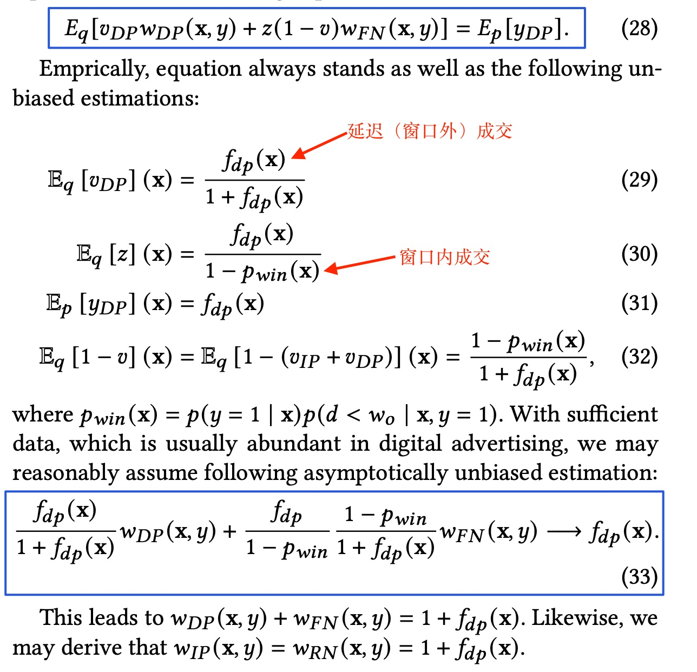

> 等式(28)左边是在观测分布 $q$ 上的期望，左边第一项是观测延迟正样本 $v_{DP}$ 用重要度权重 $w_{DP}$ 纠正后的期望，第二项为观测的负样本 $1-v$ 实际是延迟正样本然后用重要度权重 $w_{FN}$ 纠正后的期望，其中 $z$ 表示一个负样本会延迟转正的概率（即 $z = \frac{p_{DP}}{p_{RN}+p_{DP}}$），等式右边是真实延迟label $y_{DP}$在真实分布$p$上的期望。
> (29)式表示观测延迟正样本 $v_{DP}$ 在观测分布 $q$ 上的期望，由于我们回补了DP，所以(29)成立；(30)式分母表示真实分布里除窗口内成交之外的所有样本，分子为延迟样本；(33)式是将(29)-(32)代入(28)得来。

考虑到DP可观测，将(15)式中最后对 $w_{DP}(x)$ 和 $w_{FN}(x)$ 约束简化为  $w_{DP}(x)=1$ 和 $w_{FN}(x) = f_{dp}(x)$，同时引入辅助模型 $f_{dp}(x)$ 通过训练一个点击最终为窗口外延迟成交的概率来计算重要度权重。至此，就差对隐变量 $z$ 的建模了。

由于$z = \frac{p_{DP}}{p_{RN}+p_{DP}}$，$z(x)$ 的求解有两种方式：
1. $z_1(x) = 1 - f_{rn}(x)$，为此我们需要训练一个二分类模型 $f_{rn}(x)$ 来预测一个观测负样本实际是真负样本的概率，此方法形式简单，实际使用效果往往优于2;
2. $z_2(x) = \frac {f_{dp}(x)}{1 - f_{\theta}(x) + f_{dp}(x)}$，其实就是z的定义，这一形式的好处是只需通过过训练的无偏CVR模型 $f_{\theta}(x)$ 和延迟模型 $f_{dp}(x)$表示，无需引入额外的模型，但由于形式复杂，预估稳定性较差。

#### 3.2.5.3 Bi-DEFUSE

虽然DEFUSE已经实现了CVR的无偏估计，但在实际应用中发现对z的预估存在较大方差，使训练收敛速度变慢或导致次优解。同时考虑到实际场景中有一半左右的成交会在较短时间(30min)内完成，因子作者还提出将预估拆成窗口内外成交的Bi-DEFUSE方法，两个子任务分别单独建模，并通过多任务学习框架实现联合训练。

模型结构如下图(a)所示，两个子任务的定义如下
1. 窗口内成交 $F_{IP}(x)$：其观测分布与真实分布一致，采用传统的二分类即可，具体形式为 $F_{IP}(x) = p(y=1, d< w_0 | x)$ ；

2. 窗口外成交 $F_{DP}(x)$：通过DEFUSE进行分布修正，从而将引入 z 产生的方差限定在窗口外建模的范围内，最大程度上保证了训练的稳定性。

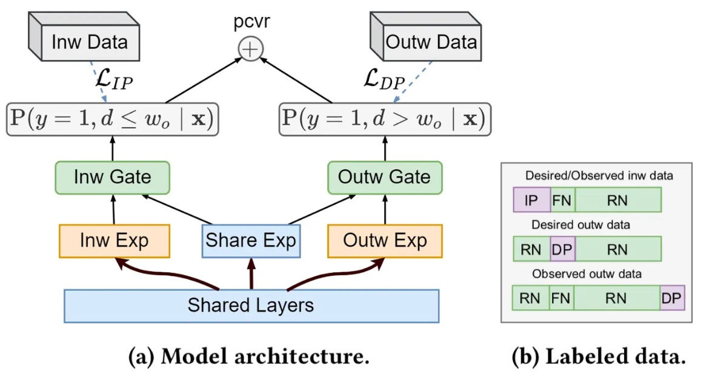

最终的CVR输出为二者之和。

如上图(b)所示，窗口内成交 $F_{IP}(x)$ 直接面向真实分布建模，无需考虑重要度权重和及辅助模型表现的影响；窗口外成交$F_{DP}$的观测分布从形式上与FNW的回补机制一致，与基于ES-DFM回补方式推导类似，基于FNW的DEFUSE及其重要度权重的推导结果如下：

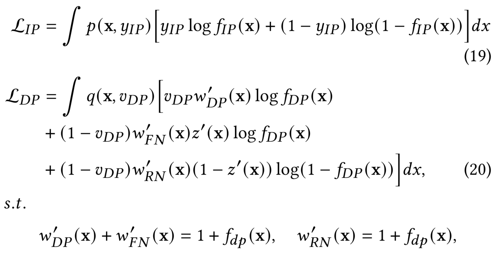

可见两者不仅实际用于训练的样本集合不同，所使用的的label也存在差异(见上图(b))。

## 3.3 多臂老虎机

由于我对多臂老虎机还不是很了解，这里先列下相关论文，后续再填坑吧。

[Stochastic bandit models for delayed conversions, 2017](https://arxiv.org/pdf/1706.09186.pdf)
[Learning in Generalized Linear Contextual Bandits with Stochastic Delays, NeurIPS 2019](https://proceedings.neurips.cc/paper_files/paper/2019/file/56cb94cb34617aeadff1e79b53f38354-Paper.pdf)
[Gradient-free Online Learning in Games with Delayed Rewards, ICML 2020](https://arxiv.org/pdf/2006.10911.pdf)

# 4. 参考文献

[精排pCVR-Delayed Feedback：DFM、NoDeF、FSIW、FNW、ES-DFM、DEFER、DEFUSE - 知乎](https://zhuanlan.zhihu.com/p/555950153)
[WWW 2022 | 搜索广告CVR延迟反馈建模DEFUSE - 知乎](https://zhuanlan.zhihu.com/p/506476146)
[搜索推荐广告排序艺术-Delayed Feedback问题 - 知乎](https://zhuanlan.zhihu.com/p/373509195)

