在搜广推场景下，各业务团队会生产很多特征，但很多都是冗余甚至与预测任务不相干的，这不仅带来了额外的性能开销，还可能会导致模型陷入局部最优影响模型预估效果。因此，不管是性能优化，还是效果优化，特征选择都是必不可少的。本人近期阅读了一些特征选择相关的文章（包括特征重要度学习、embedding维度搜索等），总结成本文留作日后回顾，也供大家参考。

<!-- more -->

# 1. FiBiNET（RecSys 2019）

论文链接：[FiBiNET: Combining Feature Importance and Bilinear feature Interaction for Click-Through Rate Prediction](https://arxiv.org/abs/1905.09433)

这篇文章有些早了，不过里面采用SENet来学习不同特征权重的思想，还是很有效的。

## 1.1 主要思想

推荐领域数据海量稀疏，存在大量长尾低频特征，而这些低频特征去学一个靠谱的Embedding是基本没希望的，但是又不能把低频的特征全抛掉，因为有一些又是有效的。所以需要弱化那些不靠谱低频特征Embedding的负面影响，强化靠谱低频特征以及重要中高频特征的作用。因此，本文通过使用Squeeze-Excitation network (SENet) 结构动态学习特征的重要性，此外还提出了用双线性交叉层进行更精细的特征交叉。

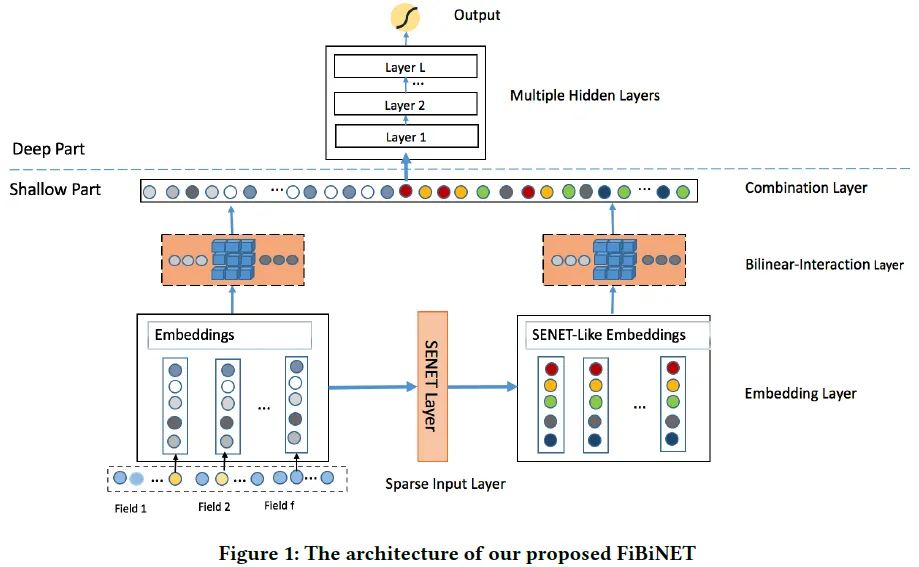

## 1.2 SENet学习特征重要性

SENet首先被提出用于对CNN中的通道间的相关性进行建模，对重要通道进行强化来提升模型准确率。本文用SENet学习每个特征的重要度：将每个特征向量embedding进行pooling（原SENET论文用的max，本论文说用mean结果更好），然后经过mlp映射（一般两层，先降维再升维）得到每个特征的重要度权重，然后将原始embedding乘上重要度权重作为输出。

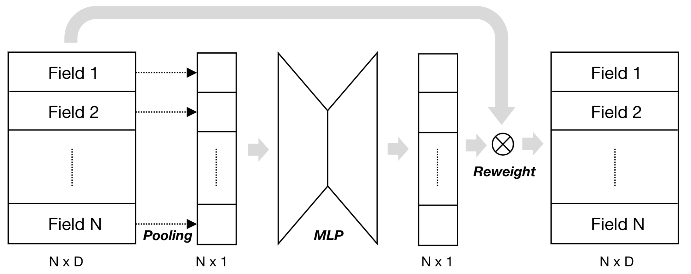

# 2. AutoFIS（KDD 2020）

论文链接：[AutoFIS: Automatic Feature Interaction Selection in Factorization Models for Click-Through Rate Prediction](https://dl.acm.org/doi/pdf/10.1145/3394486.3403314)

自动进行学习特征交叉的筛选。

## 2.1 主要思想

分为两个阶段：
1. 搜索阶段：学习每个特征交叉的重要度门控参数（受NAS算法DARTS的启发）；
2. 重新训练阶段：去掉不重要的特征交叉，重新训练模型。

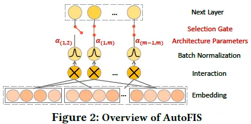

## 2.2 特征交叉重要性搜索

对每一对特征交叉，引入一个可学习的门控参数 $\alpha$ 和其他参数一起联合训练，为了避免特征尺度对 $\alpha$ 学习的影响，引入BatchNorm；为了学习得到稀疏的 $\alpha$，使用GRDA（Generalized regularized dual averaging）优化器来学习 $\alpha$（其他参数还是用Adam进行学习）；

# 3. FSCD-PreRank（SIGIR 2021）

论文链接：[Towards a Better Tradeoff between Effectiveness and Efficiency in Pre-Ranking: A Learnable Feature Selection based Approach](https://arxiv.org/abs/2105.07706)

参考：[SIGIR 2021 | FSCD-PreRank：面向效率和效果更加均衡的交互式粗排模型 - 知乎](https://zhuanlan.zhihu.com/p/375943741)

阿里用于粗排的工作。

## 3.1 主要思想

主要思想如下图所示

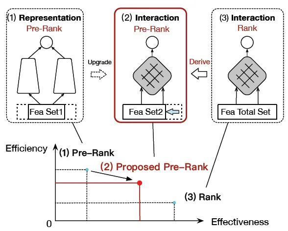

1. 基于特征复杂度和variational dropout的可学习特征选择方法(FSCD)进行特征选择，选择精排特征的子集提供给粗排模型进行训练；
2. 通过继承精排模型结构，粗排阶段成功采用了IF结构的模型，解决传统向量点击模型效果不足的问题；

## 3.2 FSCD

FSCD：Feature Selection based on feature Complexity and variational Dropout

 

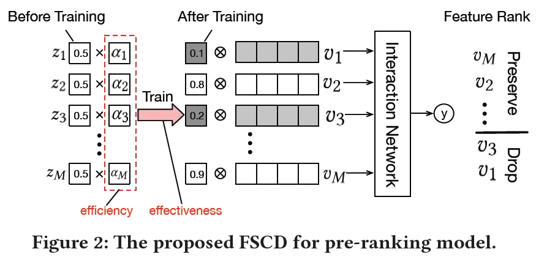

借鉴Dropout FR（Dropout Feature Ranking for Deep Learning Models）的思想，针对每个特征学习一个丢弃率（dropout rate）z，该值越小表示该特征越重要。

 

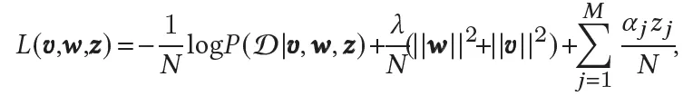

损失函数为上式。其中 $ \alpha $ 为 z 的正则惩罚项，是特征复杂度（包括计算和存储复杂度，例如在线计算复杂度、embedding维度、取值个数等等）的增函数。即较大复杂度的特征在训练中会受到较大的惩罚，因此有更大的可能被舍弃掉。

# 4. PEP（ICLR 2021）

PEP是Plug-in Embedding Pruning的缩写，用于特征embedding维度搜索。

论文链接：[[2101.07577] Learnable Embedding Sizes for Recommender Systems](https://arxiv.org/abs/2101.07577)

参考：[ICLR2021 | 推荐系统中可学习的嵌入维度 - 知乎](https://zhuanlan.zhihu.com/p/389037631)

## 4.1 解决的问题

在搜广推场景下，由于数据海量且稀疏，传统Embedding方式会面临下面两个问题：

1. 模型参数量embedding占主导，过大的embedding size会带来极大地计算/存储开销。

2. 相同的维度可能很难处理不同特征之间的异质性，很可能会导致那些不需要太大表示容量的特征出现过拟合，导致推荐模型陷入局部最优。

因此，对于不同特征，需要赋予不同的embedding维度。

## 4.2 主要思想

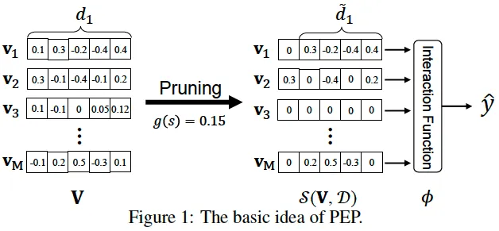

如上图所示，通过设置阈值，将embedding进行剪枝。例如v1的第一个值被置为0丢弃，可以看作其embedding维度减1；另外对于一些不重要的特征，例如v3的所有值都置为了0，相当于进行了特征筛选。
为了自动实现上述过程，受Soft Threshold Reparameterization的启发，作者将soft剪枝后的embedding矩阵可表示为：

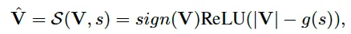

其中 g 为剪枝阈值计算函数（例如sigmoid），s 为可学习参数（需合理初始化以确保阈值开始时接近0），与其他参数联合训练优化。上述 s 为实数，即全局一个阈值，当然也可以向量甚至矩阵，实现更细粒度的剪枝。
剪枝完成后，对embedding进行mask，然后对模型重新训练。

# 5. AMTL（2021 CIKM）

论文链接：[Learning Effective and Efficient Embedding via an Adaptively-Masked Twins-based Layer](https://arxiv.org/pdf/2108.11513.pdf)
参考：[CIKM 2021 | AMTL：设计孪生掩码层高效学习维度自适应的Embedding - 知乎](https://zhuanlan.zhihu.com/p/434470873)

也是一篇特征embedding维度学习的文章。

## 5.1 主要思想

如下图所示，AMTL（Adaptively-Masked Twins-based Layer）可对不同特征学习到不同的embedding维度。由于AMTL的输入是特征频次信息，所以能够对高频特征赋予长embedding，对低频特征赋予短embedding。

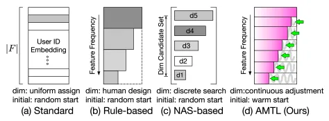

## 5.2 AMTL模型结构

如下图所示，AMTL的的输入输出分别是：
1）输入：特征 i 的频率信息 $s_i$，如特征历史出现次数、出现次数排名等等；
2）输出：特征 i 对应embedding的mask，该mask前 $k_i$ 个元素都是1，后面全是0；

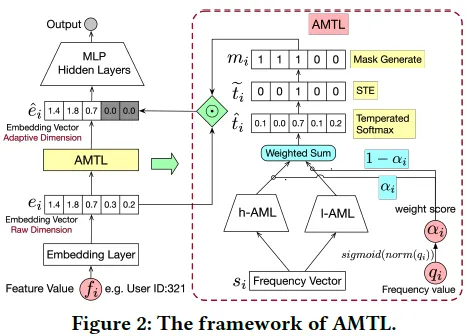

由于网络参数很容易被高频的特征所主导， 因此作者提出了用两个分支网络来计算mask，h-AML 和 l-AML 分别被用来刻画高频和低频特征。在实践中，很难去卡一个阈值来事先定义哪些是高频特征哪些是低频特征，因此采用了soft的方法，即将 h-AML 和 l-AML 的输出通过加权得到，而这个权重是由特征的出现次数 $q_i$ 进行归一化得到的。即如果一个特征是高频特征，那 h-AML 的输出就会占主导，反向传播主要更新h-AML，反之亦然。

## 5.3 Relaxation 策略

由于我们期望的输出需要 argmax 操作，是不可微的。因此，训练时，作者实际采用的是temperated softmax：

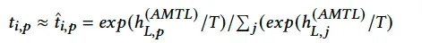

其中 T>0 是温度超参，当T趋于0时，上式趋近于 argmax。然而，这样的操作会使得训练和推断之间存在gap，为了消除这个gap，受 Straight-Through Estimator (STE) 启发，作者重构t_i为

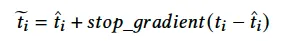

由于前向不受 stop_gradient 影响，故训练和推理保持了一致。 而在反向传播时，通过 stop_gradient 来避免不可微过程的梯度更新。

# 6. AutoDim（WWW 2021）

论文链接：[AutoDim: Memory-efficient Embedding for Recommendations](https://arxiv.org/pdf/2006.14827.pdf)

参考：[AutoDim:自动Embedding维度寻优，如何节省70%的存储空间同时还能大幅提效？](https://zhuanlan.zhihu.com/p/378166274)

也是一篇特征embedding维度学习的文章。

## 6.1 解决的问题

在搜广推场景下，由于数据海量且稀疏，会面临下面两个问题：

1. 模型参数量embedding占主导，过大的embedding size会带来极大地计算/存储开销。

2. 不同特征的基数（即取值个数）大小不一，将所有特征编码成同一维度显然是不合理的。例如性别只有两种取值，而和商品ID有成千上万个取值，如果都编码成同一维度的embedding，那前者存在计算浪费，后者可能存在表达能力不足。

## 6.2 主要思想

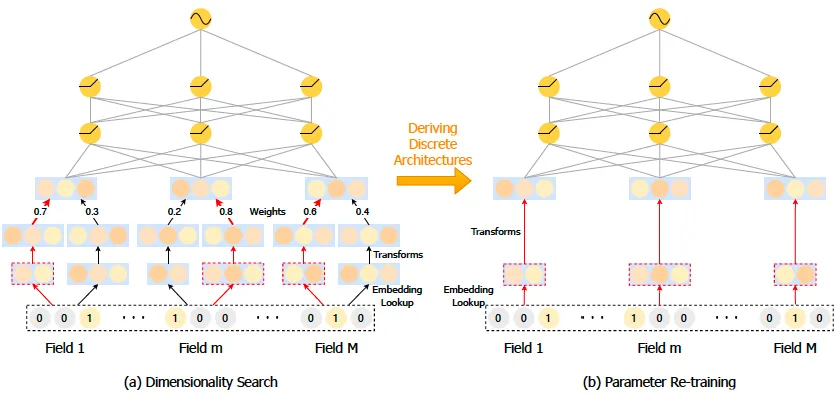

如上图，分为两个阶段，
（a）维度搜索：对每个特征的每个候选维度，学习一个权重（学习时复用embedding减小开销）。
（b）参数再训练：对每个特征选择权重最大的维度作为最终维度，重新训练。

为了避免过拟合，作者在训练集上训练模型权重，在验证集上训练不同维度的权重（实验证明，同在训练集上处理，模型容易过拟合，基本会选择embedding size大的）。

## 6.2 阶段一、维度搜索

在实践中，在维度权重学习之前，我们首先为所有候选embeddings分配相等的权重，固定这些权重进行预训练embedding。

1. 权重共享embedding
对每个特征学习多个维度的embedding，训练代价太大了。因此，如下图所示，考虑只学习一个维度为d（d为所有候选维度的最大值）的embedding，小于此维度的embedding复用前面的digits即可。这样做的好处是，1）大大减小了训练代价；2）embedding中靠前的digits被多次训练，更有可能学习到特征的重要信息。

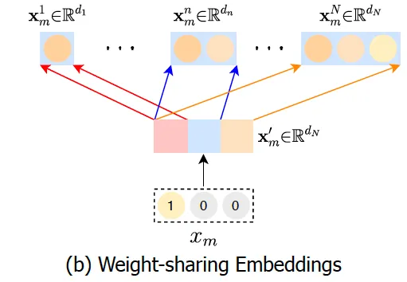

2. embedding维度统一
由于MLP的输入需要固定维度，所以需要统一不同长度的特征，有两种方法：1）线性映射，这会引入额外的参数；2）补0，注意需要做BN。

3. 维度选择
学习不同维度embedding的权重时，引入Gumbel-softmax模拟从一个类别分布中进行不可微的采样。

## 6.3 阶段二、参数再训练

由于维度搜索阶段的次优Embedding也会影响模型的训练，因此需要一个只训练最优维数模型的再训练阶段来消除这些影响。具体的，对每个特征，选取权重最大的维度，重新训练embedding，也需要不同特征维度统一，类似阶段一可以采用线性映射或者0填充两种方法。

# 7. AutoField（WWW 2022）

论文链接：[AutoField: Automating Feature Selection in Deep Recommender Systems | Proceedings of the ACM Web Conference 2022](https://dl.acm.org/doi/pdf/10.1145/3485447.3512071)

## 7.1 主要思想

和AutoDim基本是一模一样的，只是AutoDim是学习不同embedding维度，AutoField是学习是否丢弃某个特征。也分为两个阶段：
1. 搜索阶段：对每个特征赋予可学习的保留和丢弃参数 $\alpha^1$ 和  $\alpha^0$（二者和为1），采用类似DARTS的优化方法，在验证集上对这两个参数进行学习（同样采用了Gumbel-Softmax）；
2. 重训练：选取部分特征，重新训练。

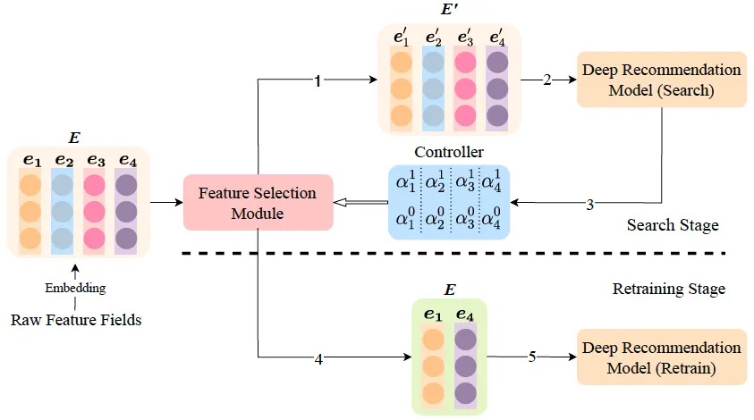

# 8. AdaFS（KDD 2022）

论文链接：[AdaFS: Adaptive Feature Selection in Deep Recommender System | Proceedings of the 28th ACM SIGKDD Conference on Knowledge Discovery and Data Mining](https://dl.acm.org/doi/pdf/10.1145/3534678.3539204)

注：思路和AutoField基本一样，也是同一个团队做的，只是AutoField是先筛选出固定的特征子集，而AdaFS是对所有特征学一个重要度分数。感觉前者是为了性能提升，后者是为了效果提升。

## 8.1 解决的问题

现有特征选择方法大多是筛选出固定的特征子集，如上面的AutoField。但对于不同的用户物品对（user-item interactions），某个特征的重要性可能是不同的，因此需要动态的特征选择，即对不同特征学习一个重要度分数。

## 8.2 主要思想

用一个Controller网络（就是个MLP）计算每个特征embedding的重要性。

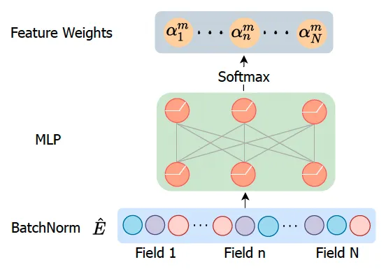

具体的，如上图所示，为了消除不同embedding大小的影响，会首先做一个BatchNorm；然后经过一个MLP，输出维度为N（N为特征field数），再经过softmax得到每个特征field的重要性分数。在得到了重要性分数后，有两种处理方式：

1. soft selection：用重要性分数对特征embedding加权求和作为输出；
2. hard selection：将不重要的特征mask掉，即将不重要的特征embedding置为0。

优化时，和其他特征选择方法一样，采用DARTS，即在验证集上优化Controller参数，在训练集上优化其他参数。另外在实践中，还首先不考虑Controller而只对其他参数进行预训练。

# 9. AutoFAS（KDD 2022）

论文链接：[AutoFAS: Automatic Feature and Architecture Selection for Pre-Ranking System](https://arxiv.org/pdf/2205.09394.pdf)

参考：[美团搜索粗排优化的探索与实践](https://www.6aiq.com/article/1660225427073)

在粗排场景下，利用NAS进行特征选择和结构选择。

下图左边部分是常规排序模型，用于特征选择；右部分对模型结构（候选结构仅包括MLP和直接连接）进行搜索。

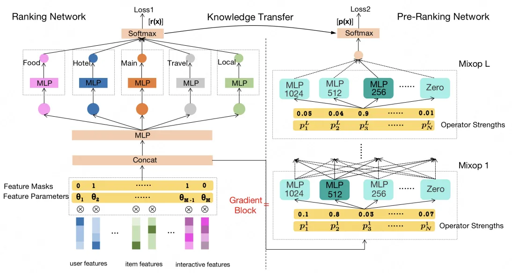

# 10. OptEmbed（CIKM 2022）

论文链接：[[2208.04482] OptEmbed: Learning Optimal Embedding Table for Click-through Rate Prediction](https://arxiv.org/abs/2208.04482)

## 10.1 解决的问题

文中提出，最佳Embedding需要满足三个条件：

1. NRE（No Redundant Embeddings，没有冗余）：只有有用的特征值（feature value，如性别=男）才有embedding；
2. EDF（Embedding Dimension Flexible，维度可变）：不同特征赋予不同维度的embedding（field-wise）；
3. HF（Hardware Friendly，硬件友好的）：适合常见的并行处理硬件如GPU

如下图，现有的一些工作都没同时满足上述三个条件，例如AutoField不满足2），AutoDim不满足1）。

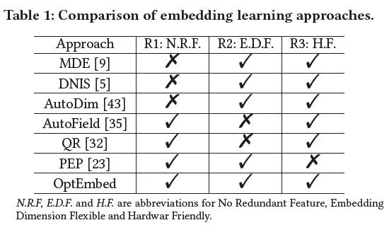

## 10.2 主要思想

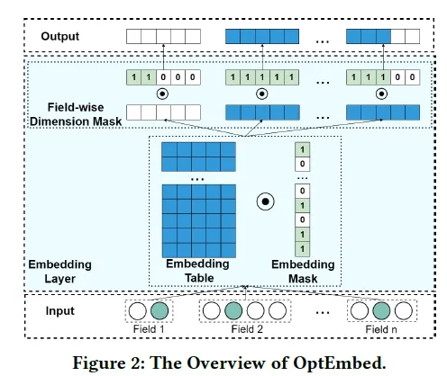

如上图所示，为了满足前面提到的三个条件，本文提出了：1）训练一个特征值粒度的mask来只保留有用的特征值；2）训练一个特征粒度（field-wise）的维度mask来对不同特征赋予不同维度embedding；3）最后重新训练得到最优embedding。

# 11. PEPNet（2023）

论文链接：[PEPNet: Parameter and Embedding Personalized Network for Infusing with Personalized Prior Information](https://arxiv.org/pdf/2302.01115.pdf)

参考：[「2023 | 快手」PEPNet：融合个性化先验信息的多场景多任务网络 - 知乎](https://zhuanlan.zhihu.com/p/611400673)

快手的PEPNet用一个子网络，学习特征的重要度分数。

## 11.1 解决的问题

PEPNet主要是为了解决多场景多任务的问题。

1. EPNet（Embedding Personalized）：在不同场景下，某个特征的重要度可能是不同的，因此可以考虑用一个子网络，将场景特征（如场景ID）作为输入，得到每个特征的重要度分数。这个思路和AdaFS是类似的，只是AdaFS的子网络输入是所有特征。
2. PPNet（Parameter Personalized）：除了用子网络学习不同特征重要度，还可以将子网络的输出与主网络DNN层结果element-wise相乘后，作为下一层DNN的输入。

## 11.2 网络结构

PEPNet结构如下图所示，

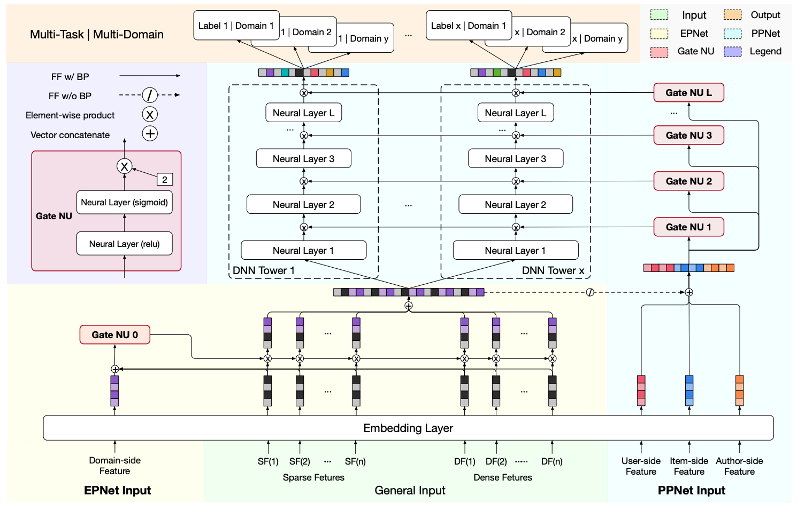

主要包含Gate Nu、EPNet和PPNet三部分：
1. Gate NU：即一个子网络门控结构，输入为一些先验信息，是EPNet和PPNet的基本单元；
2. EPNet：场景信息作为输入，输出不同特征的重要度分数，增强模型对用户跨域行为的感知能力；
3. PPNet：用户和item信息作为门控输入，适配不同任务每层参数，平衡顶层任务间相互依赖关系；

总的来说，就是挑选一些重要特征（如场景特征、item特征等），经过一个子网络，然后作用到主网络。

# 总结

总结一下，这些工作都需要对特征赋予一个重要度分数（或Embedding维度大小），这个重要度分数可以直接作为可学习参数进行学习（如AutoFIS、PEP、FSCD、AutoDim、AutoField、AutoFAS、OptEmbed）；也可以作为一个子网络的输出（如FiBiNet、AMTL、AdaFS、PEPNet），子网络的输入可以是所有特征（如FiBiNet、AdaFS），也可以是一些先验信息（如AMTL是特征频次，PEPNet是一些场景特征）。将重要度作为可学习参数直接学习的，往往还会去掉不重要的特征对模型进行重新训练。可见前者主要是为了性能优化（去掉不重要的特征），后者主要是为了效果优化（如强化一些先验信息）。
