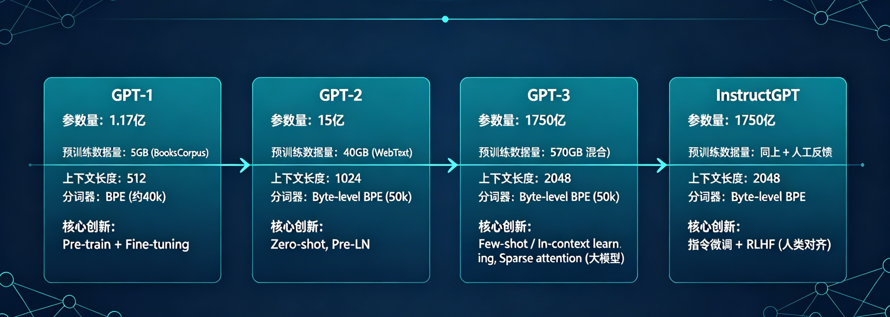
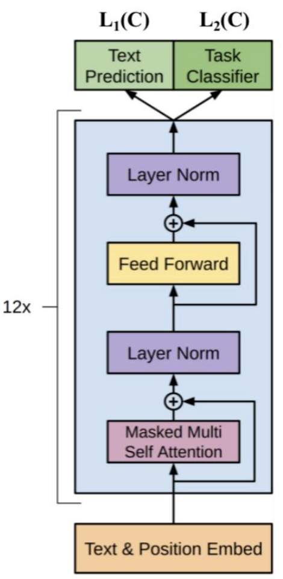
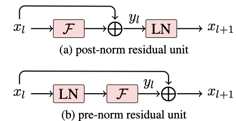
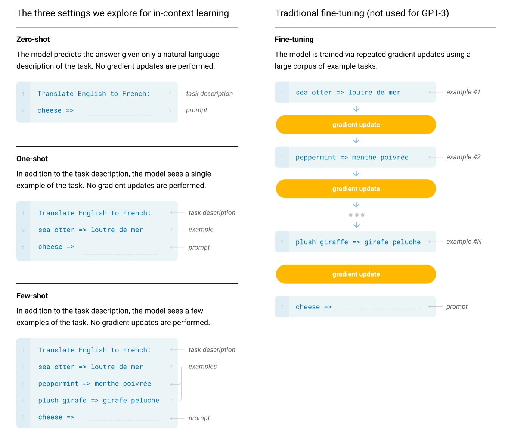
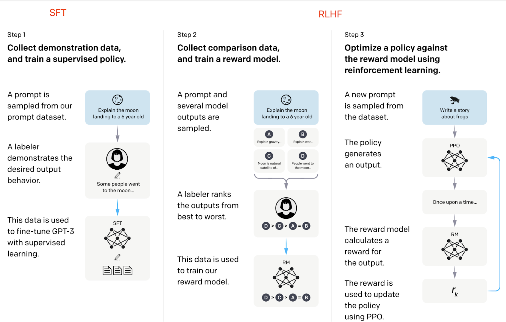
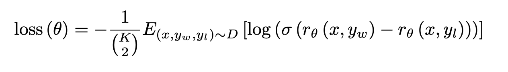

本文从初代 GPT 开始，总结 GPT 系列（GPT、GPT2、GPT3、InstructGPT/ChatGPT）的发展演变，主要包括模型结构、训练数据、核心创新等。

<!-- more -->

# 总览对比

| 模型          | 参数量    | 预训练数据量             | 上下文长度 | 分词器                  | 核心创新                                                   |
| ----------- | ------ | ------------------ | ----- | -------------------- | ------------------------------------------------------ |
| GPT-1       | 1.17 亿 | 5 GB (BooksCorpus) | 512   | BPE (约40k)           | Pre-train + Fine-tuning                                |
| GPT-2       | 15 亿   | 40 GB (WebText)    | 1024  | Byte-level BPE (50k) | Zero-shot, Pre-LN                                      |
| GPT-3       | 1750 亿 | 570 GB (混合)        | 2048  | Byte-level BPE (50k) | Few-shot / In-context learning, Sparse attention (大模型) |
| InstructGPT | 1750 亿 | 同上 + 人工反馈          | 2048  | Byte-level BPE       | 指令微调 + RLHF (人类对齐)                                     |

---

# GPT

_Improving Language Understanding by_ **_G_**_enerative_ **_P_**_re-_**_T_**_raining_，即使用通用的预训练模型来提升语言理解能力。

## 模型结构

GPT模型结构其实就是多层Transformer的decoder堆叠而来，如下所示。

预训练时采用标准的语言模型目标函数，即训练目标是根据前k个词，来预测下一个词。这里的 k 表示上文的窗口大小，理论上来讲 k 取的越大，模型所能获取的上文信息越充足，模型的能力越强。

在微调阶段，在有特定下游任务label的情况下，可以再进行有监督的学习。

模型结构的一些关键参数为：

| 参数                 | 取值     |
| ------------------ | ------ |
| transformer 层数     | 12     |
| 特征维度               | 768    |
| transformer head 数 | 12     |
| 总参数量               | 1.17 亿 |

## GPT和BERT的区别

GPT 模型选择了 Transformer 的 decoder 部分，这是因为 GPT 的预训练目标函数选取的是标准的语言模型目标函数，使得模型在预测某一个词的时候只考虑上文信息而不参考下文。

BERT 在预训练的时候选择的不是标准的语言模型作为目标函数，而是一种 mask 语言模型，也就是在预测句子中某一个词的时候可以同时看到它前后的所有上下文信息（类似完形填空），所以 BERT 选择的是 Transformer 的 encoder。

GPT 和 BERT 的预训练目标函数的不同决定了其选择decoder还是encoder，GPT 选择的是一个更难的训练目标，它是根据前面的信息去预测下文，预测未来肯定是比完形填空难度要更大的。这也能从某种程度上解释了为什么相同规模的 GPT 和 BERT 模型，GPT 的效果要比 BERT 差。但是从另一个角度去想，如果能够把预测未来这个事情做好的话，它最终所能达到的效果的天花板一定是更高的，这可能也是 OpenAI 从一开始到现在一直坚持使用标准语言模型目标函数来做预训练模型的其中一个原因吧，当然这只是一种猜想。事实证明，从 GPT-3 开始，到最近的 ChatGPT，OpenAI 所取得的令人惊艳的效果也一定程度上证明了他们的选择的正确性。

## 模型训练

训练数据方面，初代 GPT 使用了 BooksCorpus 数据集，文本大小约 **5 GB**，包含 7400w+ 的句子。该数据集是由约 7000 本独立的、不同风格类型的书籍组成。选择该数据集主要的好处是书籍文本包含大量高质量长句，保证模型学习长距离信息依赖。

## 总结

初代 GPT 到底做了什么？有哪些贡献？
1. 它是最早一批提出在 NLP 任务上使用 pre-train + fine-tuning 范式的工作。其实 pre-train + fine-tuning 在计算机视觉里面早在好多年前已经成为主流的范式，但是在 NLP 中一直没有流行起来，主要还是因为在 NLP 里面没有像 ImageNet 那样大规模标好的数据集，这也导致相当一段时间内，深度学习在 NLP 的进展相对比较缓慢，直到 GPT 和 BERT 的出现才渐渐打开局面。
2. GPT 的实验证明了模型的精度和泛化能力会随着解码器层数增加而不断提升。
3. 预训练模型具有 **zero-shot** 的潜力（虽效果有限，但验证了可迁移性），并且这种能力能随着预训练的进行不断增强（GPT-2 将其作为主推方向）。

---

# GPT-2

_Language Models are Unsupervised Multitask Learners_，语言模型是一种无监督多任务学习器。

GPT-2的主要思想是，当模型的容量非常大且数据量足够丰富时，迁移到其他任务上的时候不需要额外的标注数据，也不需要额外的模型训练（不用微调），即 **zero-shot**。
在 zero-shot 的设定下，由于没有进行微调，因此不同任务需要以自然语言的形式去作为输入，例如下面两个任务的输入序列是这样改造的：
- 机器翻译任务：**translate** to french, { english text }, { french text }
- 阅读理解任务：**answer** the question, { document }, { question }, { answer }

上述 zero-shot 奏效是因为在预训练的语料中，存在一些不同任务相关的自然语言描述示例，比如“xxx在法语中即xxx”这种。

## 模型结构

在模型结构方面， GPT-2 与 GPT-1 基本相同，只是有几个训练trick调整：

1. **后置 Layer-Norm （残差之后做 LN）改为前置（Pre-LN）**，见论文《Learning Deep Transformer Models for Machine Translation》，这是因为当模型层数不断增加，梯度消失和梯度爆炸的风险越来越大，Pre-LN 相比 Post-LN 能使梯度更加稳定，缓解深层网络的训练问题。

2. 在模型最后一个自注意力层之后，额外增加一个 Layer-Norm。
3. 调整参数的初始化方式，按残差层个数进行缩放，缩放比例为 1:sqrt(N)。
4. 输入序列的最大长度从 512 扩充到 **1024**。
5. **分词器升级**：采用 **Byte-level BPE**，词表大小 50k，可以处理任意 Unicode 字符，解决了原 BPE 对非英文文本的支持问题。

## 模型训练

在训练数据方面，为了保证 zero-shot 的效果，必须要足够大且覆盖面广。所以 GPT-2 专门爬取了大量的**网络文本**数据，最后得到的数据集叫 WebText。它选取了 Reddit 上的高质量帖子，最终得到 4500w 网页链接，800w 有效的文本文档，语料大小为 **40G**。

## GPT-2与GPT-1的区别

1. **主推 zero-shot**，而 GPT-1 为 pre-train + fine-tuning。
2. **训练数据规模更大**，GPT-2 为 800w 文档 40G，GPT-1 为 5GB。
3. **模型大小**，GPT-2 最大 15 亿参数，GPT-1为 1 亿参数。
4. **模型结构调整**：Pre-LN、额外 LN、参数初始化方式。
5. **训练参数**：batch_size 从 64 增加到 512，上文窗口大小从 512 增加到 1024。
6. **分词器**：Byte-level BPE，支持任意 Unicode。

---

# GPT-3

虽然 GPT-2 主推的 zero-shot 在创新度上有比较高的水平，但是由于其在效果上表现平平，所以在业界并没有取得比较大的影响力，而 GPT-3 正是为了解决效果上的问题而提出的。GPT-3 不再去追求那种极致的不需要任何样本就可以表现很好的模型，而是考虑像人类的学习方式那样，仅仅使用**极少数样本**就可以掌握某一个任务，因此就引出了 GPT-3 标题 _Language Models are_ **_Few-Shot_** _Learners_。

这里的 few-shot 不是像之前那样，使用少量样本在下游任务上去做微调，因为在 GPT-3 那样的参数规模下，即使是参数微调的成本也是高到无法估计。

## 模型结构

整体沿用 GPT 模型结构，但引入了 **Sparse Transformer** 中的 sparse attention（稀疏注意力）模块。  
**需要注意的是**：GPT-3 并非所有尺寸的模型都使用了 sparse attention。小模型（如 125M、350M）仍使用传统的 dense attention，只有大模型（13B、175B）为了降低计算量才在部分层使用了 **交替的 dense + locally banded sparse attention**。

sparse attention 与传统 self-attention（称为 dense attention） 的区别在于：

> dense attention：每个 token 之间两两计算 attention，复杂度 O(n²)  
> sparse attention：每个 token 只与其他 token 的一个子集计算 attention，复杂度 O(n log n)  
> 具体来说，sparse attention 除了相对距离不超过 k（局部紧密相关）以及相对距离为 k，2k，3k...（远程稀疏相关）的 token，其他所有 token 的注意力都设为 0，如下图所示：

> 图片来源：[为节约而生：从标准Attention到稀疏Attention —— 科学空间](https://spaces.ac.cn/archives/6853)

使用 sparse attention 的好处主要有以下两点：

1. **减少注意力层的计算复杂度**，节约显存和耗时，从而能够处理更长的输入序列（GPT-3 上下文长度扩展至 **2048**）。
2. **具有“局部紧密相关和远程稀疏相关”的特性**，对于距离较近的上下文关注更多，对于距离较远的上下文关注较少。

## 下游评估

如下图所示，GPT-3 在下游任务的评估与预测时，提供了三种不同的方法：

> **Zero-shot**：仅使用当前任务的自然语言描述，不进行任何梯度更新。  
> **One-shot**：当前任务的自然语言描述，加上一个简单的输入输出样例，**不进行任何梯度更新**。  
> **Few-shot**：当前任务的自然语言描述，加上几个简单的输入输出样例，**不进行任何梯度更新**。

其中 Few-shot 也被称为上下文学习（in-context learning），虽然它与 fine-tuning 一样都需要一些有监督标注数据，但是两者的本质区别是前者使用标注数据时**不做任何的梯度回传，模型参数不更新**。

## 模型训练

由于 GPT-3 在模型规模上的扩大，在训练数据方面也必须进行扩充来适配更大的模型使其发挥出相应的能力。

GPT-3 使用了多个数据集，其中最大的是 CommonCrawl，原始未处理的数据达到了 45TB，其实在 GPT-2 的时候他们就有考虑使用这个数据集，但是后来还是觉得这个数据集太脏了所以没用，但是现在 GPT-3 的模型规模太大了，使得训练对数据量的需求也增加了很多，他们不得不重新考虑这个数据集。因此，他们必须在这个数据集上做一些额外的数据清洗工作来尽量保证数据的质量。

数据处理主要包括以下几个部分：

> 1. 使用高质量数据作为正例，训练 LR 分类算法，对 CommonCrawl 的所有文档做初步过滤。
> 2. 利用公开的算法做文档去重，减少冗余数据。
> 3. 加入之前 BERT、GPT、GPT-2 使用过的已知的高质量数据集。

最终处理完成后使用的数据规模约 **570G**。

## 与GPT-2区别

整体来看，GPT-3 相比于 GPT-2 有如下几点区别：

1. **效果上**，超出 GPT-2 非常多，能生成人类难以区分的新闻文章。
2. **主推 few-shot**，相比于 GPT-2 的 zero-shot，具有很强的创新性。
3. **模型结构**略微变化，大模型采用 sparse attention 模块。
4. **海量训练语料** 45TB（清洗后 570GB），相比于 GPT-2 的 40GB。
5. **海量模型参数**，最大模型为 1750 亿，GPT-2 最大为 15 亿参数。
6. **上下文长度**从 1024 扩展至 2048。

## 模型“偏见”

模型最终呈现的效果取决于训练数据，这会导致模型会出现各种各样的“**偏见**”，比如“种族偏见”和“性别偏见”。  
GPT-3由于其影响力本就较大，容易造成一定的社会影响，比如生成新闻稿，散布一些不实的消息等。

---

# InstructGPT/ChatGPT

GPT-3 虽然在各大NLP任务的效果上令人惊艳，但前面提到的“偏见”问题容易造成严重的负面社会影响（比如模型将黑人预测为黑猩猩，引发了巨大争议，负面舆论对大公司来说影响是巨大的），而且很多时候，他并不按人类喜欢的表达方式去说话。之所以有这个问题，作者认为是模型没有跟人类意图进行对齐（Align）。因此，需要 Align，就有了 InstructGPT 这个工作。

为了进行对齐，原文分为了三个步骤：

1. **有监督微调（Supervised FineTune，SFT）**：收集标注的数据集，有监督微调训练 GPT-3。
2. **奖励模型训练（Reward Model，RM）**：训练一个奖励模型（可以看做一个分类模型），该模型输入是 prompt 和 response，输出是奖励值。
3. **强化学习训练**：使用初始化的策略模型根据 prompt 输入生成 response，然后使用奖励模型对该 response 打分，再使用打分值借助 **PPO 算法**重新优化策略模型。

可以把上述步骤拆分成两大步：一个是有监督微调（SFT），一个是基于人类反馈的强化学习（RLHF）。

## 监督微调（SFT）

SFT 可以理解为人工标注了一批数据，然后去微调 GPT-3。注意这里的微调和 GPT-3 之前用来做下游任务使用的 few-shot learning 有非常本质的区别：

GPT-3 中的 few-shot 对于同一个下游任务，通常采用固定的任务描述方式，而且需要人去探索哪一种任务表述方式更好。显然这种模式与真实场景下用户的使用方式存在较大的 gap，用户在向 GPT-3 提问时才不会采用某种固定的任务表述，而是随心所欲地以自己的说话习惯去表达某个需求。InstructGPT 在 SFT 中标注的数据，正是为了消除这种模型预测与用户表达习惯之间的 gap。在标注过程中，他们从 GPT-3 的用户真实请求中采样大量下游任务的描述，然后让标注人员对任务描述进行续写，从而得到该问题的高质量回答。这里用户真实请求又被称为某个任务的**指令**，即 InstructGPT 的核心思想“基于人类反馈的指令微调”。

## 基于人类反馈的强化学习（RLHF）

基于 SFT 得到的模型被用于后续的 RLHF 做进一步的模型优化。

### 奖励模型（RM）

训练 Reward 模型去选择人类更倾向的选项（Instruction Learning，指示学习）。  
首先通过人工标注的方式来提供奖励（Reward），标注者可以给那些涉及偏见的生成内容更低的分，从而鼓励模型不去生成这些人类不喜欢的内容。奖励模型 RM 的结构是将 SFT 训练后的模型的最后的嵌入层去掉后的模型。它的输入是 prompt 和 response，输出是奖励值。具体的讲，对每个 prompt，InstructGPT 会随机生成 K 个输出，然后向每个人工标注者成对的展示输出结果，标注者从中选择效果更好的输出。奖励模型的损失函数为：

其中 \( r_\theta \) 是奖励值，\( y_w \) 是标注者更喜欢的响应结果，\( y_l \) 是标注者不喜欢的响应结果。损失函数本质上是一个 **pair-wise ranking loss**，它最大化偏好响应与不偏好响应之间的奖励差值（实际是最小化负对数似然）。

### 强化学习模型（PPO）

PPO 算法（Proximal Policy Optimization）的核心思想是通过**剪切概率比**来限制策略更新的幅度，避免更新过大导致破坏奖励模型。在 InstructGPT 中，每个 episode 仅包含一对 prompt-response 和其 reward，为防止 RL 过度优化，还使用了 per-token KL 惩罚。PPO算法的详细流程这里不过多赘述。

## InstructGPT 总结

总的来说，InstructGPT 相对于之前的 GPT 系列，有以下几点值得注意：

1. 解决 GPT-3 的输出与人类意图之间的 Align 问题。
2. 让具备丰富世界知识的大模型，学习“人类偏好”。
3. 标注人员明显感觉 InstructGPT 的输出比 GPT-3 的输出更好，更可靠。
4. InstructGPT 在真实性、丰富度上表现更好。
5. InstructGPT 对有害结果的生成控制得更好，但是对于“偏见”没有明显改善。
6. 基于指令微调后，在公开任务测试集上的表现仍然良好。
7. InstructGPT 有令人意外的泛化性，在缺乏人类指令数据的任务上也表现很好。

InstructGPT 是 OpenAI 在 2022 年初发布的模型，后续的 **ChatGPT** 是在 InstructGPT 的基础上进一步优化对话体验的版本（同样使用了 RLHF，但数据收集方式和对话数据规模不同）。可以认为 ChatGPT 是 InstructGPT 的对话专用衍生品。

---

# 参考

- GPT1: [Improving Language Understanding by Generative Pre-Training](https://cdn.openai.com/research-covers/language-unsupervised/language_understanding_paper.pdf)
- GPT2: [Language Models are Unsupervised Multitask Learners](https://cdn.openai.com/better-language-models/language_models_are_unsupervised_multitask_learners.pdf)
- GPT3: [Language Models are Few-Shot Learners](https://arxiv.org/pdf/2005.14165)
- instructGPT: [Training language models to follow instructions with human feedback](https://arxiv.org/pdf/2203.02155)
- [GPT / GPT-2 / GPT-3 / InstructGPT 进化之路 —— 知乎](https://zhuanlan.zhihu.com/p/609716668)
- [Sparse Transformer —— 知乎](https://zhuanlan.zhihu.com/p/504609631)
- [为节约而生：从标准Attention到稀疏Attention —— 科学空间](https://spaces.ac.cn/archives/6853)
- [OpenAI ChatGPT（四）：十分钟读懂 GPT-3 —— 知乎](https://www.zhihu.com/tardis/zm/art/614597581?source_id=1003)