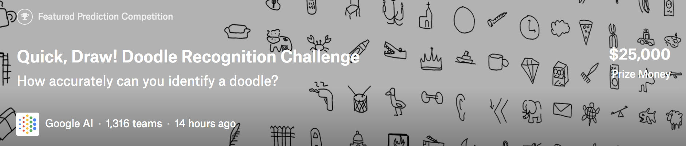
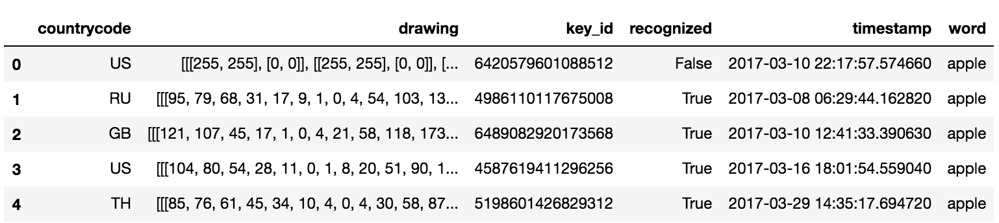
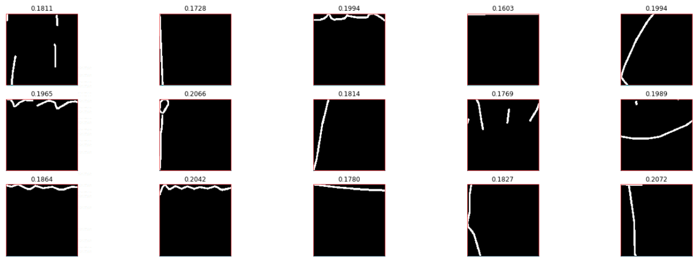
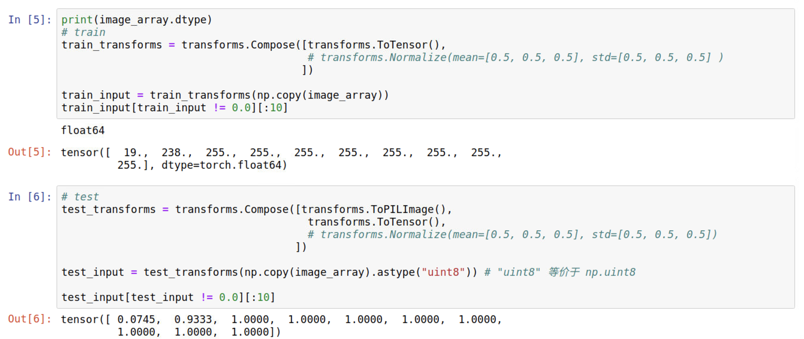

<center>

</center>

这个比赛于12.05早上结束，最终结果是排在69/1316、铜牌，离银牌区差4名，还是比较遗憾的。不过这是我第一次花大量时间和精力在图像分类问题上，作为一个小菜鸡能拿到牌还算满意。现在作个总结。另外本次比赛我的所有代码（带注释）已经开源([戳我](https://github.com/ShusenTang/kaggle-doodle-recognition))，有兴趣的可以看看，顺便给个star。


<!-- more -->


这篇博客主要记录我在这次比赛过程中学到的一些东西，由于是第一次花精力认真做图像类的比赛所以学到的东西还是很多的。此外还会总结一下排在前列的大佬们在讨论区分享的他们的方案，留作日后参考。

# 1. 赛题简述
## 1.1 数据集
还记得前段时间很火的微信小程序“猜画小歌”吗，[这个比赛](https://www.kaggle.com/c/quickdraw-doodle-recognition)的数据就来自这个小程序的网页版[Quick, Draw!](https://quickdraw.withgoogle.com/)，游戏提示用户绘制描绘特定类别的涂鸦，例如“香蕉”，“桌子”等，所以Google通过这个小游戏收集了来自世界各地的涂鸦数据, 数据集所有信息都可见此数据集的[官方仓库](https://github.com/googlecreativelab/quickdraw-dataset#the-raw-moderated-dataset)。本次比赛使用了340类一共约五千万个样本。

主办方给了两个版本的训练集，raw 和 simplified，都是以csv文件的形式给出的。raw版本就是原始收集到的数据各字段如下所示:

| Key          | Type                   | Description                                  |
| ------------ | -----------------------| -------------------------------------------- |
| key_id       | 64-bit unsigned integer| 独一无二的样本ID     |
| word         | string                 | 样本所属类别    |
| recognized   | bool               | 样本是否被游戏识别 |
| timestamp    | datetime             | 样本创建时间                |
| countrycode  | string                 | player所在国家代码([ISO 3166-1 alpha-2](https://en.wikipedia.org/wiki/ISO_3166-1_alpha-2))|
| drawing      | string                 | 涂鸦数据信息 |  

其中drawing字段就是涂鸦数据，包含坐标和时间信息，示例如下:
```
[ 
  [  // First stroke 
    [x0, x1, x2, x3, ...],
    [y0, y1, y2, y3, ...],
    [t0, t1, t2, t3, ...]
  ],
  [  // Second stroke
    [x0, x1, x2, x3, ...],
    [y0, y1, y2, y3, ...],
    [t0, t1, t2, t3, ...]
  ],
  ... // Additional strokes
]
```

raw版本的数据集很大而且很多冗余信息，所以大多数选手(包括我)都是用的simplified版本作为主要训练集，simplified数据集去掉了时间信息和冗余的坐标信息(比如两点确定一条线段，那么线段中间的点就是冗余的)并将坐标进行了scale，具体处理方式如下:   
* scaled 的坐标数据进行了左上对齐，最小值为0最大值为255.
* 进行了重采样使坐标都是0-255的整数.
* 去除冗余坐标使用的是Ramer–Douglas–Peucker算法，epsilon设为2.0；

simplified数据集示例如下图所示:
<center>
    
    <br>
    <div style="border-bottom: 1px solid #d9d9d9;
    display: inline-block;
    color: #999;">图1.1</div>
</center>

更多信息可见此数据集的[官方仓库](https://github.com/googlecreativelab/quickdraw-dataset#the-raw-moderated-dataset)，这里就不赘述了。

## 1.2 赛题任务
本题的任务就是预测测试集涂鸦属于哪个类别，是一个单分类问题。此题的难度在于，由于训练数据来自游戏本身，涂鸦样本可能不完整而且可能与标签不符，噪声比较多，如图1.2所示([图片来源](https://www.kaggle.com/gaborfodor/un-recognized-drawings/output))。选手需要构建一个识别器，可以有效地从这些噪声数据中学习得到模型。
<center>
    
    <br>
    <div style="border-bottom: 1px solid #d9d9d9;
    display: inline-block;
    color: #999;">图1.2</div>
</center>

上图就是训练集中属于“蚊子”类别的数据示例，绿色是被标记为"可识别"的样本，红色是被标记为"不可识别"的样本，可以看到不管是可识别还是不可识别的样本，都存在噪声的情况。

## 1.3 评价指标
虽然是一个单分类问题，但是对于每一个样本，我们需要提交最有可能的3个预测结果(按可能性从大到小排)，评价指标是Mean Average Precision @ 3 (MAP@3):
$$
\text{MAP@3} = \frac { 1 } { U } \sum _ { u = 1 } ^ { U } \sum _ { k = 1 } ^ { m i n ( n , 3 ) } P ( k )
$$
其中 $U$ 是测试集样本总数，$n$ 是每个样本的预测值总数，$P(k)$ 是前 $k$ 个结果中准确率, 具体可参见[这个kernel](https://www.kaggle.com/wendykan/map-k-demo)，另外计算代码可参考[这里](https://github.com/benhamner/Metrics/blob/master/Python/ml_metrics/average_precision.py)。简单点讲，在提交的三个预测结果中，真实结果越靠前分数就越高。


# 2. 我的方案
可见此题的数据是序列数据，所以最先想到可以用RNN，当然把数据渲染成图片也可以用CNN。根据我的实际实验，RNN的效果并不好（应该是我网络结构没设计好，讨论区有人提到用RNN也可以达到不错的效果），所以就采用了CNN相关模型，后来又merge了队友，最终的69名(PB 0.94223)是队友的提交结果，我的提交结果(PB 0.94185)应该是73名。

## 2.1 数据相关
### 2.1.1 打乱原始文件
题目给的数据是每一类一个csv文件，一共有340类，每一类有十多万个样本，即使是使用simplified数据集，总的csv文件大小也达到了20G+的级别，所以一次性读进内存肯定是不行的。
我首先采用了[这个kernel](https://www.kaggle.com/gaborfodor/shuffle-csvs)将340个csv文件混合在一起然后再随机分成100份分别存储，这样每一份里面的每一个样本的类别都是随机的。思路就是根据key_id的值产生一个0-99的伪随机数cv，然后cv就觉定当前样本应该放在哪个文件，最后再将每个文件里的样本顺序打乱。其核心代码如下:

(1) 决定某个样本应该存放在哪个文件:
``` python
for y, cat in tqdm(enumerate(categories)): # 共340个类别
    df = s.read_training_csv(cat) # df就为当前类别的csv
    df['y'] = y # y为 0~339 的数字，相当于对类别进行了LabelEncode
    df['cv'] = (df.key_id // 10 ** 7) % NCSVS  # NCSVS = 100, cv决定了应该放在哪一个文件中
    for k in range(NCSVS):
        filename = INPUT_PATH + '/shuffled_csv/train_%d_%d.csv'%(k+1, NCSVS)
        chunk = df[df.cv == k] # 得到df中cv=k的样本，应该存放在当前文件中
        chunk = chunk.drop(['key_id'], axis=1)
        if y == 0: # 新建文件
            chunk.to_csv(filename, index=False)
        else: # mode='a': 附加写 方式打开文件
            chunk.to_csv(filename, mode='a', header=False, index=False) 
``` 
(2) 将每个文件中的样本顺序打乱:
``` python
for k in tqdm(range(NCSVS)):
    filename = INPUT_PATH + '/shuffled_csv/train_%d_%d.csv'%(k+1, NCSVS)
    if os.path.exists(filename):
        df = pd.read_csv(filename)
        df['rnd'] = np.random.rand(len(df)) # 给每个样本一个随机数
        df = df.sort_values(by='rnd').drop('rnd', axis=1)
        df.to_csv(filename + '.gz', compression='gzip', index=False) # 以压缩的方式存储csv
        os.remove(filename)
```
这样处理后，原始simplified数据集中340个共20G+的csv文件被处理成100个csv共7G+，而且每个文件里的样本不是属于同一类而是随机的，这就方便后续的数据读取了。上面完整的代码见我的[仓库](https://github.com/ShusenTang/kaggle-doodle-recognition/blob/master/shuffle_csv.ipynb)。

### 2.1.2 多进程读取
经过2.1.1处理后的数据就可以很方便地直接用了，我们可以考虑并行读取使读取更快:
``` python 
def read_one_df_file(df_file):
    """定义一个读取一个csv的函数，这个函数会当做参数传入下面的并行处理的函数"""
    unused_cols = ["countrycode", "recognized", "timestamp", "cv"]
    name = df_file.split('_')[-2]
    print('%s ' % (name), end = ' ', flush=True)
    df = pd.read_csv(df_file)
    drop_cols = [col for col in unused_cols if col in df.columns]
    if len(drop_cols) > 0:
        df = df.drop(drop_cols, axis=1)
    return df


def multi_thread_read_df_files(df_files, processes=32):
    """并行读取多个csv并组成一个大的bigdf"""
    start = dt.datetime.now()
    pool = Pool(processes=processes) # from multiprocessing import Pool
    dfs = pool.map(read_one_df_file, df_files)
    pool.close()
    pool.join()
    end = dt.datetime.now()
    print("\nTotal time:", (end - start).seconds, "seconds")
    
    big_df = pd.concat(dfs, ignore_index=False, sort=False)
    big_df.reset_index(drop=True, inplace=True)
    
    return big_df
```
上面的完整代码见我的[仓库里的data_loader.py](https://github.com/ShusenTang/kaggle-doodle-recognition/blob/master/data_loader.py)，另外多进程的学习可参考[此处](https://morvanzhou.github.io/tutorials/python-basic/multiprocessing/5-pool/)。

## 2.1.3 outliers
由图1.2知训练数据中有很多噪声，如何衡量噪声并去除这些噪声数据（outliers）呢？
kernel [sketch entropy](https://www.kaggle.com/sorokin/sketch-entropy)提出用熵（entropy）来找出这些outliers, 即把entropy低于和高于某阈值的样本视为outliers。

先来看看如何计算entropy：
``` python
def entropy_it(x):
    counts = np.bincount(x) # 计算x中 0-255这些数字的出现次数
    p = counts[counts > 0] / float(len(x)) # 归一化成概率
    # compute Shannon entropy in bits
    return -np.sum(p * np.log2(p))
```
直观理解，如果一张图片上的信息很少例如像素值几乎完全一样，那么归一化后的概率p就几乎是一个one hot的向量，这样 `-np.sum(p * np.log2(p))` 就几乎得0；相反地，如果图片上的信息很丰富，像素分布比较均匀，那么p就是一个每个元素几乎都相等的向量，这样算出来的entropy就比较大。

例如训练集样本entropy低于和高于99%样本的示例分别如下：
<center>
    
    
    <br>
    <div style="border-bottom: 1px solid #d9d9d9;
    display: inline-block;
    color: #999;">图2.1</div>
</center>

但是我最终并没有按照此方法去掉这些“outliers”，主要是出于以下考虑：
* 训练集很大，接近五千万，所以数据噪声对模型的影响应该有限；
* 按照此方法可得出测试集中也有一些噪声；
* 按照此方法得出的不一定就是噪声，例如图2.1第一排第一个应该是‘雨滴’，最后一排第三个应该是‘龙卷风’。
* 时间不够了，如果时间够的话我肯定会试一下。

这个kernel的作者也在讨论中提到：
> Be careful, do not remove unusual samples from training. In my recipe I use a curriculum learning, i.e. increase the amount of outliers at each new epoch.

虽然我最后并没有用这个方法，但是却提供了一个去噪的好思路。本节的完整代码见我的[仓库中的sketch_entropy notebook](https://github.com/ShusenTang/kaggle-doodle-recognition/blob/master/sketch_entropy.ipynb)。

## 2.2 模型
### 2.2.1 模型结构
本次比赛我最后采用的结构是xception（完整代码见[此处](https://github.com/ShusenTang/kaggle-doodle-recognition/blob/master/xception.py)），用的是[pretrainedmodels](https://github.com/Cadene/pretrained-models.pytorch)库,这个库有主流模型的pytorch的实现，直接用就是，特别方便。代码如下
``` python
from pretrainedmodels.models.xception import Xception
xception_path = "/YOUR_PATH/pytorch/xception-43020ad28.pth"

def create_model(num_classes=340, model_func=Xception, pretrained_path=xception_path):
    model = model_func(num_classes=1000)
    
    # imageNet预训练参数，真的有用吗？
    model.load_state_dict(torch.load(pretrained_path))
    
    # 修改最后的fc层
    fc_in_feas = model.fc.in_features
    model.fc = nn.Linear(fc_in_feas, num_classes)
    model.last_linear = model.fc # pretrainedmodels这个包里的模型作forward时使用的是last_linear
    return model
```
### 2.2.2 梯度累积trick
我们知道，一般来说，增大batch size会使最终的预测效果变得更好，但是GPU显存是有限的不可能无限增大batch size，这时候梯度累积就派上用场了。
简单来说，梯度累积就是累积多个batch的梯度然后一次更新参数，而不是常用的一个batch更新一次，亲测在小数据集上是有效果提升的（本次比赛数据集size很大，但我也用了这个trick，没有和不用这个trick做比较）。参考[这里](https://discuss.pytorch.org/t/how-to-implement-accumulated-gradient/3822)Gopal_Sharma的系列回答，我写了如下代码：
``` python 
# loss, preds, step_acc = train_step(model, inputs, labels, criterion, optimizer)
################# 将batch_accumulate_size个batch的梯度积累起来,只在最后一次更新网络参数 ###################
inputs = inputs.to(DEVICE, dtype=torch.float)
labels = labels.to(DEVICE, dtype=torch.float)
if step % batch_accumulate_size == 0: 
    optimizer.zero_grad()
with torch.set_grad_enabled(True):
    # forward
    outputs = model(inputs)
    loss = criterion(outputs, labels.long()) / batch_accumulate_size # 一定要除以这个size,原因见上面链接的讨论
    loss.backward()

    _, preds = torch.max(outputs, 1)
correct_num = torch.sum(preds == labels.long())
step_acc = correct_num.double() / inputs.size(0) 
    
if (step + 1) % batch_accumulate_size == 0:
    optimizer.step() # 只在最后一次更新网络参数

loss = batch_accumulate_size * loss.item() # 转换为数字方便后面用visdom画图
step_acc = step_acc.item()
########################################################################################
```

### 2.2.3 多GPU
pytorch实现多GPU还是比较方便的，只需要加上一行代码即可：
``` python
model = create_model()
multi_gpu_model = nn.DataParallel(model)
```
需要注意的是，使用了`DataParallel(model)`的模型在保存的时候会在参数的key前面加上“module.”，所以如果使用单GPU时加载多GPU保存的模型参数时会报错`KeyError: 'unexpected key "module.xx.weight" in state_dict' `，正确的处理方式如下：
``` python
from collections import OrderedDict

pretrained_net_dict = torch.load(best_model_path)
if hps.gpus == 1 and list(pretrained_net_dict.keys())[0][:6] == "module":
# 如果当前是单GPU但是保存的模型是多GPU，那就要去掉每个key的前缀"module."
    new_state_dict = OrderedDict()
    for k, v in pretrained_net_dict.items():
        name = k[7:] # remove "module."
        new_state_dict[name] = v
    # load params
    model.load_state_dict(new_state_dict)
else:
    model.load_state_dict(pretrained_net_dict)
```
### 2.2.4 图像数据的一个坑
本节的notebook见[此处](https://github.com/ShusenTang/kaggle-doodle-recognition/blob/master/bug.ipynb)。

事情的起因是这样的，我在训练的时候没有进行数据增强(只用了`toTensor`和`Normalize`两个transform)，而我在测试的时候想用一下用[torchvision](https://pytorch.org/docs/stable/torchvision/transforms.html)自带的一些图片增强的transform(例如`CenterCrop、RandomHorizontalFlip、RandomRotation`等等)，但是这些transform要求输入的是PIL图片，所以我在测试的时候就用了如下代码将image array转成了PIL图片：
``` python
PIL_image = Image.fromarray(image_array.astype('uint8'), 'RGB')
```
但最后测试出来的结果与验证时完全不一样，模型基本上是靠猜。这是为什么呢？仔细看看下面这个图就知道了。
<center>
    
    <br>
    <div style="border-bottom: 1px solid #d9d9d9;
    display: inline-block;
    color: #999;">图2.2</div>
</center>

由图2.2可知，训练和测试的时候数据取值范围都变了，网络预测结果当然就很差了。
先来看看`ToTensor`的[官方文档](https://pytorch.org/docs/stable/torchvision/transforms.html):
> 
```
torchvision.transforms.ToTensor
Convert a PIL Image or numpy.ndarray to tensor.
Converts a PIL Image or numpy.ndarray (H x W x C) in the range [0, 255] to a torch.FloatTensor of shape (C x H x W) in the range [0.0, 1.0].
```
可见`ToTensor`将输入的0-255的数据scale到0-1并且还调整了一下维度顺序，那为什么图2.2的训练输入还是0-255呢? 问题就出在数据的类型上面，训练时，原始图片数据`iamge_array`的类型是float64(而不是`ToTensor`期待的uint8)，经过`ToTensor`转换后数值大小不会变依然是0-255只是调了一下维度顺序。而测试的时候，由于`ToPILImage`强制要求输入类型是uint8，所以先将输入转换成了uint8格式，所以就正确的被scale到了0-1。

总结一下，由于像素值为0到255的整数，所以刚好是uint8所能表示的范围，而很多关于图片的函数就默认输入的是uint8型，若不是，可能不会报错但的可能得不到想要的结果。<font color=red>所以，如果用像素值(0-255整数)表示图片数据，那么一律将其类型设置成uint8，避免不必要的bug </font>。


# 3. top方案
## 3.1 1st place solution
第一名的方案由现在排在所有kaggle用户第五的超级大佬[Pavel Pleskov](https://www.kaggle.com/ppleskov)贡献，原文见[此处](https://www.kaggle.com/c/quickdraw-doodle-recognition/discussion/73738)。
### 3.1.1 模型结构
刚开始，Pavel训练了很多分类模型：resnet18, resnet34, resnet50, resnet101, resnet152, resnext50, resnext101, densenet121, densenet201, vgg11, pnasnet, incresnet, polynet, nasnetmobile, senet154, seresnet50, seresnext50, seresnext101。
此外，数据预处理尝试了1个和3个通道的输入、image size从112逐渐增大到256。
大约40个模型中，最优的模型得到了0.946的分数，这个单一模型就可以拿到金牌了。
> 可以看到，这种类型的比赛如果前期能花大量时间尝试不同的模型，那基本就能保证奖牌了，甚至金牌。

### 3.1.2 ensemble
为了将多个模型的输出集成起来，粗暴一点就是直接将输出的概率值求平均再取top3即得到最终的输出(也就是blend)。怎样将多个模型的结果ensemble在一起呢？
因为一共340类，所以每一个模型对每个样本都会输出340个概率值，如果将每个概率值作为ensemble的feature，假设一共有8个模型，那么一个样本就有340x8个feature，这个特征维度有点大了而且其中很多都是接近0的值。

Pavel的思路是:
> for each sample and for each model you collect top 10 probabilities with the labels, then convert them into 10 samples with the binary outcome - whether this is a correct label or not (9 negative examples + 1 positive). It's easy to feed such a dataset to any booster because the number of features will be small (equal to the number of models). 

大概意思是将ensemble转换成一个二分类问题: 根据8(模型数)个概率值判断是不是label(例如这8个概率值都大于0.8，那么几乎可以肯定这就是label)。详细来讲，LGBM的特征维度等于模型数(每个特征就代表一个模型的输出概率)，而样本数将会是原始样本数的10倍。[21st place solution](https://www.kaggle.com/c/quickdraw-doodle-recognition/discussion/73754)也用到了这个方法，比直接平均得到的分数要高。
> 但是我有一点不明白的是如何找这个top10，因为对于mode1它的输出概率值top10可能是class0-9，对于model2它的输出概率值top10可能是class1-10，这样就对应不上了。但是我倒是有一个思路那就是先对8个模型的输出概率求个平均再取top10([21st place solution](https://www.kaggle.com/c/quickdraw-doodle-recognition/discussion/73754)貌似使用的最好的model来预测出top10)。例如8个模型对于某张涂鸦图片的平均输出概率top10是O1、O2...O10，那么这就能产生10个LGBM的输入样本，会得到10个输出(是0-1的概率值)，取最大的三个即最终这个涂鸦样本的结果。

### 3.1.3 Predictions balancing trick
Heng CherKeng发现，测试集中的groundtruth分布应该是均匀的，而且发现 (112199+1)/340=330 (训练集样本数加1除以类别数得330)。这一点很重要，通过对模型输出的概率按照此规律进行后处理，平均给每个模型带来了0.7%的提升。那么如何进行后处理呢? Pavel给出的算法是：对于当前最多的预测类别,将所有这个类别对应的概率不断减去一个很小的数直到这个类别不是最多的，重复上述过程直到预测类别差不多均匀。Pavel在之前的比赛也用到了这个算法([代码见此处](https://github.com/PavelOstyakov/camera_identification/blob/master/camera/postprocessing.py))，代码原理和刚刚说的略有不同，算法步骤如下:
1. 先对每一种类别赋一个初始为1的系数coefficients，当前预测概率等于实际概率乘以对应的系数；
2. 计算每种类别的数目，按照这个数目再计算一个score，逻辑是预测越均匀score就越大;
3. 对最多的类别label，执行`coefficients[label] -= alpha`；
4. 若还没达到最大迭代次数，就继续执行2、3，执行过程中记录最大的score对应的coefficients，迭代完成后返回这个coefficients。

上述的score计算过程如下:
``` python
def _compute_score_with_coefficients(predicts, coefficients):
    _, counter = _get_labels_distribution(predicts, coefficients) # 计算每种类别的数目

    # 按照下面的计算过程，当预测是均匀的时，score达到最大340
    score = 0.
    for label in range(NCATS): # NCATS=340
        score += min(NCATS * float(counter[label]) / len(predicts), 1.0)
    return score
```
Pavel Ostyakov写的此算法的pytorch版[见此处](https://github.com/PavelOstyakov/predictions_balancing)。

## 3.2 5th place solution
### 3.2.1 总体流程
第五名的方案由[Artur Ispiriants](https://www.kaggle.com/aispiriants)和[Mykhailo Matviiv](https://www.kaggle.com/firenero)贡献，原文见[此处](https://www.kaggle.com/c/quickdraw-doodle-recognition/discussion/73708)。

Artur Ispiriants先将每个样本从CSV文件提取出来，每个样本用一个二进制文件存放，这占用了大约400G的SSD，比较耗空间，但是方便后续各种模型的使用。

Artur一共训练了三个模型:
* Se-Resnext50
* DPN-92
* Se-Resnext101

每个模型都使用了在ImageNet上预训练的权重。图片尺寸使用了128、192、224、256，实验显示图片尺寸越大分数就越高，但是由于显存限制，尺寸越大就越难训练了。使用128的尺寸就能达到0.944的LB。

后来Artur Ispiriants merge了队友Mykhailo Matviiv，LB达到了约0.948，后来又使用了完整数据集里的时间信息:
1. 延迟时间
2. 每一笔的时间
3. 笔画数量

上述三个数据都被scale到0-255。使用了这三个信息后，LB提升到了0.951。

### 3.2.2 训练流程
由于数据集巨大，所以训练一个epoch就需要很长的时间，所以要经常保存模型，大约4-6个小时保存一下checkpoint。下面是Mykhailo Matviiv训练SE-ResNext101的流程：
* 图片尺寸取128x128训练网络直到收敛，这大概需要20个checkpoint，能达到0.945.
* 上一步得不到提升时，使用2.2.2节的梯度累积技术使batch size达到约3-4k，继续训练，模型进一步提升；
* 更进一步的提升就是在更大的图片尺寸(192然后256)进行fine tune。

### 3.2.3 trick
比赛使用的一些trick如下：
* 经常保存checkpoint带来的一个提升就是snapshot ensembling，即一个模型最终的预测输出是这个模型的几个checkpoint的综合。最后的输出是多个模型的平均blend。
* 伪标签。这个方法是比赛最后阶段的主要提分点。此时blend模型的分数为0.951，使用这个输出给测试集加上了label（预测的top1），然后(只)用这些带label的测试集fine tune所有模型10个epoch，挑选3个最佳的epoch blend得到了0.952的LB。然后再用新的输出给测试集加上label，再fine tune，分数就达到了0.953，然后由于种种原因没再进行了(作者说再进行可能会进一步提升)。我认为这个方法要避免过拟合，作者也说了要谨慎使用，可以考虑将带伪标签的测试集混合在训练集进行训练以减少过拟合的风险。

## 3.3 其他
### 3.3.1 RNN模型
单模型0.941的RNN模型: [1d CNN+LSTM](https://www.kaggle.com/c/quickdraw-doodle-recognition/discussion/73816#434040)

### 3.3.2 11th place solution
资源有限的情况下达到[第11名的方案](https://www.kaggle.com/c/quickdraw-doodle-recognition/discussion/73808)。

### 3.3.3 21st place solution
也使用了3.1.2所示的ensemble方法，[评论处](https://www.kaggle.com/c/quickdraw-doodle-recognition/discussion/73754)有具体的ensemble方法。

### 3.3.4 24th place solution
[24th solution](https://www.kaggle.com/c/quickdraw-doodle-recognition/discussion/73701), 用的keras，并用了keras封装好的梯度累积trick

### 3.3.5 10 lessons
46th的团队在[这里](https://towardsdatascience.com/10-lessons-learned-from-participating-to-google-ai-challenge-268b4aa87efa)给出了参加这个比赛得出的10条教训，有兴趣的可以去看看。

# 4. 总结
1. 比赛前期应该多多尝试不同的网络结构；
2. 这种超大数据集的图像类比赛，一般来讲就是网络越深、图片尺寸越大、batchsize越大，效果就越好；
3. 注意积累一些trick，例如梯度累积、伪标签、Predictions balancing等等；
4. 由于训练一个epoch时间漫长，所以每隔几个小时就保存一下模型是很有必要的，一个模型的预测输出应该是该模型几个checkpoint的输出的融合；
5. 多逛逛讨论区。
