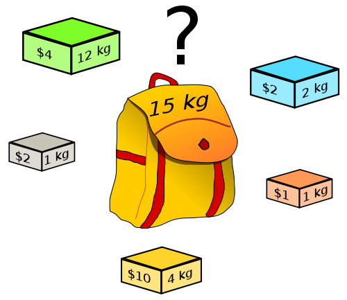
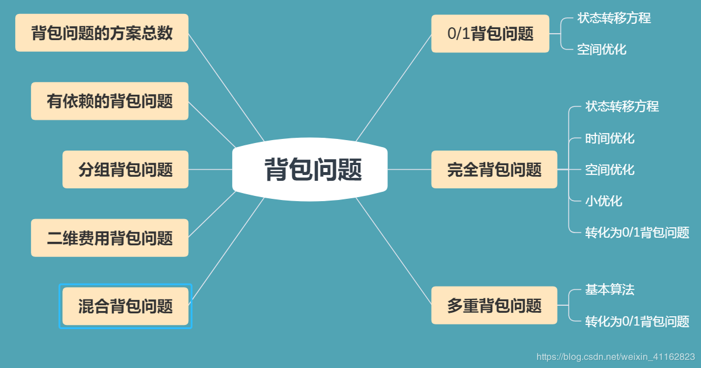

<center>

</center>

背包问题是一类经典的动态规划问题，它非常灵活，需要仔细琢磨体会，本文先对背包问题的几种常见类型作一个总结，然后再看看LeetCode上几个相关题目。

<!-- more -->

根据[维基百科](https://zh.wikipedia.org/wiki/%E8%83%8C%E5%8C%85%E9%97%AE%E9%A2%98)，背包问题（Knapsack problem）是一种组合优化的NP完全（NP-Complete，NPC）问题。问题可以描述为：给定一组物品，每种物品都有自己的重量和价格，在限定的总重量内，我们如何选择，才能使得物品的总价格最高。NPC问题是没有多项式时间复杂度的解法的，但是利用动态规划，我们可以以伪多项式时间复杂度求解背包问题。一般来讲，背包问题有以下几种分类：
1. 01背包问题
2. 完全背包问题
3. 多重背包问题

此外，还存在一些其他考法，例如恰好装满、求方案总数、求所有的方案等。本文接下来就分别讨论一下这些问题。


# 1. 01背包

## 1.1 题目
最基本的背包问题就是01背包问题（01 knapsack problem）：一共有N件物品，第i（i从1开始）件物品的重量为w[i]，价值为v[i]。在总重量不超过背包承载上限W的情况下，能够装入背包的最大价值是多少？

## 1.2 分析
如果采用暴力穷举的方式，每件物品都存在装入和不装入两种情况，所以总的时间复杂度是O(2^N)，这是不可接受的。而使用动态规划可以将复杂度降至O(NW)。我们的目标是书包内物品的总价值，而变量是物品和书包的限重，所以我们可定义状态dp:
```
dp[i][j]表示将前i件物品装进限重为j的背包可以获得的最大价值, 0<=i<=N, 0<=j<=W
```
那么我们可以将dp[0][0...W]初始化为0，表示将前0个物品（即没有物品）装入书包的最大价值为0。那么当 i > 0 时`dp[i][j]`有两种情况：
1. 不装入第i件物品，即`dp[i−1][j]`；
2. 装入第i件物品（前提是能装下），即`dp[i−1][j−w[i]] + v[i]`。

即状态转移方程为
```
dp[i][j] = max(dp[i−1][j], dp[i−1][j−w[i]]+v[i]) // j >= w[i]
```

由上述状态转移方程可知，`dp[i][j]`的值只与`dp[i-1][0,...,j-1]`有关，所以我们可以采用动态规划常用的方法（滚动数组）对空间进行优化（即去掉dp的第一维）。需要注意的是，为了防止上一层循环的`dp[0,...,j-1]`被覆盖，循环的时候 j 只能**逆向枚举**（空间优化前没有这个限制），伪代码为：
```
// 01背包问题伪代码(空间优化版)
dp[0,...,W] = 0
for i = 1,...,N
    for j = W,...,w[i] // 必须逆向枚举!!!
        dp[j] = max(dp[j], dp[j−w[i]]+v[i])
```
时间复杂度为O(NW), 空间复杂度为O(W)。由于W的值是W的位数的幂，所以这个时间复杂度是伪多项式时间。

动态规划的核心思想**避免重复计算**在01背包问题中体现得淋漓尽致。第i件物品装入或者不装入而获得的最大价值完全可以由前面i-1件物品的最大价值决定，暴力枚举忽略了这个事实。

# 2. 完全背包

## 2.1 题目
完全背包（unbounded knapsack problem）与01背包不同就是每种物品可以有无限多个：一共有N种物品，每种物品有无限多个，第i（i从1开始）种物品的重量为w[i]，价值为v[i]。在总重量不超过背包承载上限W的情况下，能够装入背包的最大价值是多少？

## 2.2 分析一
我们的目标和变量和01背包没有区别，所以我们可定义与01背包问题几乎完全相同的状态dp:
```
dp[i][j]表示将前i种物品装进限重为j的背包可以获得的最大价值, 0<=i<=N, 0<=j<=W
```
初始状态也是一样的，我们将dp[0][0...W]初始化为0，表示将前0种物品（即没有物品）装入书包的最大价值为0。那么当 i > 0 时`dp[i][j]`也有两种情况：
1. 不装入第i种物品，即`dp[i−1][j]`，同01背包；
2. 装入第i种物品，此时和01背包不太一样，因为每种物品有无限个（但注意书包限重是有限的），所以此时不应该转移到`dp[i−1][j−w[i]]`而应该转移到`dp[i][j−w[i]]`，即装入第i种商品后还可以再继续装入第种商品。

所以状态转移方程为
```
dp[i][j] = max(dp[i−1][j], dp[i][j−w[i]]+v[i]) // j >= w[i]
```
这个状态转移方程与01背包问题唯一不同就是max第二项不是dp[i-1]而是dp[i]。

和01背包问题类似，也可进行空间优化，优化后不同点在于这里的 j 只能**正向枚举**而01背包只能逆向枚举，因为这里的max第二项是`dp[i]`而01背包是`dp[i-1]`，即这里就是需要覆盖而01背包需要避免覆盖。所以伪代码如下：

```
// 完全背包问题思路一伪代码(空间优化版)
dp[0,...,W] = 0
for i = 1,...,N
    for j = w[i],...,W // 必须正向枚举!!!
        dp[j] = max(dp[j], dp[j−w[i]]+v[i])
```
由上述伪代码看出，01背包和完全背包问题此解法的空间优化版解法唯一不同就是前者的 j 只能逆向枚举而后者的 j 只能正向枚举，这是由二者的状态转移方程决定的。此解法时间复杂度为O(NW), 空间复杂度为O(W)。

## 2.3 分析二
除了分析一的思路外，完全背包还有一种常见的思路，但是复杂度高一些。我们从装入第 i 种物品多少件出发，01背包只有两种情况即取0件和取1件，而这里是取0件、1件、2件...直到超过限重（k > j/w[i]），所以状态转移方程为：
```
# k为装入第i种物品的件数, k <= j/w[i]
dp[i][j] = max{(dp[i-1][j − k*w[i]] + k*v[i]) for every k}
```
同理也可以进行空间优化，需要注意的是，这里max里面是`dp[i-1]`，和01背包一样，所以 j 必须**逆向枚举**，优化后伪代码为
```
// 完全背包问题思路二伪代码(空间优化版)
dp[0,...,W] = 0
for i = 1,...,N
    for j = W,...,w[i] // 必须逆向枚举!!!
        for k = [0, 1,..., j/w[i]]
            dp[j] = max(dp[j], dp[j−k*w[i]]+k*v[i])
```
相比于分析一，此种方法不是在O(1)时间求得dp[i][j]，所以总的时间复杂度就比分析一大些了，为 $O(NW \frac W {\bar{w}})$级别。

## 2.4 分析三、转换成01背包
01背包问题是最基本的背包问题，我们可以考虑把完全背包问题转化为01背包问题来解：将一种物品转换成若干件只能装入0件或者1件的01背包中的物品。

最简单的想法是，考虑到第 i 种物品最多装入 W/w[i] 件，于是可以把第 i 种物品转化为 W/w[i] 件费用及价值均不变的物品，然后求解这个01背包问题。

更高效的转化方法是采用二进制的思想：把第 i 种物品拆成重量为 $w_i 2^k$、价值为 $v_i 2^k$ 的若干件物品，其中 k 取遍满足 $w_i 2^k \le W$ 的非负整数。这是因为不管最优策略选几件第 i 种物品，总可以表示成若干个刚才这些物品的和（例：13 = 1 + 4 + 8）。这样就将转换后的物品数目降成了对数级别。


# 3. 多重背包
## 3.1 题目
多重背包（bounded knapsack problem）与前面不同就是每种物品是有限个：一共有N种物品，第i（i从1开始）种物品的数量为n[i]，重量为w[i]，价值为v[i]。在总重量不超过背包承载上限W的情况下，能够装入背包的最大价值是多少？

## 3.2 分析一
此时的分析和完全背包的分析二差不多，也是从装入第 i 种物品多少件出发：装入第i种物品0件、1件、...n[i]件（还要满足不超过限重）。所以状态方程为：
```
# k为装入第i种物品的件数, k <= min(n[i], j/w[i])
dp[i][j] = max{(dp[i-1][j − k*w[i]] + k*v[i]) for every k}
```
同理也可以进行空间优化，而且 j 也必须**逆向枚举**，优化后伪代码为
```
// 完全背包问题思路二伪代码(空间优化版)
dp[0,...,W] = 0
for i = 1,...,N
    for j = W,...,w[i] // 必须逆向枚举!!!
        for k = [0, 1,..., min(n[i], j/w[i])]
            dp[j] = max(dp[j], dp[j−k*w[i]]+k*v[i])
```
总的时间复杂度约为 $O(NW{\bar{n}}) = O(W \sum_i {n_i})$ 级别。

## 3.3 分析二、转换成01背包
采用2.4节类似的思路可以将多重背包转换成01背包问题，采用二进制思路将第 i 种物品分成了 $O(logn_i)$ 件物品，将原问题转化为了复杂度为 $O(W \sum_i{logn_i})$ 的 01 背包问题，相对于分析一是很大的改进。

# 4. 其他情形

除了上述三种基本的背包问题外，还有一些其他的变种，如下图所示（[图片来源](https://blog.csdn.net/weixin_41162823/article/details/87878853)）。

<center>
    
</center>

本节列举几种比较常见的。

## 4.1 恰好装满

背包问题有时候还有一个限制就是必须恰好装满背包，此时基本思路没有区别，只是在初始化的时候有所不同。

如果没有恰好装满背包的限制，我们将dp全部初始化成0就可以了。因为任何容量的背包都有一个合法解“什么都不装”，这个解的价值为0，所以初始时状态的值也就全部为0了。如果有恰好装满的限制，那只应该将dp[0,...,N][0]初始为0，其它dp值均初始化为`-inf`，因为此时只有容量为0的背包可以在什么也不装情况下被“恰好装满”，其它容量的背包初始均没有合法的解，应该被初始化为`-inf`。

## 4.2 求方案总数

除了在给定每个物品的价值后求可得到的最大价值外，还有一类问题是问装满背包或将背包装至某一指定容量的方案总数。对于这类问题，需要将状态转移方程中的 max 改成 sum ，大体思路是不变的。例如若每件物品均是完全背包中的物品，转移方程即为
```
dp[i][j] = sum(dp[i−1][j], dp[i][j−w[i]]) // j >= w[i]
```

## 4.3 求最优方案

一般而言，背包问题是要求一个最优值，如果要求输出这个最优值的方案，可以参照一般动态规划问题输出方案的方法：记录下每个状态的最优值是由哪一个策略推出来的，这样便可根据这条策略找到上一个状态，从上一个状态接着向前推即可。

以01背包为例，我们可以再用一个数组G[i][j]来记录方案，设 `G[i][j] = 0 `表示计算 dp[i][j] 的值时是采用了max中的前一项(也即dp[i−1][j])，`G[i][j] = 1` 表示采用了方程的后一项。即分别表示了两种策略: 未装入第 i 个物品及装了第 i 个物品。其实我们也可以直接从求好的dp[i][j]反推方案：若 `dp[i][j] = dp[i−1][j]` 说明未选第i个物品，反之说明选了。


# 5. LeetCode相关题目

本节选取几个LeetCode上面的背包问题进行讨论。

## 5.1 Partition Equal Subset Sum（分割等和子集）
[416. Partition Equal Subset Sum（分割等和子集）](https://leetcode.com/problems/partition-equal-subset-sum/)

题目给定一个只包含正整数的非空数组。问是否可以将这个数组分割成两个子集，使得两个子集的元素和相等。

由于所有元素的和sum已知，所以两个子集的和都应该是sum/2（所以前提是sum不能是奇数），即题目转换成从这个数组里面选取一些元素使这些元素和为sum/2。如果我们将所有元素的值看做是物品的重量，每件物品价值都为1，所以这就是一个恰好装满的01背包问题。

我们定义空间优化后的状态数组dp，由于是恰好装满，所以应该将dp[0]初始化为0而将其他全部初始化为`INT_MIN`，然后按照类似1.2节的伪代码更新dp：
``` C++
int capacity = sum / 2;
vector<int>dp(capacity + 1, INT_MIN);
dp[0] = 0;
for(int i = 1; i <= n; i++)
    for(int j = capacity; j >= nums[i-1]; j--)
        dp[j] = max(dp[j], 1 + dp[j - nums[i-1]]);
```

更新完毕后，如果dp[sum/2]大于0说明满足题意。

由于此题最后求的是能不能进行划分，所以dp的每个元素定义成bool型就可以了，然后将dp[0]初始为true其他初始化为false，而转移方程就应该是用或操作而不是max操作。完整代码如下：
``` C++
bool canPartition(vector<int>& nums) {
    int sum = 0, n = nums.size();
    for(int &num: nums) sum += num;
    if(sum % 2) return false;
    
    int capacity = sum / 2;
    vector<bool>dp(capacity + 1, false);
    dp[0] = true;
    for(int i = 1; i <= n; i++)
        for(int j = capacity; j >= nums[i-1]; j--)
            dp[j] = dp[j] || dp[j - nums[i-1]];
        
    return dp[capacity];
}
```

> 另外此题还有一个更巧妙更快的解法，基本思路是用一个bisets来记录所有可能子集的和，详见[我的Github](https://github.com/ShusenTang/LeetCode/blob/master/solutions/416.%20Partition%20Equal%20Subset%20Sum.md)。

## 5.2 Coin Change（零钱兑换）
TODO

## 5.3 Target Sum（目标和）
TODO

## 5.4 Ones and Zeros（一和零）
TODO

# 6. 总结

本文讨论了几类背包问题及LeetCode相关题目，其中01背包问题和完全背包问题是最常考的，另外还需要注意一些其他变种例如恰好装满、求方案总数等等。除了本文讨论的这些背包问题之外，还存在一些其他的变种，但只要深刻领会本文所列的背包问题的思路和状态转移方程，遇到其它的变形问题，应该也不难想出算法。如果想更加详细地理解背包问题，推荐阅读经典的[背包问题九讲](https://github.com/tianyicui/pack/blob/master/V2.pdf)。

# 参考
* [背包问题 - 维基百科](https://zh.wikipedia.org/wiki/%E8%83%8C%E5%8C%85%E9%97%AE%E9%A2%98)
* [背包问题-笔记整理](https://blog.csdn.net/weixin_41162823/article/details/87878853)
* [动态规划与贪婪法题16：背包问题总结 - CSDN](https://blog.csdn.net/kk55guang2/article/details/86179068)
* [背包问题九讲2.0 - 崔添翼](https://github.com/tianyicui/pack/blob/master/V2.pdf)


------------------
更多我的LeetCode中文题解，可前往GitHub查看：https://github.com/ShusenTang/LeetCode
