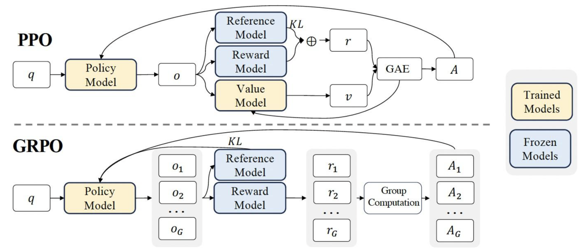
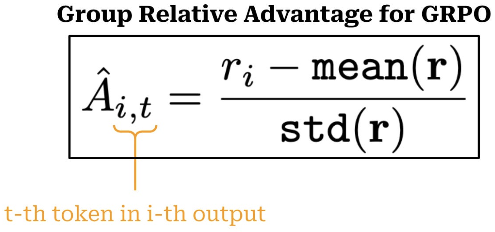
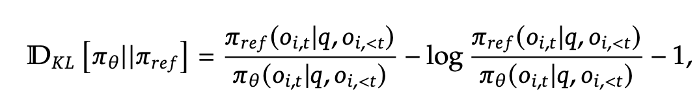
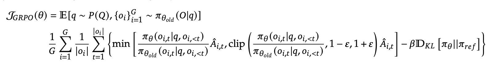

在LLM训练场景中，一般在监督微调（SFT）阶段之后，需要通过强化学习对模型进一步优化，让模型生成符合人类偏好的内容。

<!-- more -->

> 阅读本文需要具备一些强化学习基础，可先阅读[强化学习基础与经典算法](/2026/06/21/rl-basic/)。

# 引言

## 基本概念

这里简单回顾一些基本概念：

- **奖励R**：R即为Reward，指智能体在环境的某一状态下所获得的**真实**反馈**即时奖励**，通常情况下只有当语言模型完整回答后才会有即时奖励，中间状态没有。
- **价值V**：奖励 R 是**真实的、来自外部的信号**（比如人类打分），相对应的，**价值（value）是对未来奖励的估计**——因为模型不能预知未来，只能靠猜。
- **状态价值$V(s_t)$**：在 $s_t$ 状态下，继续生成后续内容，期望能获得的奖励。一般由评论家模型预估得到。
- **动作价值$Q(s_t,a)$**：如果我现在处于状态 $s_t$（比如上下文是“今天过得”），并选择动作 a（比如生成“不”），那么我能获得的即时奖励（通常是 0，因为回复还没结束），再加上未来所有状态价值的折现和，即$Q(s_t, a) = R_t + \gamma V_{t+1} + \gamma^2 V_{t+2}+...$ 。
- **优势A**：即Advantage，优势函数通常定义为A(s, a) = Q(s,a) - V(s)，直观上，优势函数反映了当前动作相对于该状态下平均策略动作的“优势”程度。

## 优势估计

优势函数 $A_t = Q(s_t, a_t) - V(s_t)$，衡量的是"在状态 $s_t$ 下选择动作 $a_t$ 比平均水平好多少"。问题是 Q 和 V 我们都没有真实值，只能估计。不同的估计方式在偏差（bias）和方差（variance） 之间存在取舍。

### 方法一：时序差分（1步估计）

时序差分（TD）法结合即时奖励和当前时刻的状态价值估计和下一个状态的价值估计值来更新当前的价值估计。
$$A(s,a) = \delta_t = r_t + \gamma V(s_{t+1}) - V(s_t)$$
其中，$\delta_t$ 就是时序差分误差， r 是当前状态s采取动作a所得到的即时奖励，$\gamma$ 是折扣因子。
优缺点：
- 只看一步（适合在线学习），依赖 Critic 的估计 $V(s_{t+1})$
- 低方差（只涉及一步随机性），但高偏差（Critic 估计不准时误差会传导）

### 方法二：蒙特卡洛方法（全展开估计）
蒙特卡洛方法通过对完整的轨迹进行采样，计算实际的回报来对优势进行无偏估计：
$$A(s,a)  = \sum_{l=0}^{T-t-1} \gamma^l r_{t+l} - V(s_t) = R_t(s,a) - V(s_t)$$
其中，R(s,a)是从状态 _s_ 采取动作 _a_ 后获得的实际总回报。

- 用完整的实际回报，完全不依赖 Critic 对中间状态的估计
- 零偏差（用的是真实回报），但高方差（受整条轨迹上所有随机性影响）
- 只有在整个回合结束后才能得到估计结果，因此不能用于在线场景

### 广义优势估计GAE

 GAE结合上述两种方法进行 bias-variance tradeoff。GAE 的核心思想是：不只看一步，而是综合考虑未来多步的 TD 误差，并通过引入一个新参数 $\lambda$ (通常在 0 到 1 之间，实践常取0.95) 来对它们进行加权平均。
- 当 $\lambda = 0$ 时，GAE 只考虑单步 TD 误差，这对应于低方差、高偏差的情况。
- 当 $\lambda = 1$ 时，GAE 会考虑未来所有步的 TD 误差，这等价于蒙特卡洛方法，对应于高方差、低偏差的情况。

将前面的1步差分估计优势推广到k步：
- **1-step 优势估计**：$A_t^{(1)} = -V(s_t) + r_t + \gamma V(s_{t+1}) = \delta_t^V$

- **2-step 优势估计**：$A_t^{(2)} = -V(s_t) + r_t + \gamma r_{t+1} + \gamma^2 V(s_{t+2}) = \delta_t^V + \gamma \delta_{t+1}^V$

- **k-step 优势估计**：$A_t^{(k)} = \sum_{l=0}^{k-1} \gamma^l \delta_{t+l}^V$

为了综合不同步数的优势估计，引入衰减系数 $\lambda$ 对所有 k-step 优势进行几何加权平均（指数加权平均）：
$$
A_t^{GAE} = (1-\lambda) [A_t^{(1)} + \lambda A_t^{(2)} +  \lambda^2 A_t^{(3)} + ... ]
$$
代入k-step优势估计并运用等比数列求和可以得到
$$
A_t^{GAE} = \sum_{l=0}^{\infty} (\gamma\lambda)^l \delta_{t+l}
$$
 
注意观察这个式子，
- $\delta_t$：当前这一步的 TD 误差 $\delta_{t}$ 被完全计算在内，权重为 1。
- $(\gamma\lambda) \delta_{t+1}$: 下一步的 TD 误差 $\delta_{t+1}$ 也被考虑进来，但它的权重被折扣了两次：一次是常规的未来奖励折扣 $\gamma$，另一次是 GAE 的平衡因子 $\lambda$。
- $(\gamma\lambda)^2\delta_{t+2}$: 再下一步的 TD 误差 $\delta_{t+2}$ 被考虑，但其权重被进一步削减。
以此类推，来自更遥远未来的 TD 误差的“话语权”会以 $\gamma\lambda$ 的指数级速度衰减。

在代码实现中，不需要对每个 t 都去做求和，而是从后往前递推：
$${A}_t = \delta_t + \gamma\lambda \cdot {A}_{t+1}$$
伪代码：
``` python
delta_t = r_t + gamma * V(s_{t+1}) - V(s_t)
# 在 LLM 场景中，r_t = 0 (t < T-1), r_{T-1} = R (最终奖励)
deltas = torch.zeros(T)
for t in range(T):
    r_t = R if t == T - 1 else 0.0
    deltas[t] = r_t + gamma * values[t + 1] - values[t]
    
# 从后往前递推计算 GAE
advantages = torch.zeros(T)
advantages[T - 1] = deltas[T - 1]
for t in reversed(range(T - 1)):
    advantages[t] = deltas[t] + gamma * lam * advantages[t + 1]
```

# PPO

OpenAI于2017年提出的[PPO（Proximal Policy Optimization）](https://arxiv.org/abs/1707.06347)是 RLHF（基于人类反馈的强化学习）流程中的核心算法，PPO的目标是：**让大语言模型生成更受人类欢迎的回复**。

PPO一共涉及四个模型：

| 模型                                                     | 作用                                                                                                  | 是否训练     | 输入                                                | 输出                                                | 输出维度说明                         |
| ------------------------------------------------------ | --------------------------------------------------------------------------------------------------- | -------- | ------------------------------------------------- | ------------------------------------------------- | ------------------------------ |
| **Policy Model**<br>**策略模型**                           | SFT后的我们想要训练的目标模型                                                                                    | ✅        | prompt x（token IDs，长度 L）                          | 生成回复 $y=(a_1,…,a_T)$, <br>以及每个 token 的对数概率logprob | y: [T] ,  logprobs: [T]        |
| **Critic Model**<br>**评论家模型**<br><br>也叫Value Model价值模型 | 用来预估总收益，一般用SFT模型做初始化                                                                                | ✅        | 状态序列: concat(x, $y_{\leq t}$ )，（token IDs，长度 L+t） | 价值估计 V                                            | 对每个 t=0,…,T 输出一个值<br>总输出 [T+1] |
| **Reward Model**<br>**奖励模型**                           | 用来计算即时收益，提前用人工标注数据训练好的                                                                              | ❌ <br>冻结 | (x, y)（完整 prompt + response）                      | 标量奖励 R                                            | 标量（或 [1]）                      |
| **Reference Model**<br>**参考模型**                        | 用来增加一些“约束”防止训崩，一般就是SFT模型。<br>直观理解：我们希望训练出来的Actor模型既能符合人类喜好，又尽量让它和SFT模型不要差异太大（两个模型输出分布尽可能相似 => KL散度） | ❌ <br>冻结 | 和策略模型一样：prompt x（token IDs，长度 L）                  | 每个token的对数概率log-prob                              | [T]                            |

PPO主要分成两个阶段：采样与反馈（数据生成） + 策略学习（参数更新）

伪代码：
``` python
policy_model = load_model()

for k in range(20000):
    # 采样（生成回答和价值估计）
    prompts = sample_prompt()
    data = respond(policy_model, critic_model, prompts)
    # 反馈（计算奖励）
    rewards = reward_func(reward_model, data)
    
    # 策略学习（更新参数）
    for epoch in range(4):
        policy_model = train(policy_model, critic_model, prompts, data, rewards)
```

## 1. 采样与反馈（数据生成）

### 流程
采样：策略模型根据提示（prompt）输出token数为T的回答（response），以及评论家模型对回答的每一步输出预估收益V（是个向量）。
反馈：用冻结的奖励模型给response整体打分（标量），并利用【当前收益 = 当前即时收益 + 折现因子 * 未来收益】计算每一步的实际收益，注意中间态的即时收益为0。然后计算优势（advantage），表示在某个状态下执行某个动作比“平均水平”要好多少。

### 伪代码
``` python
trajectories = []
for x in prompts: # x: [L_x]
	# 1. 用当前策略生成回复 y 和 log-prob 
    y, logprobs = policy_model.generate_with_logprobs(x) # y: [T], logprobs: [T] 

    # 2. 构建状态序列 s_0 ... s_T 
    states = [torch.cat([x, y[:t]]) for t in range(len(y) + 1)] # len = T+1
    
    # 3. 用当前评论家估计每个状态的价值
    values = torch.stack([critic_model(s) for s in states]) # [T+1]
    
    # 4. 奖励模型打分
    R = reward_model(x, y) # scalar
    
    # 5. 计算回报：R_t = γ^{T−t} * R T_len = len(y) 
    returns = torch.zeros(T_len + 1) 
    returns[T_len] = R 
    for t in reversed(range(T_len)): 
        returns[t] = gamma * returns[t + 1] 
	
    # 6. 计算优势：A_t = R_t - V(s_t)，仅对 t=0..T-1 有效 
    # 这里使用了蒙特卡洛回报计算优势（即lambda=1的GAE）。实际实现中通常用 lambda = 0.95 来提升训练稳定性
    advantages = returns[:-1] - values[:-1] # [T] 

    # 7. 保存“旧”值（detach 阻断梯度） 
    trajectories.append({
        'x': x, 'y': y, 
        'logprobs_old': logprobs.detach(), # [T] , old后缀表示是采样阶段得到的,而不是在学习阶段得到的
        'values_old': values.detach(),     # [T+1] 
        'advantages': advantages.detach(), # [T] 
        'returns': returns.detach()        # [T+1] 
    })
```
此阶段结束时，我们得到一个**固定的数据集**，后续训练将在此数据上多次迭代。

## 2. 策略学习（策略和评论家模型更新）

### 学习目标

利用阶段 1 收集的数据，**更新策略模型（Policy）和评论家模型（Critic）**，使得：
- 策略模型更倾向于选择高优势的动作（需要clip以避免策略突变）；
- 同时通过和参考模型计算 **KL正则** 防止策略偏离初始SFT模型太远。
- 另外评论家也需要不断更新来更准确地预测未来回报；

因此总的损失函数为三者加权和：$L_{total} = L_{PPO} + \beta L_{KL} + c_1 L_{value}$  


### 损失函数

#### （1）策略损失

为了使策略模型倾向于选择高优势的动作，直观上，我们可以构造如下损失函数：

$$
L_{PPO} = - A_t \cdot p(a_t|s_t)
$$
其中 $A_t$ 就是优势（注意优势是detach的），p是策略模型输出的概率。实践中采用的loss是：
$$
L_{PPO} = - A_t \frac {p(a_t|s_t)}{p_{old}(a_t|s_t)}
$$
即多了一个分母 $p_{old}$，注意 $p_{old}$ 是detach的，不回传梯度，所以可以看做是学习率的一部分。这其实就是重要性采样机制， $\frac{p}{p_{old}}$ 就是重要度权重。**直观来说，比如当生成某个token的概率已经很大了的时候，即便这个动作的优势很大，也不要再使劲增大概率了。** 此外，实践中还会对 $\frac{p}{p_{old}}$ 进行裁剪（clip）避免步子迈得过大，最终的loss变为
$$
L_{PPO} = - min[A_t \cdot \frac {p(a_t|s_t)}{p_{old}(a_t|s_t)}, A_t \cdot \text{clip}( \frac {p(a_t|s_t)}{p_{old}(a_t|s_t)}, 1-\epsilon,  1+\epsilon)] 
$$
这样当 $\frac{p}{p_{old}}$ 过大或者过小时会被设置成一个常数，没梯度了，那Actor也就不会被更新。

> 至于最终loss为啥会把原始的和clip后的取min，详细可见[如何理解 PPO-CLIP 目标函数中的 clip 和 min 操作？过犹不及论](https://zhuanlan.zhihu.com/p/28223597805)。
> 
> 一句话理解：取min后目标函数成了原始目标函数的下界，这样当动作概率表现很好（优势大于0时动作概率很大或者优势小于0时动作概率很小）时进行截断以忽视它对目标函数的贡献，不更新。
> 
> 详细理解：
> - 当A > 0, 要提升动作概率
>     （1）比值大于 $1+\epsilon$，说明当前动作概率很大，不需要再提升了（可能会崩），所以选择 clip 后的值（对应取 min 操作）参与计算目标函数值，此时没有梯度不更新；
>     （2）比值小于 $1+\epsilon$，说明当前动作概率没那么大，还有上升空间，正常计算梯度&更新；
>     
> - 当A < 0, 要降低动作概率
> 	（1）比值小于 $1-\epsilon$，说明当前动作概率很小，不需要再降低了（可能会崩），所以选择 clip 后的值（对应取 min 操作）参与计算目标函数值，此时没有梯度不更新；
> 	（2）比值大于 $1-\epsilon$，说明当前动作概率没那么小，还有下降空间，正常计算梯度&更新；


#### （2）KL散度（防止训崩）

虽然我们希望训练出来的策略模型能符合人类喜好，但不希望让它和参考模型（即SFT模型）差异太大（两个模型输出分布尽可能相似 => KL散度）以至于崩掉。

$$
L_{KL} = KL[Actor(X) || Ref(X)] = E[\log \frac {p}{p_{ref}}] = E[log(p) - log(p_{ref})]
$$

注意参考模型是始终冻结的。

> 实际上，GRPO才是直接将KL散度作为惩罚项添加到损失函数中，而PPO是从奖励中减去KL散度。这里忽略了这个区别。

#### （3）评论家损失

这个和经典Actor-Critic算法是一样的，定义评论家损失函数为mse(收益估计, 实际收益)：
$$
L_{value} = E_t[(V_t - R_t)^2]
$$
目标是让评论家能准确预估出价值估计V。


### 伪代码
```python
for epoch in range(K):  # K=2~4，对同一数据集多轮优化
    for traj in trajectories:
        x, y = traj['x'], traj['y']                     # x: [L_x], y: [T]
        logprobs_old = traj['logprobs_old']             # [T]
        advantages = traj['advantages']                 # [T]
        returns = traj['returns']                       # [T+1]

        # --- 1. 策略损失 ---
        logprobs_curr = policy_model.get_logprobs(x, y)  # [T]
        ratio = torch.exp(logprobs_curr - logprobs_old)  # [T]

        surr1 = ratio * advantages
        surr2 = torch.clamp(ratio, 1 - eps, 1 + eps) * advantages
        ppo_loss = -torch.mean(torch.min(surr1, surr2))

        # KL 正则（ref_model 冻结）
        with torch.no_grad():
            logprobs_ref = ref_model.get_logprobs(x, y)  # [T]
        kl_loss = torch.mean(logprobs_curr - logprobs_ref)

        policy_loss = ppo_loss + beta * kl_loss

        # --- 2. 评论家损失 ---
        states = [torch.cat([x, y[:t]]) for t in range(len(y) + 1)]
        values_pred = torch.stack([critic_model(s) for s in states])  # [T+1]
        value_loss = F.mse_loss(values_pred, returns)

        # --- 3. 优化 ---
        total_loss = policy_loss + c1 * value_loss
        optimizer.zero_grad()
        total_loss.backward()
        optimizer.step()
```


# DPO

DPO（Direct Preference Optimization， 直接偏好优化）核心思想是直接从人类偏好数据中优化策略，相对于PPO更简单、低成本。

DPO只涉及2个模型：策略模型和参考模型。

## 损失函数

我们有如下成对的人类偏好数据：
- $x$：用户输入（prompt）
- $y_w$：人类偏好的回复（win）
- $y_l$：较差的回复（lose）

DPO的损失函数为
$$
L_{DPO} = - [\log \sigma(\beta ( \log \frac {p(y_w|x)}{p_{ref}(y_w|x)} - \log \frac {p(y_l|x)}{p_{ref}(y_l|x)}))]
$$
其中 $p_{ref}$ 是参考模型的概率输出， $\beta$ 是温度参数，越大优化越激进。DPO本质上是一种对比学习，无需标准RL那套先采样再优化的逻辑。

**通俗理解**：DPO 希望模型对“好回复”的相对概率（相比参考模型）比“坏回复”更高。

> [简单例子说明 DPO 为什么对偏好数据集要求较高](https://zhuanlan.zhihu.com/p/18603295907):
> 由于 $\log \frac {p(y_w|x)}{p_{ref}(y_w|x)} - \log \frac {p(y_l|x)}{p_{ref}(y_l|x)}$ 等价于 $\log \frac {p(y_w|x)}{p(y_l|x)} - \log \frac {p_{ref}(y_w|x)}{p_{ref}(y_l|x)}$ ，那么只要策略生成正样本和负样本的概率的比值高于参考策略就可以降低损失。假设策略模型的正负样本输出概率是 $\frac{0.3}{0.1} = 3$，参考模型的是  $\frac{0.5}{0.25} = 2$，此时损失也会下降，但模型生成正样本的概率其实是下降的（0.5 -> 0.3），当然生成负样本的概率也下降了，这会导致模型可能会输出一些不包含在偏好数据集的奇奇怪怪的输出，比如“意大利面就应该拌42号混凝土”。所以 **DPO 对数据集要求很高（需要尽可能多地覆盖动作空间），在高质量数据集上进行 DPO 才能取得好效果**。

## 伪代码

```python
for batch in preference_data:
    x, y_w, y_l = batch
    
    # 计算当前模型和参考模型对两个回复的 log 概率
    logp_w = policy_model.log_prob(x, y_w)
    logp_l = policy_model.log_prob(x, y_l)
    ref_logp_w = ref_model.log_prob(x, y_w)
    ref_logp_l = ref_model.log_prob(x, y_l)
    
    # 计算 logits 差
    logits = beta * ((logp_w - ref_logp_w) - (logp_l - ref_logp_l))
    
    # 二分类损失：希望 logits 越大越好
    loss = -F.logsigmoid(logits).mean()
    optimizer.step(loss)
```


# GRPO

PPO需要4个模型，DPO只需要2模型，而DeepSeek提出的[组相对策略优化（GRPO）](https://arxiv.org/pdf/2402.03300) 则是二者折中——3个，相比PPO去掉了Critic Model（评论家模型，或者价值模型）。

> 注意在PPO中Critic Model是需要训练更新的，因此很耗费显存和计算资源。

<center>

</center>

去掉了价值模型，那怎么计算优势呢？

GRPO的核心思想是：从旧策略中采样多个输出，将这些输出的平均奖励视为基准，高于平均值的产生“正优势”，低于平均值的都产生“负优势”：

<left>

</left>

此外，GRPO 通过直接在损失函数中加入策略模型和参考模型之间的 KL 散度来正则化，而不是像PPO那样在奖励中加入 KL 惩罚项。另外GRPO使用以下无偏估计量估计KL散度（unbiased estimator）：
<left>

</left>
即 new_KL = KL - log(KL) - 1，这能保证计算结果始终大于0。

最终，GRPO采用下述loss来对策略模型进行优化：
<left>

</left>

## 与PPO的异同

**与PPO相同点**：
1. 都引入了重要性采样（ $\frac{p}{p_{old}}$ ），来让rollout出来的样本可以更新多次参数，注意这个重要性采样是token级别的。
2. 都使用了clip，用于防止策略更新导致训练崩溃的问题；

**与PPO的不同点**：
1. 优势函数的计算不同：抛开GAE不说的话，PPO中的优势函数是动作价值函数（reward模型-kl散度）- 状态价值函数（critic模型）。而GRPO是利用reward模型计算出当前回复的得分后，减去rollout出来的所有序列的reward的平均得分（baseline），不需要价值模型，更加适合资源受限的场景。
2. GRPO把KL散度从reward移出来，移动到loss中来，另外KL使用了无偏估计量（unbiased estimator）。

## 伪代码


```python
def grpo_training_step(
    model,          # 当前 Actor 模型 (pi_theta)
    ref_model,      # 冻结的参考模型 (pi_ref)
    tokenizer,
    prompts,        # 输入的 Prompts [Batch_Size]
    group_size=4,   # G: 每组生成多少个回答
    beta=0.04,      # KL 惩罚系数
    clip_eps=0.2,   # PPO 裁剪系数
    optimizer=None
):  
    # ================= PHASE 1: 采样与评估 (Sampling & Eval) =================
    # 这一步不需要梯度，因为我们要生成“旧数据”
    model.eval()
    with torch.no_grad():
        # 1. 复制 Prompts 以进行组采样
        # [Batch] -> [Batch * G]
        prompts_repeated = [p for p in prompts for _ in range(group_size)]
        inputs = tokenizer(prompts_repeated, return_tensors="pt", padding=True)
        
        # 2. 模型生成 (Action)
        # 生成输出序列 outputs
        generation_output = model.generate(
            **inputs, 
            do_sample=True, 
            temperature=1.0, 
            max_new_tokens=512,
            return_dict_in_generate=True,
            output_scores=True
        )
        sequences = generation_output.sequences
        
        # 3. 计算旧概率 (pi_old)
        # 这里必须保存 log_probs 用于计算 Ratio
        old_log_probs = compute_log_probs(model, sequences, inputs.attention_mask)
        
        # 4. 计算参考概率 (pi_ref) 用于 KL
        ref_log_probs = compute_log_probs(ref_model, sequences, inputs.attention_mask)
        
        # 5. 获取奖励 (Reward), rewards shape: [Batch * G]
        raw_rewards = external_reward_func(prompts_repeated, sequences)
        
        # 6. 计算优势 (Advantage) - 组内标准化
        rewards_matrix = raw_rewards.view(-1, group_size) # [Batch, Group]
        mean_rewards = rewards_matrix.mean(dim=1, keepdim=True)
        std_rewards = rewards_matrix.std(dim=1, keepdim=True)
        
        # 核心公式: (r - mean) / std
        advantages = (rewards_matrix - mean_rewards) / (std_rewards + 1e-8)
        advantages = advantages.view(-1) # 展平回 [Batch * G]

    # ================= PHASE 2: 训练更新 (Training) =================
    model.train()
    
    # 7. 重新计算当前概率 (pi_theta) - 这一次带有梯度
    new_log_probs = compute_log_probs(model, sequences, inputs.attention_mask)
    
    # 8. 计算损失函数
    # Ratio: exp(log_new - log_old)
    ratio = torch.exp(new_log_probs - old_log_probs)
    
    # 近似 KL: log_new - log_ref
    kl_div = new_log_probs - ref_log_probs
    
    # PPO Loss 部分
    surr1 = ratio * advantages
    surr2 = torch.clamp(ratio, 1 - clip_eps, 1 + clip_eps) * advantages
    ppo_loss = -torch.min(surr1, surr2).mean()
    
    # KL 惩罚部分
    kl_loss = beta * kl_div.mean()
    
    # 总 Loss
    total_loss = ppo_loss + kl_loss
    
    # 9. 反向传播
    optimizer.zero_grad()
    total_loss.backward()
    optimizer.step()
    
    return total_loss.item()

def compute_log_probs(model, sequences, attention_mask):
    """辅助函数：计算序列的 Log Probabilities"""
    outputs = model(sequences, attention_mask=attention_mask)
    logits = outputs.logits[:, :-1, :]
    labels = sequences[:, 1:]
    
    # 提取对应 Token 的 log_prob
    log_probs = F.log_softmax(logits, dim=-1)
    selected_log_probs = torch.gather(log_probs, -1, labels.unsqueeze(-1)).squeeze(-1)
    
    # Mask 掉 Padding 部分，求和得到整个句子的 log_prob
    mask = attention_mask[:, 1:]
    sum_log_probs = (selected_log_probs * mask).sum(dim=-1)
    return sum_log_probs

```

# 三者对比

|             | **PPO** (Proximal Policy Optimization)                                                             | **DPO** (Direct Preference Optimization)                                    | **GRPO** (Group Relative Policy Optimization)                                                       |
| ----------- | -------------------------------------------------------------------------------------------------- | --------------------------------------------------------------------------- | --------------------------------------------------------------------------------------------------- |
| **核心思想**    | Actor-Critic 框架，通过重要性采样和比率裁剪（Clip）限制策略更新步长。                                                        | 将 RLHF 中的奖励拟合过程显式求解，直接通过**二元偏好对**（Chosen/Rejected）优化策略，绕过强化学习。              | PPO 的变体，**抛弃了价值网络（Critic）**，利用同一 Prompt 下**组内多个响应的相对奖励**来标准化优势。                                     |
| **所需模型架构**  | **4 个模型**：  <br>1. Actor (策略)  <br>2. Critic (价值)  <br>3. Reward Model (奖励)  <br>4. Reference (参考) | **2 个模型**：  <br>1. Policy (策略)  <br>2. Reference (参考)  <br>（无需奖励模型和 Critic） | **3 个模型**：  <br>1. Actor (策略)  <br>2. Reward Model (奖励)  <br>3. Reference (参考)  <br>（**无需 Critic**） |
| **训练数据流**   | **在线 (Online)**：  <br>策略实时生成响应，与环境（奖励模型）交互，持续采集新样本。                                                | **离线 (Offline)**：  <br>基于固定的静态偏好数据集（如人类标注的对比数据）训练，不生成新样本。                   | **在线 (Online)**：  <br>策略实时为每个 Prompt 采样 G 个响应，在线获取奖励并更新。                                            |
| **优势/回报估计** | **GAE (广义优势估计)**  <br>依赖 Critic 网络预测状态价值 V                                                         | **隐式建模**：  <br>直接优化策略概率比，无显式优势计算。                                           | **组内标准化**：  <br>仅依赖本组奖励的相对高低，无需价值预测。                                                                |
| **显存占用**    | **极高** 🔴  <br>需同时加载 4 个与主模型同规模的大模型（尤其是 Critic 参数量极大），显存压力巨大。                                      | **低** 🟢  <br>仅需加载 2 个模型，且梯度只更新 Policy，显存消耗约为 PPO 的一半。                      | **中等** 🟡  <br>比 PPO 少加载一个 Critic，但需同时加载 Actor、RM 和 Ref，通常配合 Offload 使用。                            |
| **训练稳定性**   | **较困难**：  <br>Critic 拟合误差易引入偏差，且 KL 惩罚系数、裁剪阈值等超参数极为敏感。                                             | **较稳定**：  <br>无强化学习探索方差，训练过程平稳，收敛快。                                         | **较稳定**：  <br>无价值网络导致的过估计（Overestimation）问题，组内标准化使训练更为平滑。                                           |
| **计算效率**    | **慢**：  <br>需进行多轮优势估计和策略更新（通常多 Epoch），且生成和训练串行。                                                    | **快**：  <br>只需一次前向传播计算损失，支持大 Batch 训练，训练速度极快。                               | **中等偏快**：  <br>生成阶段需采样 G 倍样本，但**去除了 Critic 的前向/反向计算**，实际训练速度优于 PPO。                                 |
| **主要优点**    | ✅ 通用性强，适用范围广；  <br>✅ 能处理复杂的非标量奖励（如结合过程监督）。                                                         | ✅ 极简架构，无需强化学习库；  <br>✅ 完全避免 Reward Hacking 中的复杂度问题。                         | ✅ **内存友好**（省去 Critic）；  <br>✅ 避免了 GAE 中价值估计不准造成的方差；  <br>✅ 效果强，支撑了 DeepSeek-Math/R1 的推理能力。          |
| **主要缺点**    | 资源消耗大，调参难                                                                                          | 依赖离线高质量偏好数据分布，泛化性受限，容易过拟合（尤其数据少时）；无法引入精细化动态奖励                               | 需要为每个指令生成多个样本，增加了开销                                                                                 |

选型建议：

- **选 PPO**：你有**顶级算力**（如 A100/H100 集群），且需要处理**非标量、过程级**的复杂奖励信号（如代码执行结果、数学验证器）。
- **选 DPO**：你的算力**有限**，且有现成的高质量离线对比数据（如人工标注的“好/坏”回答），希望快速迭代出可用模型。
- **选 GRPO**：你既想保留**在线采样**带来的探索增益（数据分布不依赖静态集），又**无法承受** PPO 中 Critic 带来的显存和调参负担——这是目前做 **RL 微调最“性价比”** 的选择，尤其适合推理任务（数学、代码）。

# 参考

- [LLM 场景下的强化学习技术扫盲](https://www.cnblogs.com/marsggbo/p/19161792)
- [图解大模型RLHF系列之：人人都能看懂的PPO原理与源码解读](https://zhuanlan.zhihu.com/p/677607581)
- [人人都能看懂的RL-PPO理论知识](https://zhuanlan.zhihu.com/p/7461863937)
- [拆解大语言模型RLHF中的PPO](https://zhuanlan.zhihu.com/p/645225982)
- [RLHF第一篇-从PPO->GRPO->GSPO（动机、理论、verl代码、分析）](https://zhuanlan.zhihu.com/p/1934998392511132399)
- [一文吃透 PPO / DPO / GRPO / GSPO:从公式推导到 verl 源码逐行拆解](https://zhuanlan.zhihu.com/p/2047023571269165830)
- 公式可视化讲解：[强化学习算法在 LLM 训练中的交互式可视化](https://zcy233035.github.io/rl-explainer/)
