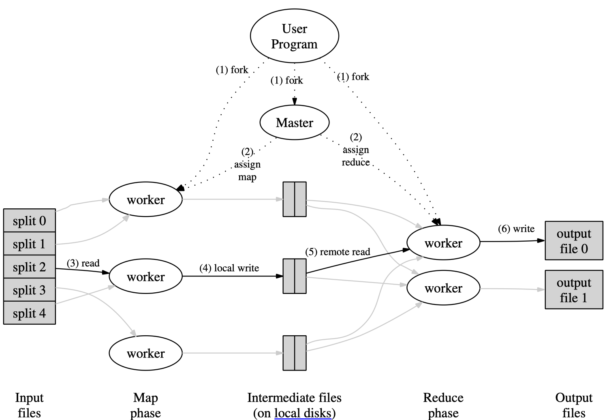
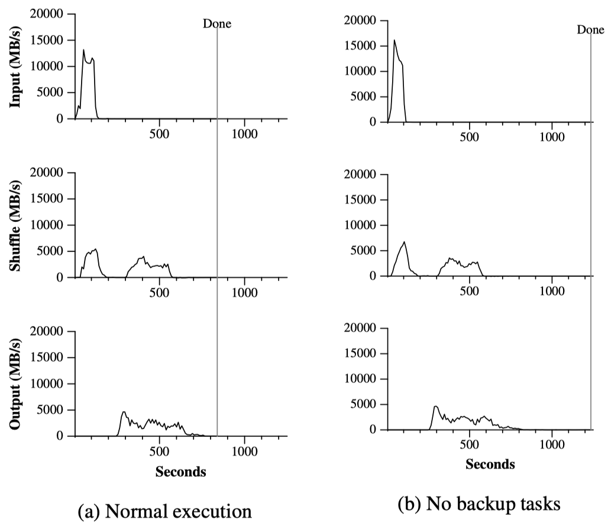

<!-- <center>

</center> -->

Google三驾马车（Google File System (GFS)，MapReduce，BigTable）不仅在大数据领域广为人知，更直接或间接性的推动了大数据、云计算、乃至如今火爆的人工智能领域的发展。本文参考原论文对 MapReduce 进行学习总结。

<!-- more -->

[TOC]

# 1. 引言
首先回答几个基本问题。

1. MapReduce是什么？
MapReduce 是一个编程模型及实现，用于处理或生成超大数据集。

2. MapReduce解决什么问题？
针对超大量数据，MapReduce解决如何在很多台机器上并行计算、数据分配及故障处理等问题。


3. MapReduce的基本原理？
Map函数处理一个键值对（key/value pair）的数据集合，输出中间结果（依然是键值对集合）；然后 Reduce 函数处理中间结果，合并具有相同 key 的 value 值得到最终输出。

4. MapReduce有哪些实际应用？
    * 大规模机器学习系统；
    * 数据挖掘，例如从新闻等网页中提取有用信息（如地理位置信息）；
    * 大规模图形计算；
    * 大规模搜索系统；

# 2. 编程模型

总的来讲，MapReduce 所执行的分布式计算会以一组键值对作为输入，输出另一组键值对，用户则通过编写 Map 函数和 Reduce 函数来指定所要进行的计算。


具体来讲， Map 函数和 Reduce 函数的输入和输出的数据类型为：
$$
\begin{array}{lll}
\textrm{map} & (k_1,v_1) & \rightarrow \textrm{list}(k_2,v_2) \\
\textrm{reduce} & (k_2,\textrm{list}(v_2)) & \rightarrow \textrm{list}(v_2) \\
\end{array}
$$

以统计大量文档每个单词出现的次数（Word Count）为例，伪代码如下：
```
map(String key, String value):
  // key: document name
  // value: document contents
  for each word w in value:
    EmitIntermediate(w, “1”);

reduce(String key, Iterator values):
  // key: a word
  // values: a list of counts
  int result = 0;
  for each v in values:
    result += ParseInt(v);
  Emit(AsString(result));
```

可以看到，一般使用 Iterator 来表示输入的集合，因为可以避免集合过大，无法被完整地放入到内存中。


# 3. 实现

## 3.1 MapReduce执行过程

MapReduce 的大致执行过程如下图所示：

<center>
    
</center>

图中的6个步骤对应如下：

1. 先将输入文件分成 $M$ 个数据片段，每个数据片段的大小一般从 16MB 到 64MB。然后用户程序在集群中创建大量程序副本。

2. 副本程序中除了一个 master，其他都是 worker 程序，并由 master 分配 $M$ 个 map 任务和 $R$ 个 reduce 任务。master 将一个 map 任务或 reduce 任务分配给一个空闲的 worker。

3. 被分配了 map 任务的 worker 程序读取对应的输入数据片段，解析并处理键值对，生成并输出中间键值对结果，并缓存在内存缓冲区中。

4. 周期性地，缓冲区中的中间结果会被用户指定的切分（partition）函数（例如`hash(key) mod R`）切分为 $R$ 个部分，并存入到本地磁盘中。任务完成时，缓存在本地磁盘上的存储位置将被回传给 master，由 master 负责把这些存储位置再传送给 reduce worker。

5. Reduce worker 程序接收到 master 程序发来的数据存储位置信息后，使用 RPC 从 map worker 所在主机的磁盘上读取这些缓存数据，然后通过对 key 进行<font color=red>排序</font>后使得具有相同 key 值的数据聚合在一起。如果中间数据太大无法在内存中完成排序，那么就要在外部进行排序。

6. Reduce worker 程序遍历排序后的中间数据，对于每一个唯一的中间 key 值，reduce worker 将这个 key 值和它相关的 value 值的集合传递给用户自定义的 reduce 函数进行处理，处理输出被追加到所属分区的输出文件。<font color=red>由于是按顺序对排序后的中间数据进行处理，所以每个输出文件分片内部是有序的。</font>

成功完成所有任务之后，MapReduce 的输出存放在了 $R$ 个输出文件中（对应每个 reduce 任务产生一个输出文件，文件名由用户指定）。一般情况下，用户不需要将这 $R$ 个输出文件合并成一个文件，而会把这些文件作为另外一个 MapReduce程序的输入，或者在另外一个分布式应用中使用。

关于分片数$M$和$R$：

- $M$：输入文件会被切分成的分片数，也是 map 任务的个数；
- $R$：输出文件的分片数，也是 reduce 任务的个数；

<font color=red>即 $M$ 个 map 任务与输入文件分片分别一一对应，$R$ 个 reduce 任务与输出文件分片分别一一对应。</font> $M$和$R$ 的值都应比集群中的 Worker 数量要大，以达成集群内负载均衡的效果。例如如果有 2000 台 worker 机器，可设置成 $M=200000, R=5000$。


## 3.2 Master的作用

Master会存储每一个 Map 和 Reduce 任务的状态（idle、in-progress, or completed，空闲、工作中或完成)，以及 Worker 机器的标识。Master 就像一个数据管道，中间文件存储区域的位置信息通过这个管道从 Map 传递到 Reduce，对于每个已经完成的 Map 任务，master 存储了 Map 任务产生的 $R$ 个中间文件存储区域的大小和位置的更新信息，这些信息被逐步递增的推送给那些正在工作的 Reduce 任务。

## 3.3 容错机制

由于MapReduce库旨在使用数百或数千台计算机处理大量数据，因此必须能容忍机器故障。

### 3.3.1 Worker故障

故障判定：master 周期性的 ping 每个 worker，在一个约定的时间范围内没有收到 worker 返回的信息，master 将把这个 worker 标记为失效。

故障处理：
- 正在运行：正在运行的 Map 或 Reduce 任务将被重新置为空闲状态，等待重新调度；
- <font color=red>已完成：已完成的 Map 任务也需要被重设为的空闲状态等待重新调度执行，因为该 Worker 不可用也意味着存储在该 Worker 本地磁盘上的中间结果也不可用了；已经完成的 Reduce 任务的输出存储在全局文件系统（Google File System）上，因此不需要重新执行。</font>

### 3.3.2 Master故障

最简单的解决办法是让 master 周期性的将checkpoint写入磁盘，如果这个 master 任务失败了，可以从最后一个checkpoint开始启动另一个 master 进程。

整个 MapReduce 集群中只会有一个 master 结点，因此 master 故障的情况并不多见。所以现在的实现是如果 master 故障，就中止 MapReduce 运算。用户可以检查到这个状态，并且可以根据需要重新执行 MapReduce 操作。


## 3.4 数据的本地性

机器间的网络带宽是比较稀缺的资源，需要尽量减少在机器间过多地进行不必要的数据传输。因此，

* 尽量把输入数据存储在集群中机器的本地磁盘上来节省网络带宽；
* 尽量将一个 map 任务调度在包含对应输入数据副本的机器上执行；
* 如果无法将 map 任务分配至该机器，Master 也会利用 Google File System 提供的机架拓扑信息将任务分配到较近的机器上。

## 3.5 备用任务机制

如果集群中有某个 Worker 花了特别长的时间来完成最后的几个 Map 或 Reduce 任务，整个 MapReduce 计算任务的耗时就会因此被拖长，这样的 Worker 也就成了落后者（Straggler）。

因此，当一个 MapReduce 操作接近完成的时候，master 会调度备用（backup）任务进程来执行剩下的、处于处理中状态（in-progress）的任务。无论是最初的执行、还是备用（backup）任务进程完成了任务，我们都把这个任务标记成为已经完成。

<center>
    
</center>

上图是一个真实MapReduce的执行过程中数据传输速率随时间的变化图，可见当没有采用备用任务机制时，完成（Done）时间被少量Straggler拖长了。


# 4. 一些技巧

## 4.1 分区函数

MapReduce对中间结果的 key 使用分区函数来对数据进行分区，之后再输入到后续任务执行进程。默认分区函数是使用 hash（比如`hash(key) mod R`），有时候也可以使用其他函数，例如将`hash(Hostname(urlkey)) mod R`作为分区函数就可以把所有来自同一个主机的 URLs 保存在同一个输出文件中。


## 4.2 Combiner函数

某些情况下，Map 函数产生的中间 key 值的重复数据会占很大的比重（例如WordCount时一些stop words如"the"），并且用户自定义的 Reduce 函数满足结合律和交换律。在这种情况下，MapReduce 系统允许用户声明在 Mapper 上执行的 Combiner 函数: Combiner 函数首先在本地将这些记录进行一次合并，然后将合并的结果再通过网络发送出去，以减少 Mapper 和 Reducer 间需要传输的数据量。

一般情况下，Combiner 和 Reduce 函数是一样的，唯一的区别是 Reduce 函数的输出被保存在最终的输出文件里，Combiner 函数的输出被写到中间文件里，然后被发送给 Reduce 任务。


## 4.3 跳过损坏的数据

有时候少量特定的数据记录可能会导致Map或者Reduce函数出错，导致整个MapReduce程序出错。此时MapReduce提供一种模式来检测并跳过这些特定的数据：Master会记录在每个数据记录上的失败次数，如果发现之前在此条数据记录上失败过了，那就跳过此条数据。

## 4.4 其他

* 本地执行：MapReduce支持本地执行方便debug；
* 状态信息：master 使用 HTTP 服务器（如 Jetty）显示一些状态信息，用户可以监控各种执行状态。
* 计数器：计数器机制对于 MapReduce 操作的完整性检查非常有用。

# 5. 总结

MapReduce编程模型已经在Google内部成功应用于多个领域，主要有以下几个原因：
1. 由于 MapReduce 封装了并行处理、容错处理、数据本地化优、负载均衡等等技术难点的细节，这使得 MapReduce 库易于使用（即使是对没有并行和分布式系统经验的程序员来说）；
2. 很多问题都可以用Map和Reduce的方式解决，例如搜索、排序、数据挖掘、机器学习以及其他许多系统。
3. Google实现了一个在数千台计算机组成的大型集群上灵活部署运行的 MapReduce 系统，这个实现有效地利用了这些机器资源，因此适合用于Google遇到的许多大型计算问题。

我们也从MapReduce开发过程中学到了不少东西：
1. 对编程模型的限制（约束编程模式）使得并行化和分布式计算变得非常容易，并具有容错性。
2. 网络带宽是一种稀缺资源。因此，MapReduce系统很多优化都是以减少网络数据传输量为目标的：
    * 本地优化使大量数据能够从本地磁盘上读取；
    * 将中间数据的唯一副本写入本地磁盘则可以节省网络带宽。
    
3. 冗余执行可以减少慢速机器（Straggler）带来的负面影响，同时解决了机器失效导致的数据丢失问题。

# 参考

[MapReduce: Simplified Data Processing on Large Clusters](https://static.googleusercontent.com/media/research.google.com/zh-CN//archive/mapreduce-osdi04.pdf)
[CSDN：Google 早期三驾马车之 MapReduce 论文学习与研读](https://blog.csdn.net/HeyShHeyou/article/details/103538057)
[知乎：Google MapReduce 论文详解](https://zhuanlan.zhihu.com/p/34849261)