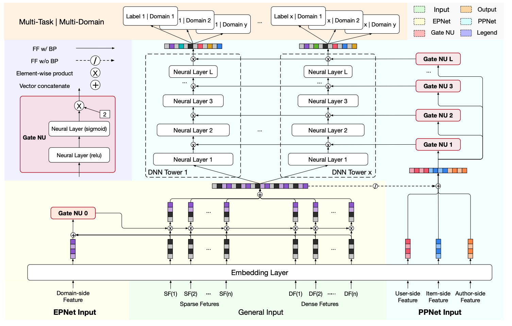

<!-- more -->

# 1. 背景

不同用户群体（如新老用户）、APP不同频道模块、不同客户端等，可以看作不同场景。不同场景具有用户差异，即使是同一用户，在不同场景下的行为偏好也可能不同，页面呈现的形式和内容、进入页面前的用户状态也存在很大的差异，这些差异直接反映到数据分布上，使得不同场景数据分布上存在明显差异。注意多场景学习和多任务学习的区别，多任务是解决相同场景/分布下的不同任务，如CTR和CVR等目标同时预估；而多场景建模是解决不同场景/分布下的相同任务，如对不同场景样本预估相同的 CTR 目标。

<!-- 

 -->

为什么需要多场景学习？

1）如果采用各场景独立的方式，会忽视场景共性，加剧数据稀疏性，导致长尾小场景难以学好；
2）每个场景维护一个模型，会极大地增加系统资源开销和人力成本；
3）如果直接将样本混合，训练共享模型，会忽视场景差异性；
4）如果各场景数据量不均衡，容易被数据量大的大场景主导，数据量小的小场景学习不好。

因此，多场景学习建模的是不同场景的共性和以及异性（或者说各场景的特性）。

# 2. 常见范式

## 2.1 场景信息直接作为特征

为了让模型感知到样本来自不同场景，我们可以将场景信息作为特征（如场景ID）输入到模型中。

这是最简单的方法，但场景特征相比特征总数一般较少，随着网络深度的增加，对最终预测结果影响有限。

## 2.2 场景子网络

为了强化场景特征对模型输出的影响，可以考虑构建一个子网络，输入场景特征，然后将输出作用到主网络的某处：

1）SubNet-logit：作用到最终输出，与主网络logit相加，如STAR中的辅助网络；
2）SubNet-NN：作用到主网络中间某些层（例如MMoE的gate，作用方法一般可用attention、动态权重等），如M2M、PPNet等；
3）SubNet-embed：作用到主网络输入层，例如对输入的特征学习重要度分数，如PEPNet中的EPNet；

业界很多方法都可以认为是场景子网络，总结如下：

| 分类 | 业界工作名称 | 
| :----:| :---- | 
| SubNet-logit | STAR辅助网络 | 
| SubNet-NN | M2M、APG、PPNet、AdaSparse | 
| SubNet-embed | EPNet | 

## 2.3 多网络结构
例如使用MMoE或者PLE结构，结合范式2场景子网络，对场景间共性信息和特定场景信息融合。或者STAR这种多网络结构，每个场景对应独有的网络参数。

# 3. 业界方法

## 3.1 快手PEPNet（2019）
一开始叫PPNet（Parameter Personalized Net），后面扩展整理成了论文PEPNet：[PEPNet: Parameter and Embedding Personalized Network for Infusing with Personalized Prior Information](https://arxiv.org/abs/2302.01115)

### 3.1.1 PPNet
借鉴的是LHUC，核心思想是用一个子网络GateNN为不同场景/用户学习个性化偏差，乘到主网络输入上。

如图所示，PPNet具体做法是：
1）利用一个小的子网络GateNN，输入一些ID类特征（换成场景特征就可以实现多场景建模）及主干网络特征（GateNN梯度不回传主干网络特征）；
2）GateNN的每层输出（激活函数是2 * sigmoid）和主网络DNN每层输入维度相同，这样就可以和主网络各层输入做element-wise乘法，从而引入个性化偏置；

### 3.1.2 EPNet
PEPNet论文包含了上述PPNet以及EPNet，如下图所示。

EPNet将场景信息作为输入，输出不同特征的重要度分数，增强模型对用户跨场景行为的感知能力。

## 3.2 阿里STAR（CIKM 2021）

论文链接：[One Model to Serve All: Star Topology Adaptive Recommender for Multi-Domain CTR Prediction](https://arxiv.org/abs/2101.11427)

核心思想是每个场景都有自己独有的MLP参数，最终的参数通过独有参数乘以共享参数得到。
整体模型结构如下图所示，相比于单场景（左）模型，STAR有三个改动：星型拓扑结构FCN、Partitioned Normalization以及辅助网络。

### 3.2.1 星型拓扑结构FCN

对于每一个FC层，都有中心的共享参数和场景私有参数，每个场景最终的参数通过二者进行element-wise product得到。STAR的共享参数被所有场景样本的梯度更新学习场景共性，而场景私有参数只被场景内样本更新建模场景差异性。

作者认为，这种方式与业界常用方案MMoE的优势在于：
- STAR包含共享参数：MMoE对不同任务采用独立的 FC 层，而STAR包含共享参数可以学习场景共性行为（可引入共享塔解决）；
- STAR显式建模多场景：MMoE 通过学习 gate 隐式建模场景间的关系，会丢失显示的 domain-specific 知识，而 STAR 引入场景先验，通过场景私有/共享参数显示建模场景间的关系；
- STAR计算量更小：MMoE需要计算每个场景的 expert，相对共享模型 FC 层会有 M 倍的计算开销 (M 为场景数)，而 STAR 稀疏激活的特性不引入额外计算，和原来计算开销持平；
- STAR更方便接入新场景：由于 gate 的学习存在冷启动，MMoE 对于新场景不友好，而 STAR 更易于接入新场景，只需将新场景私有参数全初始化为1即可开始 fine-tune 接入；

### 3.2.2 Partitioned Normalization
为了加快模型收敛，一般模型中都会加入BN（Batch Normalization），但BN其实有个前提假设是所有样本独立同分布，但在多场景中，样本往往只在场景内独立同分布，不满足BN的前提假设。所以作者提出了PN实现domain-specific标准化，具体的，PN训练时累计场景各自的的滑动均值以及方差，并且学习场景各自的shift参数。

### 3.2.3 辅助网络
引入一个额外的小辅助网络，将场景相关特征送进去，并将其输出与主干网络相加然后经过sigmoid得到最终预估值，即 $\text{pctr} = \text{sigmoid}( \text{logit}_\text{main} + \text{logit}_\text{auxiliary})$。这样能够让场景相关特征直接影响最终预测值，捕捉场景差异性。

## 3.3 阿里M2M（WSDM 2022）

论文链接：[Leaving No One Behind: A Multi-Scenario Multi-Task Meta Learning Approach for Advertiser Modeling](https://arxiv.org/abs/2201.06814)

核心思想就是用一个子网络（Meta Unit）学习场景相关先验知识，通过动态权重机制作用于主网络。

如下图（a）所示，Meta Unit有两种作用于主网络的方式，一是attention，二是tower（就是个残差结构）。核心在于如下图（b）所示的Meta Unit结构，场景信息特征作为输入，通过全连接层和reshape方式产出动态网络的weight和bias（注：这个思路其实和Co-Action Net是类似的）。

## 3.4 阿里APG（NeurIPS 2022）
论文链接：[APG: Adaptive Parameter Generation Network for Click-Through Rate Prediction](https://arxiv.org/abs/2203.16218)

APG（Adaptive Parameter Generation）的核心思路和M2M中的动态权重是一样的，只是通过矩阵拆分进行了复杂度优化，APG整体架构如下图所示。

在通过子网络产出动态网络的参数weight和bias时，复杂度是很高的（亲测确实太高了），如果网络每层维度均为D，那生成动态权重的时间和空间复杂度将为 $O(D^3)$。所以作者用矩阵分解的思路进行复杂度优化，如下图所示。其中绿色表示子网络产出的动态权重，可见优化后比优化前小很多。

## 3.5 阿里AdaSparse（CIKM 2022）

论文链接：[AdaSparse: Learning Adaptively Sparse Structures for Multi-Domain Click-Through Rate Prediction](https://arxiv.org/abs/2206.13108)

作者认为不管是新增domain-specific可学习参数（如STAR），还是通过动态权重的方法生成参数（如M2M、APG），复杂度都较高，且泛化能力有限。因此论文从提升多场景模型泛化性和计算效率出发，提出AdaSparse模型：    
1）引入神经元级场景感知权重因子，用来衡量不同场景下神经元的重要性；
2）通过裁剪(Pruner)冗余神经元实现不同场景不同的稀疏结构；

### 3.5.1 Domain-adaptive Pruner
如上图右边部分所示，Pruner是一个轻量化的模型，对于第 $l$ 层，Pruner的输入是主网络第 $l$ 层的神经元 $h^l$ 和场景特征 $e_d$，输出是维度和 $h^l$ 一致的场景感知因子 $\pi^l$，二者element-wise相乘得到输出。场景感知因子 $\pi^l$ 有三种计算方法：
1）Binarization：场景感知因子非0即1，即设定一个阈值进行二值化，相当于hard方式；
2）Scaling：相当于soft方式（这就有点像PPNet了）；
3）Fusion：结合上面两种方式；

### 3.5.2 稀疏可控正则
为了控制稀疏率，引入稀疏正则约束，直接引入L1正则项没法达到预期的稀疏率。因此作者提出稀疏可控正则化，在训练初期不侧重稀疏性，随着训练的进行，稀疏率越来越接近预先设置的稀疏率。

## 3.6 阿里HC^2
论文链接：[Hybrid Contrastive Constraints for Multi-Scenario Ad Ranking
](https://arxiv.org/abs/2302.02636)

阿里的HC2提供了一个新的思路，利用对比学习建模场景间的共性和异性。

模型结构如上图所示，特征经过Embedding层后，会先经过Shared bottom学习不同场景的共性，然后再进入各自Scenario-specific塔学习各场景的特性。

### 3.6.1. Generalized Contrastive Loss 建模共性
如上图左边图(b)所示，作者将Shared bottom输出的表示向量进行对比学习以学习不同场景的共性。具体的，将不同场景下同label的样本作为正例对，将不同场景下不同label的样本作为负例对。值得一提的是，直观来讲与当前样本比较类似（例如相同用户）的其他场景的样本更能反映出场景共性，因此在选取其他场景下的样本的时候，采用的是K近邻算法，尽可能选类似的。

此外，由于对比学习容易出现各向异性问题（anisotropy problem），在构建负样对时，从其他场景选取的样本无法覆盖整个表示空间，因此作者还通过向样本中添加diffusion noise的方式来产生更泛化的更多样的负样本对。

### 3.6.2. Individual Contrastive Loss 建模特性
如上图右边图(c)所示，作者将各自Scenario-specific塔输出的向量进行对比学习来学习不同场景各自的特性。通过给同一条样本添加dropout noise的方式构建正例对。不同场景下的样本，各自对应的Scenario-specific塔的输出向量作为负例对（即图(c)的 $\{h_i^1,h_{i^-}^{K}\}$  ）；此外作者还从相同场景下采样样本，输入到其他场景对应的Scenario-specific塔，输出向量作为困难负样本（即图(c)的 $ h_{i^-}^{(K)}$）。

## 3.7 阿里MARIA（SIGIR 2023）
论文链接：[Multi-Scenario Ranking with Adaptive Feature Learning](https://arxiv.org/pdf/2306.16732.pdf)

将场景信息注入到模型底层（即特征表示层），如对特征进行scaling（这个就和EPNet很类似了），做得比较精细。

### 3.7.1 Feature Scaling 特征缩放

考虑到特征在不同场景中具有不同的重要度。FS（Feature Scaling）模块根据场景信息来缩小或放大每个特征。和EPNet一样，此模块的梯度不回传至特征Embedding以避免潜在的过拟合和梯度冲突问题，另外缩放的比例限定在[0, 2]之间。

### 3.7.2 Feature Refinement 特征精调

首先特征被人工分成了多个field，如上图所示有Behavior、User、Target等等五个field，每个field会经过若干（不同field对应的Refiner个数可以不一样，后文实验中指出一般为2或1）Refiner，最后进行selection。具体的，每个Refiner其实就是一个FC，输入是当前field信息；而Selector的输入是场景信息和当前field信息，输出是每个Refiner的分数，最后将所有Refiner加权拼接输出。例如对于Behavior这组特征，作用方式如下：

其中GS指GumBel Softmax（模拟离散的selection操作），$\hat{h}_b$ 表示Behavior特征信息，$e_s$ 表示场景特征信息，一共有 $N_b$个Refiner，$\beta$ 是每个Refiner的分数。

这个模块有点类似于MMoE的多专家思想，Refiner相当于Expert，Gate的输入包含场景信息。另外，由于Refiner本身可以起到一个降维的作用，可以减小下游NN层的参数量。

### 3.7.3 Feature Correlation Modeling 特征相关性

为了显式建模Field之间的交互信息，FCM模块将不同Field先映射为相同长度的向量，然后两两之间计算相关性（就是向量内积），将所有的相关性拼接起来作为输出。即

最后，FCM模块的输出和FR模块的输出拼接起来，作为下游MoE的输入。

### 3.7.4 NN层

如模型结构图（b）和（c）所示，NN层是一个MoE后接多塔的结构。每个场景塔单独服务于对应场景的样本，此外还有一个额外的共享塔来建模场景间的共享信息，即 $ \text{out} = h_\text{specific} + \alpha \cdot h_\text{extra} $。其中 $\alpha$ 是共享塔的权重，根据 Coupling Gate 计算得来，计算方式是用当前输入的样本场景特征和其他场景特征计算相似度并取平均（出发点是如果和其他场景相关性很低，那共享塔对应的权重就应该小）：

通过增加场景间的信息共享，可以利用其他场景的信息为当前场景的预测提供帮助，进而提升所有场景的预测表现。

# 总结

多场景学习，就是为了让模型学习到各场景的共性和特性，求同存异。共性一般比较好学习，多场景建模的关键在于各场景的特性学习。为此，业界从特征（让模型感知场景信息）、网络结构（用场景子网络强化场景特征的影响力）、优化方式（如对比学习）等方面入手，让模型感知并学习到场景信息。