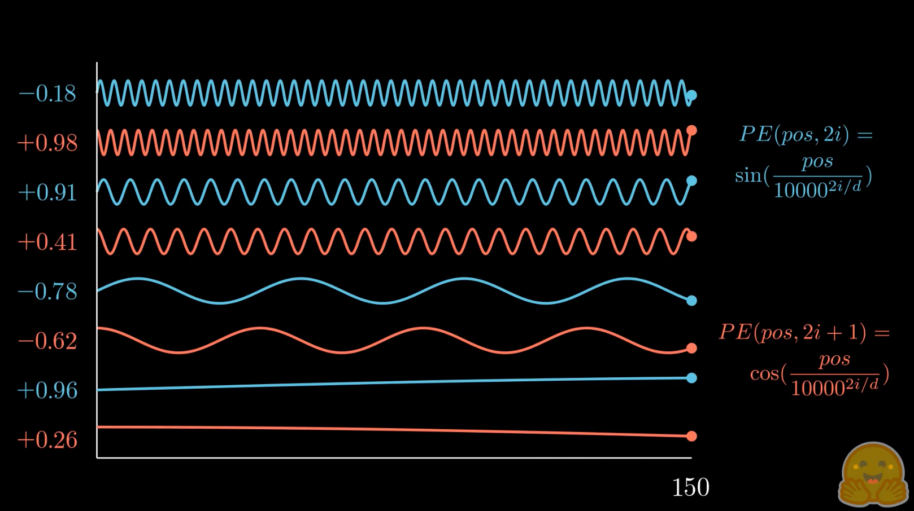
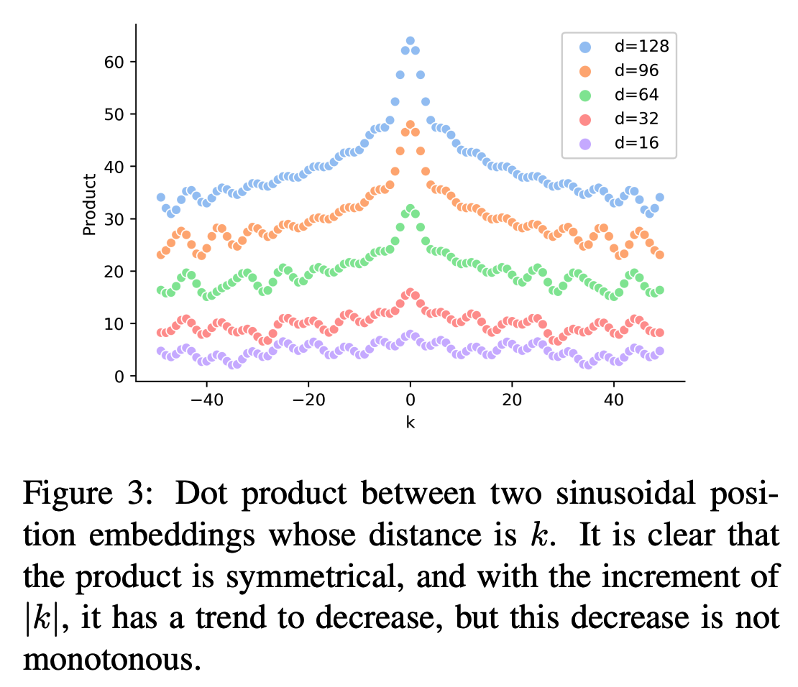
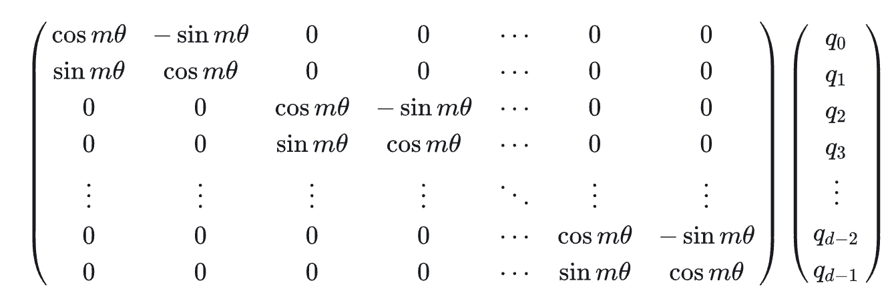
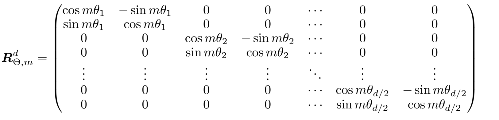
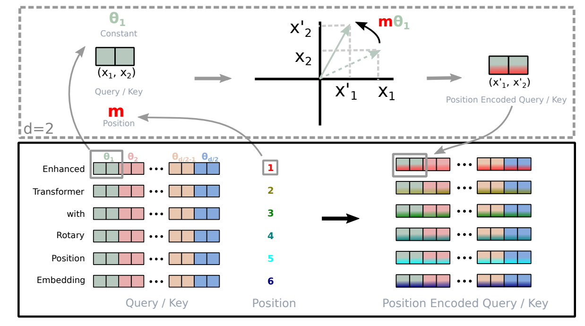
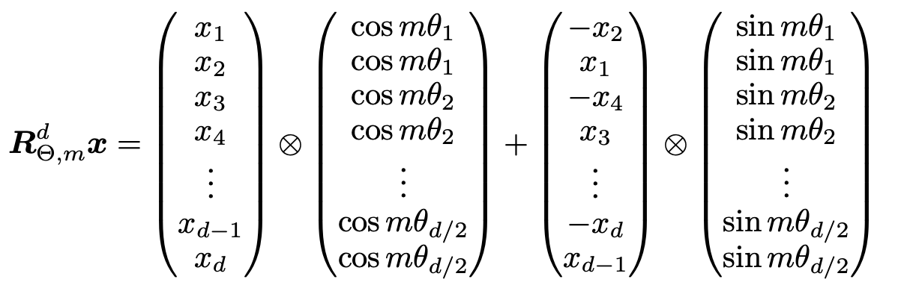

Transformer中的注意力计算是与位置无关的，这显然与真实语言逻辑不符。因此，我们需要引入位置编码（Position Encoding, PE）来告诉模型每个 token 在序列中的位置。本文介绍了三种常见的位置编码：训练式位置编码、正余弦位置编码以及现代LLM常用的RoPE位置编码。

<!-- more -->

# 为什么需要位置编码？

Attention的本质是计算输入序列中token与token之间的注意力权重。如果不加位置编码，那么这个注意力权重只和token的语义embedding有关，和位置无关，这显然和直观理解不符：一般来讲，如果两个token之间的距离较近，它们之间的的注意力权重应该更大，当距离较远时，注意力权重应该更小。


## 理想位置编码的特性

直观上，好的位置编码需要满足以下特性：
- 外推性：在超过训练长度的数据上依然能维持较好的效果
- 相对位置：任何位置之间的相对距离在不同长度的句子中应该是一致的
- 远程衰减：相对距离越大的输入，其相关性应该越弱

# 训练式位置编码

把每个位置的位置向量设置成可学习参数随着模型一起训练。训练式位置编码广泛应用于早期的transformer类型的模型，如BERT、GPT、ALBERT等。但其缺点是模型完全不具有长度外推性，因为位置编码矩阵的大小是预设的，若对其进行扩展，将会破坏模型在预训练阶段学习到的位置信息。但早期大家对长文本输入的需求并不如现在迫切。此外，训练式位置编码为每个位置分配一个固定的（可学习）向量，但语言中真正重要的往往是**相对位置**：两个词相距多远，而非它们各自在句子中的绝对位置。

> 苏神的博文[《层次分解位置编码，让BERT可以处理超长文本》](https://kexue.fm/archives/7947)通过层次分解的方式使得绝对位置编码能外推到足够长的范围，同时保持还不错的效果。

# 正余弦位置编码

Sinusoidal位置编码，是原始transformer论文[《Attention is All You Need》](https://papers.cool/arxiv/1706.03762)提出来的，它的形式如下，其中 d 表示词向量的维度，k 表示位置索引，2i 和 2i+1 表示位置向量的分量索引，则位置 k 的位置向量的第 2i 和第 2i+1 个分量为：
$$ 
\begin{align}
p_{k,2i} &= \sin(\frac{k}{10000^{2i/d}}) \\
p_{k,2i+1} &= \cos(\frac{k}{10000^{2i/d}})
\end{align}
$$
如下图所示，每个分量都具有周期性，越靠后的分量，波长越长，频率越低。

<center>

</center>

> 图片来源：[设计位置编码 - Hugging Face](https://huggingface.co/blog/zh/designing-positional-encoding)

由于Sinusoidal位置编码的每个分量都具有周期性，可以证明，两个相对位置为k的位置向量的内积是一个关于k的常数，即只和相对位置 k 有关。

除了周期性外，正余弦位置编码还具有远程衰减性质，具体表现为：对于两个相同的词向量，如果它们之间的距离越近，则他们的内积分数越高，反之则越低。

<center>

</center>

> 图片来源: [TENER: Adapting Transformer Encoder for Named Entity Recognition](https://arxiv.org/abs/1911.04474)


## 正余弦编码是否真的具备外推性？

虽然正余弦编码的內积只和相对位置有关，理论上具备外推性的潜力，**但实践中已被证明效果十分有限**。

回顾transformer的注意力计算：
$$
\begin{align}
\text{Attention}(Q,K,V)=\mathrm{softmax}\left(\frac{QK^\top}{\sqrt d}\right)  \\
Q=(x+PE_p)W_Q,\quad K=(x+PE_q)W_K
\end{align}
$$

经过 $W_Q,W_K$ 投影后，內积只和相对位置有关的性质就被破坏掉。而且权重矩阵 $W_Q,W_K$ 只在训练长度内见过位置组合： 训练最长 512 步时，权重几乎从未见过 `pos=600` 与 `pos=10` 这样远距离位置对，当推理来到超出训练长度的位置，Q‑K 点积产出的注意力分数是不可靠的。

# 旋转位置编码（RoPE）

直观理解：**旋转位置编码通过将一个向量旋转某个角度，为其赋予位置信息**。

一般地，我们通过下述运算来给向量q和k分别添加绝对位置信息m和n：  
$$
q_m=f(q,m),k_n=f(k,n)
$$
RoPE希望 $q_m$ 和 $k_n$ 的点积 $q_m \cdot k_n$ 带有相对位置 $m-n$ 信息，即
$$
⟨f(q,m),f(k,n)⟩=g(q,k,m−n)
$$
所以我们的目标就是找出满足上述等式（且尽可能简单）的函数 $f$ 。

> 注意前面正余弦位置编码的相对位置不变性只针对纯 PE 向量之间，一旦送入注意力模块经过 Q/K 投影，就不再保证成立。而RoPE 在设计时就瞄准解决这个痛点：它把相对位置不变性**保留到 Q/K 点积层面**。
> 核心区别：Sinusoidal 是**先加位置再投影**，RoPE 是**先投影语义、再对 QK 做位置旋转**。

假设向量都是2维的情况，我们可以把向量都看作是复数：

$$
q = a + bi = r e^{i\theta} = r (\cos\theta + i \sin\theta)
$$

其中 a 是实部，b是虚部，$r = \sqrt{a^2 + b^2}$ 是模长，$\theta = \arctan(b/a)$ 是幅角（或相位）表示向量与正实轴之间的夹角。

再经过一系列推导（见苏神的博客或论文：[博采众长的旋转式位置编码](https://kexue.fm/archives/8265)、[RoFormer](https://arxiv.org/pdf/2104.09864)），可得出二维RoPE：
$$
f(q,m) = q e^{im\theta}
$$
即相当于把复数 q 逆时针旋转了角度 $m\theta$。

> 复数知识：一个复数乘以单位复数 $e^{i\theta}$ 表示这个复数对应的向量逆时针旋转了角度 $\theta$。

写成矩阵形式并推广到任意偶数维（两两一组，分别旋转）即：

<left>

</left>

再借鉴正余弦位置编码，把每组的 $\theta$ 设置成不同的常量从而引入远程衰减的性质：
<left>

</left>

其中 $\theta_i = 10000^{-2(i-1)/d}, i \in [1,2,...,d/2]$ 。

RoPE的示意图：
<center>

</center>

## RoPE的高效计算

由于上面旋转矩阵的稀疏性，直接矩阵相乘会很浪费算力，因此实践一般通过下述方式来实现RoPE：

<left>

</left>

其中 $\bigotimes$ 表示element-wise相乘。


## RoPE代码实现

``` python
import torch
import torch.nn as nn

def precompute_freqs_cis(dim: int, end: int, theta: float = 10000.0):
    """
    预计算复数形式旋转因子: freqs_cis[position, i] = exp(i * m * theta_i)
    dim: head_dim
    end: 最大需要的序列长度
    return shape: [end, dim//2] complex64
    """
    freqs = 1.0 / (theta ** (torch.arange(0, dim, 2)[: (dim // 2)].float() / dim))
    t = torch.arange(end, device=freqs.device, dtype=torch.float32)
    freqs = torch.outer(t, freqs)  # [seq_len, dim/2]
    # 复数: cos + i sin
    freqs_cis = torch.polar(torch.ones_like(freqs), freqs)
    return freqs_cis


def apply_rotary_emb(
    xq: torch.Tensor,
    xk: torch.Tensor,
    freqs_cis: torch.Tensor,
) -> tuple[torch.Tensor, torch.Tensor]:
    """
    xq/xk: [batch, seq_len, n_heads, head_dim]
    freqs_cis: [seq_len, head_dim//2] 复数
    returns rotated q, k，同shape
    """
    # 转为复数: 最后一维两两配对
    xq_ = torch.view_as_complex(xq.float().reshape(*xq.shape[:-1], -1, 2))
    xk_ = torch.view_as_complex(xk.float().reshape(*xk.shape[:-1], -1, 2))
    # broadcast: freqs_cis [S, D/2] -> [1, S, 1, D/2]
    freqs_cis = freqs_cis[None, :, None, :]
    xq_out = xq_ * freqs_cis
    xk_out = xk_ * freqs_cis
    # 转回实数值
    xq_out = torch.view_as_real(xq_out).flatten(3)
    xk_out = torch.view_as_real(xk_out).flatten(3)
    return xq_out.type_as(xq), xk_out.type_as(xk)
```


# 对比

| 对比维度                | 训练式 PE                | 正余弦 PE（Sinusoidal）    | RoPE 旋转位置编码          |
| ------------------- | --------------------- | --------------------- | -------------------- |
| 位置注入方式              | Embedding 相加 \(x+PE\) | Embedding 相加 \(x+PE\) | 对投影后的 Q、K 做旋转变换，V 不动 |
| 是否带可训练参数            | ✅ 全部参数可学习             | ❌ 完全固定无参数             | ❌ 旋转公式固定无参数          |
| 能否生成大于训练长度的位置向量     | ❌ 超出 max_len 无向量      | ✅ 公式无限生成              | ✅ 旋转角度无限生成           |
| **Q‑K 点积是否仅依赖相对偏移** | ❌ 无保证                 | ❌ 投影后相对关系被破坏          | ✅ 理想状态严格成立           |
| 相对位置特性              | 偏向**绝对位置**            | 弱相对位置偏置（仅 PE 向量层）     | 强**相对位置**归纳偏置        |
| 外推能力                | ❌ 完全不可外推              | ❌ 很差，极易崩坏             | ⭐较好（有上限，超长需缩放增强）     |
| 典型代表模型              | BERT                  | 原始 Transformer        | LLaMA、Mistral、Qwen   |

# 参考
- [图解RoPE旋转位置编码及其特性](https://zhuanlan.zhihu.com/p/667864459)
- 苏神本人博客和论文：[博采众长的旋转式位置编码](https://kexue.fm/archives/8265)、[RoFormer](https://arxiv.org/pdf/2104.09864)
