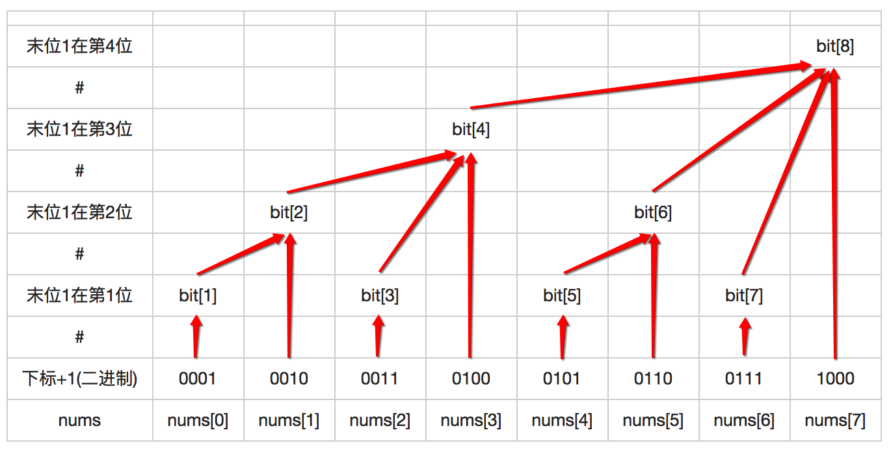

本文是[LeetCode 307. Range Sum Query - Mutable](https://leetcode.com/problems/range-sum-query-mutable/)的题解，主要是对树状数组（Binary Indexed Tree）和线段树（Segment Tree）的学习。

<!-- more -->

# 1. 问题描述

初始时给定一个大小为n的整数数组nums，设计两个方法：
1. `sumRange(i,j)`: 求区间[i, j]之间的元素和（0 <= i <= j < n），包含边界;
2. `update(i, val)`: 将nums[i]的值修改为val。

而且假设了上述两个方法的调用是均匀分布的。

# 2. 题解

## 2.1 初步分析
如果数组nums是不可变的，那就是题目[303. Range Sum Query - Immutable](https://leetcode.com/problems/range-sum-query-immutable/)，是一个很简单的题，我们只需要维护一个累加数组sum, sum[i]表示前i个元素和, 这样以后就可以以常数复杂度获得某个区间的和: `sumRange(i,j) = sum[j] - sum[i-1]`。如果此题也采用此思路的话，每次调用`update(i, val)`都需要更新sum, 即`update(i, val)`的复杂度是O(n)；若采用每次调用`sumRange(i,j)`才进行求和的策略，虽然`update(i, val)`复杂度降成常数，但是`sumRange(i,j)`复杂度变成了O(n)。由于题目说了`sumRange`和`update`的调用是均匀分布的，因此上述两种策略在分别m次调用的情况下时间复杂度都是O(mn)，不够高效。

## 2.2 解法一、折中策略

### 2.2.1 分析
2.1节的分析中的两种策略要么让`sumRange`为O(1)而`update`为O(n)，要么让`sumRange`为O(n)而`update`为O(1)，即两种策略都是不公平的。所以我们很容易想到将复杂度均摊到`sumRange`和`update`上，即采取两种策略的折中策略：将原数组分为若干块，为了均摊复杂度，我们让每块长度`block = sqrt(n)`。然后我们开辟一个大小跟块数（=sqrt(n) 向上取整）相同的二维数组，采用303题的策略提前计算好每个块内部的累加和数组。对于`sumRange`求区间和操作，我们将i和j之间块的和累加起来(需要考虑两端不足整块的部分)就可以了，由于块数是`sqrt(n)`（向上取整），所以复杂度是O(sqrt(n))。而在调用`update`更新的时候，我们先确定要更新的元素在哪个块里，然后只更新该块对应的累加和数组，因为块长度最大为sqrt(n)，所以复杂度还是O(sqrt(n))。因此`sumRange`和`update`的复杂度均为`O(sqrt(n))`，即在分别m次调用的情况下时间复杂度为O(m*sqrt(n))。

### 2.2.2 代码
``` C++
class NumArray {
    int len, block; // nums长度, 块长度
    vector<vector<int>>block_sum; 
public:
    NumArray(vector<int>& nums) {
        len = nums.size();
        block = int(sqrt(len));

        vector<int>sum;
        int accum = 0;
        for(int i = 0; i < len; i++){
            accum += nums[i];
            sum.push_back(accum);
            if((i + 1) % block == 0 || i == len - 1){
                block_sum.push_back(sum);
                accum = 0; sum.clear();
            }
        }
    }
    
    void update(int i, int val) {
        int block_i = i / block, block_j = i % block; // 块号, 块内索引
        
        int diff = val - block_sum[block_i][block_j];
        if(block_j != 0) diff += block_sum[block_i][block_j - 1];
        
        for(int j = block_j; j < block_sum[block_i].size(); j++)
            block_sum[block_i][j] += diff;
    }
    
    int sumRange(int i, int j) {
        int block_i = i / block, block_j = j / block; // 块号, 块号
        
        int res = 0;
        for(int k = block_i; k < block_j; k++)
            res += block_sum[k].back();
        // 减去左端多加的部分
        if(i % block != 0) res -= block_sum[block_i][i % block - 1];
        // 加上右端不足整块的部分
        res += block_sum[block_j][j % block];
        return res;
    }
};
```

## 2.3 解法二、树状数组

### 2.3.1 树状数组（Binary Indexed Tree）
树状数组（Binary Indexed Tree, 又Fenwick Tree）其实并不是一棵树，只是对数组各元素进行逻辑上的划分。根据[维基百科](https://zh.wikipedia.org/wiki/%E6%A0%91%E7%8A%B6%E6%95%B0%E7%BB%84)，树状数组是一种用于高效计算数列前缀和的数据结构，它可以以O(logn)的时间得到任意前缀和（两个前缀和相减即可得到区间和），并同时支持以O(logn)的时间对数组某个值进行修改，空间复杂度为O(n)。由此可见，我们可以用树状数组解此题，使`sumRange`和`update`的复杂度均为O(logn)。因此我们有必要来了解一下树状数组。

从英文名字Binary Indexed Tree可猜到树状数组是与二进制有关的，事实上确实是这样，树状数组的核心思想就是将一个前缀和划分成多个子序列的和，而划分的方法与2的幂（或者说二进制）密切相关。

> 作为对比，本文讲的三个解法都是对数组先划分成子序列，只是划分的方式不同。2.2节的思路就是无脑将数组均分成大小为sqrt(n)的块；树状数组则采用精心设计的划分方式；而2.4节讲的线段树则是不断进行二分。

举个例子说明这种划分方式，例如想求前13个数（下标从1开始，下同）的前缀和`sum(13)`，我们可以先看不大于13的最大的2的幂是多少，是2^3=8, 所以先分成第1到第8个数的和；还剩下5个数，又看不大于5的最大的2的幂是多少，是2^2=4，所以再分成第9到第12个数的和；最后还剩下一个数，即第13个数。所以我们有：
```
sum(13) = Range(1, 8) + Range(9, 12) + Range(13, 13)
```
其中`Range(i,j)`就是闭区间[i,j]的区间和。如果按照这种方式划分的话，很显然`Range(i,j)`中的参数i是可以根据j确定的，例如若j=12那么i一定等于9，我们把这个映射关系记为f(j)。如果我们将上面的数字都转成二进制然后稍加分析就可得到
```
f(j) = j - lowBit(j) + 1;
```
其中`lowBit(j)`表示将j转为二进制后, 最后一个1的位置所代表的数值。例如
```
j=12 ---二进制--> 1100 ---lowBit--> 0100 ---f(j)--> 1001 
```
学过补码表示的童鞋可以想到`lowBit(j)`可以通过将j与上-j得到，C++代码即
``` C++
int lowBit(int j){
    return j & (-j);
}
```
那么，我们用一个数组bit（Binary Indexed Tree）来表示经过我们精心设计的划分后的子序列的区间和，其中`bit[i]`表示区间`[f(i), i]`的和，如下图所示。

<!-- ||||||||||
|:--:|:--:|:--:|:--:|:--:|:--:|:--:|:--:|:--:|
|末位1在第4位||||||||bit[8]|
|#|||||||||
|末位1在第3位||||bit[4]|||||
|#|||||||||
|末位1在第2位||bit[2]||||bit[6]|||
|#|||||||||
|末位1在第1位|bit[1]||bit[3]||bit[5]||bit[7]||
|#|||||||||
|下标+1(二进制)|0001|0010|0011|0100|0101|0110|0111|1000|
|nums|nums[0]|nums[1]|nums[2]|nums[3]|nums[4]|nums[5]|nums[6]|nums[7]| -->

<center>
    
</center>

那么bit数组计算好后（先不管如何计算），那么我们该如何计算前缀和以及修改某个元素呢？

1. **计算前缀和**

    由前面计算前缀和`sum(13)`的例子
    ```
    sum(13) = Range(1, 8) + Range(9, 12) + Range(13, 13)
            = bit[8] + bit[12] + bit[13]
            = bit[13] + bit[12] + bit[8]
    ```
    可总结出求前缀和的算法：
    ``` C++
    int sum(int i){ // 前idx个数的和, logn
        // 这里的i从1开始编号
        int res = 0;
        while(i > 0){
            res += bit[i];
            i -= lowBit(i);
        }
        return res;
    }
    ```
    可见可以在log(n)的复杂度求得某个前缀和。


2. **更新元素**
    由前面的图可知，更新某个元素也是采样类似的思路，只是说是个逆向过程。例如如果想更新nums[1]，对应下标加1为2，由上图可知需要自底向上更新bit[2]、bit[4]、bit[8]；又例如更新nums[4]，对应下标加1为5，应该自底向上更新bit[5]、bit[6]、bit[8]。所以们可总结更新算法如下

    ```C++
    void update(int i, int val) { //logn
        int diff = val - nums[i];
        nums[i] = val;
        i += 1; // bit中下标从1开始
        while(i <= nums.size()){
            bit[i] += diff;
            i += lowBit(i);
        }            
    }
    ```
    可见**求前缀和函数`sum`和更新函数`update`的唯一不同就是前者是不断减去`lowBit(i)`而后者是不断加上`lowBit(i)`**。

3. **建树**
    前面的分析都是建立在我们已经计算好了数组bit的基础上，那么如何计算bit呢？最简单的思路就是先用0初始化bit，然后调用n次`update`就可以了，此时建树时间复杂度为O(nlogn)。此外，存在一个O(n)时间计算bit的算法：
    1. 将`bit[i+1]`初始化成`nums[i]`（因为bit下标从1开始）;
    2. 对1到n的每一个i，令`j = i + lowBit(i)`，更新`bit[j] = bit[j] + bit[i]`。

综上，我们可以用树状数组以对数时间复杂度求前缀和以及更新元素，而两个前缀和相减即可得到区间和，因此`sumRange`和`update`的复杂度均为`O(logn)`，初始建树的时间复杂度最低只需O(n)；我们需要一个bit数组，因此空间复杂度为O(n)。

### 2.3.2 代码
综合前面的分析，我们用如下代码（数组data是nums的复本）：
``` C++
class NumArray {
private:
    vector<int>bit;  // bit中下标从1开始, bit[0] = 0
    vector<int>data; // copy of nums
    
    int lowBit(int x){
        return x & (-x);
    }
    
    int sum(int idx){ // logn
        // 前idx个数的和
        int res = 0;
        while(idx > 0){
            res += bit[idx];
            idx -= lowBit(idx);
        }            
        return res;
    }
public:
    NumArray(vector<int>& nums) { // nlogn
        bit = vector<int>(nums.size() + 1, 0);
        
        // O(nlogn)建树
        data = vector<int>(nums.size(), 0);
        for(int i = 0; i < nums.size(); i++)
            update(i, nums[i]);
        
        // // O(n)建树
        // data = nums;
        // for(int i = 1; i <= nums.size(); i++){
        //     bit[i] += nums[i-1];
        //     int j = i + lowBit(i);
        //     if(j <= nums.size()) bit[j] += bit[i];
        // }
    }
    
    void update(int i, int val) { //logn
        int diff = val - data[i];
        data[i] = val;
        i += 1; // bit中下标从1开始
        while(i <= data.size()){
            bit[i] += diff;
            i += lowBit(i);
        }            
    }
    
    int sumRange(int i, int j) { //logn
        return sum(j+1) - sum(i);
    }
};
```

## 2.4 解法三、线段树
### 2.4.1 线段树（Segment Tree）
和树状数组一样，利用线段树也可以以对数复杂度进行区间查询和元素更新。树状数组是利用索引的二进制表示来划分子序列，而线段树是不断进行二分来划分子序列，如下图所示

```
                                [0,7]
                  ┌───────────────┴───────────────┐
                [0,3]                           [4,7]
          ┌───────┴───────┐               ┌───────┴───────┐
        [0,1]           [2,3]           [4,5]           [6,7]
      ┌───┴───┐       ┌───┴───┐       ┌───┴───┐       ┌───┴───┐
    [0,0]   [1,1]   [2,2]   [3,3]   [4,4]   [5,5]   [6,6]   [7,7]

```
可知线段树是一棵二叉树，树中的每个结点保存着一个区间范围以及对应区间和（也可以保存区间最大值、最小值、异或值等等，只要满足结合律就可以了），其左右子结点分别存储该结点区间拆分为两半之后各自区间的信息。 我们就可以自顶向下不断查询得到某个区间和，也可以自底向上地不断更新某个元素对应的叶结点到根结点的路径上的结点值来进行元素更新，由于树高是O(logn)，所以区间查询和元素修改复杂度都是O(logn)。

我们可以采用自顶向下不断递归直到叶结点的建树方式；也可以采用自底向上迭代的建树方式。前者就是普通的线段树，需要不断递归压栈；而后者就是常用的zkw线段树（出自张昆玮的论文《统计的力量》，zkw即其名字拼音首字母），本文采用的是后者。

我们用一个数组st(segment tree)来存放线段树且下标从1开始，先来看看当数据数组nums的大小n刚好是2的幂时的情况，此时最简单，因为构建出来的刚好是一个完美二叉树，如下图所示
```
                            st[1]
                            [0,3]
                  ┌───────────┴───────────┐
                st[2]                    st[3]
                [0,1]                    [2,3]
            ┌─────┴─────┐           ┌─────┴─────┐
          st[4]        st[5]       st[6]      st[7]
          [0,0]        [1,1]       [2,2]      [3,3]
         nums[0]      nums[1]      nums[2]    nums[3]
```

上图所示的是一棵完美二叉树，叶子数（即数据数组nums的大小4）刚好是2的幂，此时st的大小是2n（算上了无用的st[0]），而且可立即得到第一个叶子结点nums[0]存放在st[4]，第二个叶子结点nums[1]存放在st[5]，以此类推。
> 即叶子结点对应nums下标刚好与st相差n，其中n是nums的大小。

所以我们很好写出当nums大小刚好是2的幂时的建树代码：
``` C++
// nums的大小n是2的幂时, 建立线段树, 复杂度O(n)
void buildST(vector<int>& nums) {
    for (int i = n; i < n * 2; ++i)
        st[i] = nums[i - n]; // 叶子
    for (int i = n - 1; i > 0; --i)
        st[i] = st[i << 1] + st[(i << 1)|1];
    // st[i << 1]和st[(i << 1)|1]分别表示左右孩子
} 
```
然后自底向上修改某个元素则很简单：
``` C++
// nums的大小n是2的幂时, 更新元素, 复杂度O(logn)
void update(int i, int val) {
    i += n; // 转成到st的下标
    st[i] = val; // 更新叶子
    while (i > 0) {
        // st[i^1]表示st[i]的兄弟
        st[i >> 1] = st[i] + st[i^1];
        i >>= 1;
    }
}
```

如何进行自顶向下的区间查询`sumRange(i, j)`呢？
1. 若st[i]是右子结点，说明结果应包含它但不包含它的父亲，那么将结果加上st[i]并使i增加1，最后将i除以2进入下一循环；
2. 若st[i]是左子结点，它跟其右兄弟在要求的区间里，则此时直接将i除以2（即直接进入其父亲结点）进入下一循环即可；

对j的处理同理：若j是左子结点，那么需要加上st[j]并使j减去1最后将j除以2进入下一循环；若j是右子结点，直接将j除以2进入下一循环即可。可以通过判断i的奇偶性来判断st[i]是左子结点还是右子结点。
``` C++
// nums的大小n是2的幂时, 区间查询, 复杂度O(logn)
int sumRange(int i, int j) {
    i += n; j += n; // 转成到st的下标
    int res = 0;
    for (; i <= j; i >>= 1, j >>= 1){
        if((i & 1)) res += st[i++]; // st[i]是右子结点
        if(!(j & 1)) res += st[j--]; // st[j]是左子结点
    }
    return res;
}
```

上述分析的前提是nums的大小n是2的幂，但是对于一般情况下又是如何呢？

简单的方法是在nums的结尾补0，直到其长度正好为2的幂。最坏情况下，我们需要大小约为4n的st而不是2n（其实问题也不大，很多人就是这么做的）。例如，若n=17，则我们应该补15个0，开辟大小为64的st。

其实，<font color=red>前面的代码对于任意大小的nums都是正确的!</font>

我们依然只需要开辟一个2n大小的数组st就可以按照上述代码进行建树、查询、更新操作。

> 二叉树中: 度为0的结点数 = 度为2的结点数 + 1，又因为st中没有度为1的结点，所以只需开辟2n大小的st数组（算上了无用的st[0]）。

例如若n=6，那么建立的st树如下，可以验证一下前面查询、更新操作的代码都是正确的。

```
                            st[1]
                            [0,5]
                  ┌───────────┴───────────┐
                  |                     st[2]
                  |                     [2,5]
                  |               ┌───────┴───────┐
                st[3]           st[4]           st[5]
                [0,1]           [2,3]           [4,5]
              ┌───┴───┐       ┌───┴───┐       ┌───┴───┐
            st[6]   st[7]   st[8]   st[9]   st[10]  st[11]
            [0,0]   [1,1]   [2,2]   [3,3]   [4,4]   [5,5]
           nums[0] nums[1] nums[2] nums[3]  nums[4] nums[5]    
```

另外，线段树还支持区间更新，此时可以开辟一个大小为n的懒标记（lazy tag）数组来提高效率，由于此题并没有涉及，所以不详述。

### 2.4.2 代码
将前面的代码总结一下即可得到完整代码：
``` C++
class NumArray {
private:
    int n; // nums.size()
    vector<int>st; // segment tree
    
    // int leftChild(int r){return r << 1;}
    // int rightChild(int r){return r << 1 | 1;} // r << 1 + 1
    
    void buildST(vector<int>& nums) {
        for (int i = n; i < n * 2; ++i)
            st[i] = nums[i - n]; // 叶子
        for (int i = n - 1; i > 0; --i)
            st[i] = st[i << 1] + st[(i << 1)|1];
        // st[i << 1]和st[(i << 1)|1]分别表示左右孩子
    } 
    
public:
    NumArray(vector<int>& nums) {
        n = nums.size();
        st = vector<int>(2 * n, 0);
        
        buildST(nums);
    }
    
    void update(int i, int val) {
        i += n; // 转成到st的下标
        st[i] = val;
        while (i > 0) {
            // st[i^1]表示st[i]的兄弟
            st[i >> 1] = st[i] + st[i ^ 1];
            i >>= 1;
        }
    }
    
    int sumRange(int i, int j) {
        i += n; j += n; // 转成到st的下标
        int res = 0;
        for (; i <= j; i >>= 1, j >>= 1){
            if ((i & 1)) res += st[i++]; // st[i]是右子结点
            if (!(j & 1)) res += st[j--]; // st[j]是左子结点
        }
        return res;
    }
};
```

## 2.5 总结
本文讲的三个解法都是对数组先划分成子序列，只是划分的方式不同。2.2节的折中思路就是无脑将数组均分成大小为sqrt(n)的块，区间查询和单点修改的复杂度都是O(sqrt(n))；树状数组则采用精心设计的划分方式，区间查询和单点修改的复杂度都是O(logn)；而线段树则是不断进行二分，区间查询和单点修改的复杂度也都是O(logn)。

树状数组和线段树的思想很类似，不过也有不同之处，具体区别和联系如下：

1. 树状数组逻辑上是一棵普通的树，而线段树逻辑上是一颗完全二叉树；
2. 两者时间复杂度级别相同, 但是树状数组的常数明显优于线段树而且代码实现简单；
3. 线段树的空间复杂度在常数上为树状数组的两倍；
4. 一般来讲，凡是可以使用树状数组解决的问题, 使用线段树也可以解决, 但是线段树能够解决的问题树状数组未必能够解决（例如求区间最大/小值）；

# 参考
* [树状数组（Binary Indexed Tree），看这一篇就够了 - CSDN](https://blog.csdn.net/Yaokai_AssultMaster/article/details/79492190)
* [树状数组详解 - 博客园](https://www.cnblogs.com/aiguona/p/8278846.html)
* [Efficient and easy segment trees - Codeforces](https://codeforces.com/blog/entry/18051)
* [关于线段树(Segment tree)和树状数组(BIT)的区别 - 知乎](https://www.zhihu.com/question/54746883)


------------------
更多我的LeetCode中文题解，可前往GitHub查看：https://github.com/ShusenTang/LeetCode
