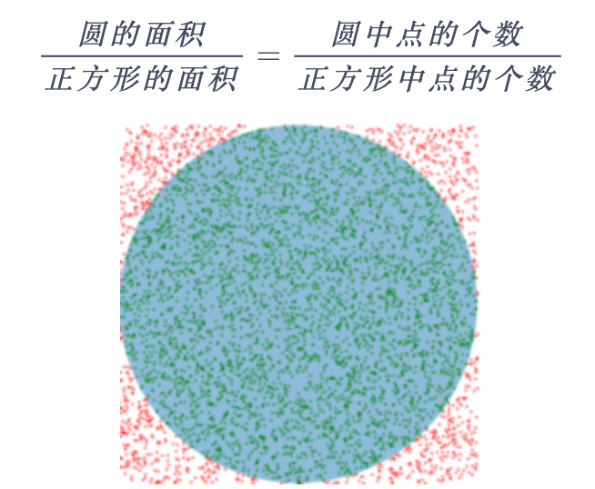
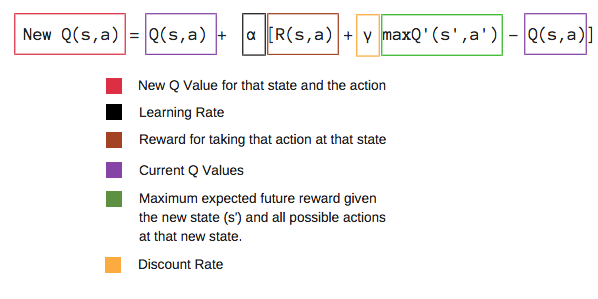
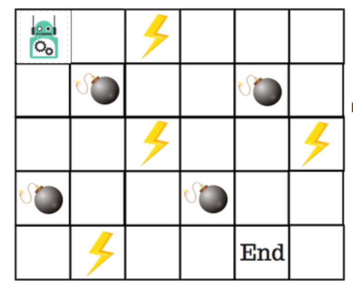
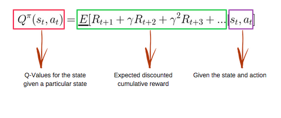
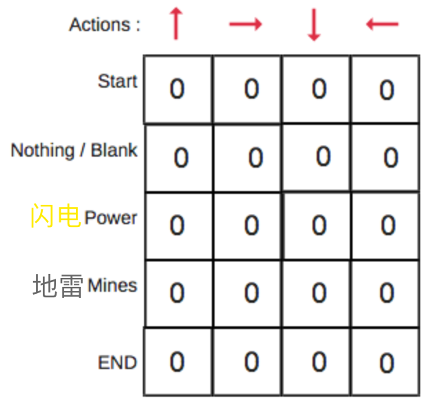
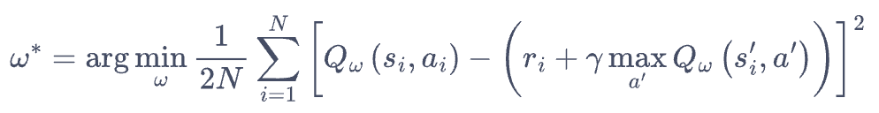
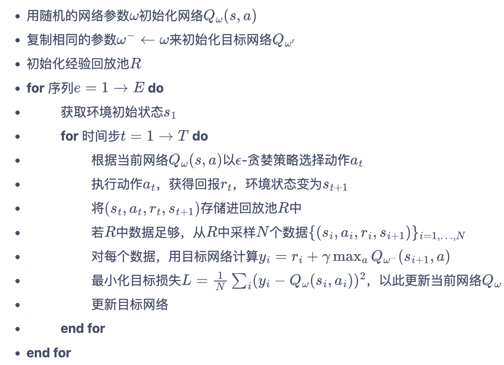
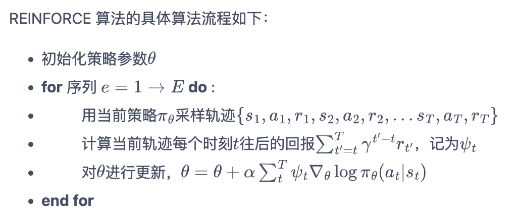
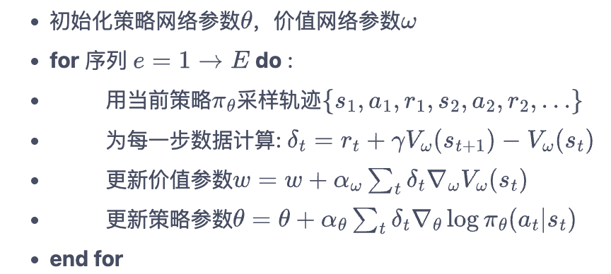

强化学习入门，包括基本思想、经典算法（如Q-Learning，DQN，Policy Gradient、Actor-Critic等）。

<!-- more -->

# 一、基本思想

## 1.1 术语

- 环境(Environment)：是一个外部系统，智能体处于这个系统中，能够感知到这个系统并且能够基于感知到的状态做出一定的行动。
- 智能体(Agent)：是一个嵌入到环境中的系统，能够通过采取行动来改变环境的状态。
- 状态(State)/观察值(Observation)：状态是对世界的完整描述，不会隐藏世界的信息。观测是对状态的部分描述，可能会遗漏一些信息。
- 策略(Policy)：策略是智能体用于决定下一步执行什么行动的规则，可以是确定性的，也可以是随机的；
- 动作(Action)：不同的环境允许不同种类的动作，在给定的环境中，有效动作的集合经常被称为动作空间(action space)；
- 奖励(Reward)：是由环境给的一个标量的反馈信号(scalar feedback signal)，这个信号显示了智能体在某一步采 取了某个策略的表现如何；
- 回报(Return)：cumulated future reward，即未来奖励累计，未来的奖励不如现在等值的奖励那么好，需要折算（类似金融经济学里面的折现）；
- 状态价值函数 $V_\pi(s)$ ：智能体在状态 s，遵循策略 $\pi$ 直至游戏结束所能获得的**期望累积回报**。不必等待未来的收益实际发生就可以获知当前状态的好坏。比如在下棋游戏中，不管中途如何，只有最终赢得游戏才得1分，否则0分，那中途就可以通过状态价值函数判断智能体下得如何；
- 动作价值函数 $Q_\pi(s, a)$：智能体在状态 s 采取特定动作 a ，随后遵循策略 $\pi$ 直到游戏结束能获得的**期望累积回报**。

在强化学习过程中，智能体跟环境一直在交互。智能体在环境里面获取到状态，智能体会利用这个状态输出一个动作，一个决策。然后这个决策会放到环境之中去，环境会根据智能体采取的决策，输出下一个状态以及当前的这个决策得到的奖励。智能体的目的就是为了尽可能多地从环境中获取奖励。

## 1.2 和监督学习/非监督学习区别

- 监督学习：是从外部监督者提供的带标注训练集（iid独立同分布的）中进行学习。 (任务驱动型)
- 非监督学习：是一个典型的寻找未标注数据中隐含结构的过程。 (数据驱动型)
- 强化学习：更偏重于智能体与环境的交互（是一个序列）， 这带来了一个独有的挑战 ——“探索（exploration）”与“利用（exploitation）”之间的折中权衡，智能体必须利用已有的经验来获取收益，同时也要进行试探，使得未来可以获得更好的动作选择空间。 (从错误中学习)

## 1.3 算法分类

按照环境是否已知划分：**免模型学习（Model-Free） vs 有模型学习（Model-Based）**

> Model-free就是不去学习和理解环境，环境给出什么信息就是什么信息，常见的方法有policy optimization和Q-learning。
> Model-Based是去学习和理解环境，学会用一个模型来模拟环境，通过模拟的环境来得到反馈。Model-Based相当于比Model-Free多了模拟环境这个环节，通过模拟环境预判接下来会发生的所有情况，然后选择最佳的情况。
> 一般情况下，环境都是不可知的，所以这里主要研究Model-Free。

按照学习方式划分：**在线策略（On-Policy） vs 离线策略（Off-Policy）**

> On-Policy：用于学习的策略和用于和环境交互采样数据的策略是**同一个**策略，目标策略产出当前训练数据，训完更新策略后，旧数据就不能用了。即边做边学，典型的算法为Sarsa、PPO等。
> Off-Policy：用于学习的策略和用于和环境交互采样数据的策略是**不同**的策略。即从别人（其他策略，或者旧策略）的经验中学习。典型的方法是Q-learning，以及Deep-Q-Network。值得一提的是和**Offline RL**（离线强化学习）的区别， Offline RL 指学习过程中完全不与环境交互，只从一个固定的、事先收集好的数据集中学习（如DPO）， Offline RL可以是 Off-Policy 的一种特殊形式，但日常讨论中，Off-Policy 更多指“能利用不同策略历史数据”的能力，不强调完全不交互。

按照学习目标划分：**基于价值（Value-Based）和基于策略（Policy-Based）**

> **Value-Based**：学一个价值函数，输出的是动作的价值，选择价值最高的动作。适用于非连续的动作。常见的方法有Q-learning、Deep Q Network和Sarsa。
> **Policy-Based**：学一个策略函数，输出下一步动作的概率，根据概率来选取动作。但不一定概率最高就会选择该动作，还是会从整体进行考虑。适用于非连续和连续的动作。常见的方法有Policy gradients。
> **还有二者的结合：Actor-Critic**，Actor根据概率做出动作，Critic根据动作给出价值，从而加速学习过程，常见的有A2C，A3C，DDPG等。

## 1.4 求解方法

强化学习的求解方法有：动态规划（DP）、蒙特卡洛（MC）、时序差分（TD）。

**动态规划**：需要事先知道环境的状态转移函数和奖励函数（即知道整个马尔可夫决策过程），且状态空间和动作空间是离散的，实际场景很难满足。

**蒙特卡洛**：如下图，一个简单的蒙特卡洛方法例子是计算圆的面积。而在强化学习中，可以用蒙特卡洛方法来求状态的价值，前面提到一个状态的价值函数是通过未来的奖励与对应的衰减乘积求和得到，蒙特卡罗法的基本思想就是：采样很多条序列，计算从这个状态出发（完整的状态序列）的回报再求均值。

**时序差分**：如果没有完整的状态序列，那么就无法使用蒙特卡罗法求解。而时序差分通过贝尔曼方程（简单来讲就是一个状态的价值由该状态的奖励以及后续状态价值按一定的衰减比例联合组成，[参考](https://www.cnblogs.com/pinard/p/9426283.html)）：$
v_\pi(s)=E_\pi\left[R_{t+1}+\gamma v_\pi\left(s_{t+1}\right) \mid s_t=s\right]$，利用后续状态的价值估计来更新当前状态的价值估计。具体的，时序差分算法用当前获得的奖励加上下一个状态的价值估计来作为在当前状态会获得的回报，即
$$
V\left(s_t\right) \leftarrow V\left(s_t\right)+\alpha\left[r_t+\gamma V\left(s_{t+1}\right)-V\left(s_t\right)\right]
$$
中括号里面的就被成为时序差分误差（TD），时序差分算法将其与步长 $\alpha$ 的乘积作为状态价值的更新量。将 TD 思想应用到动作价值函数 Q （V和Q的区别和联系见后面"常见QA"这一节）上，就得到了经典算法 Q-learning 的更新规则：

> 新Q值 = Q值 + 学习率 * (当前回报 + 折现率 * 未来最大Q值 - Q值)。实践中，可以理解成尽可能使Q值和【当前回报 + 折现率 * 未来最大Q值】接近，因此我们可以构造二者均方误差损失函数：mse(当前Q值, 当前回报+折现率 * 未来最大Q值)。

# 二、经典算法

- 基于表格、没有神经网络参与的**Q-Learning算法**

- 基于价值(Value-Based)的**Deep Q Network（DQN）算法**

- 基于策略(Policy-Based)的**Policy Gradient（PG）算法**

- 结合了Value-Based和Policy-Based的**Actor Critic算法**

## 2.1 Q-Learning（表格法）

在Q-learning中，我们维护一张Q值表，表的维数为：状态数S * 动作数A，表中每个数代表在当前状态S下可以采用动作A可以获得的未来收益的折现和。我们不断的迭代我们的Q值表使其最终收敛，然后根据Q值表我们就可以在每个状态下选取一个最优策略。

下图是机器人走迷宫的游戏：

机器人在每一步都失去1点。这样做是为了使机器人采用最短路径并尽可能快地到达目标。
如果机器人踩到地雷，则点损失为100并且游戏结束。
如果机器人获得闪电⚡️，它会获得1点。
如果机器人达到最终目标，则机器人获得100分。

### Q函数

Q函数(Q-Function)即为上文提到的动作价值函数，他有两个输入：「状态」和「动作」。它将返回在该状态下执行该动作的未来奖励期望。

### Q值表

Q值表(Q-Table)是一个简单查找表，我们计算每个状态下各个行动的最大预期未来奖励，这张表将指导我们在每个状态采取最佳行动。Q值表有m行n列，其中m=状态数，n=操作数。初始Q值表：

### 算法流程

我们先将Q值表初始化为全0，不断从重复下述过程直到Q值表收敛：
- step1：选择并执行某个操作，不断迭代更新Q值表（探索与利用）：设探索概率为「epsilon」，在一开始，因为我们不知道 Q-table 中任何的值，epsilon需要设很大比如1，即进行大量的随机探索；随着迭代的进行，Q值表逐渐迭代更新，探索概率epsilon应逐步减小。
- step2：评估：根据观察到的结果和奖励，利用时序差分算法更新Q值：新Q值 = Q值 + 学习率 * (当前回报 + 折现率 * 未来最大Q值 - Q值)

## 2.2 DQN(Deep Q Network)

当状态和动作空间是高维连续时，使用上述Q-Learning方法不现实，因为我们无法构建可以存储超大（甚至无限的）状态空间的Q值表。此时，我们可以用一个神经网络（Q Network）来拟合Q值，这样我们就没必要维护一个巨大的Q值表。

### 损失函数

我们要如何定义损失函数来训练神经网络呢？回顾一下Q-Learning采用的Q值更新规则（时序差分算法）：新Q值 = Q值 + 学习率 * (当前回报 + 折现率 * 未来最大Q值 - Q值)，可以理解成尽可能使Q值和【当前回报 + 折现率 * 未来最大Q值】接近，因此我们可以构造二者均方误差损失函数：

即 mse(当前Q值, 当前回报+折现率 * 未来最大Q值)。
### 训练数据

还有一个问题，那就是训练数据从哪儿来？可以采用Q-Learning中提到的epsilon贪婪策略来平衡探索与利用，将收集到的数据存储起来供训练使用。为了更好的利用训练数据，DQN 采用了**经验回放**策略。

在一般的有监督学习中，假设训练数据是独立同分布的，我们每次训练神经网络的时候从训练数据中随机采样一个或若干个数据来进行梯度下降，随着学习的不断进行，每一个训练数据会被使用多次。在原来的 Q-learning 算法中，每一个数据只会用来更新一次值。为了更好地将 Q-learning 和神经网络结合，DQN 算法采用了经验回放（experience replay）方法，具体做法为维护一个回放缓冲区，将每次从环境中采样得到的四元组数据（状态、动作、奖励、下一状态）存储到回放缓冲区中，训练 Q 网络的时候再从回放缓冲区中随机采样若干数据来进行训练。这么做可以起到以下两个作用：

> 1. 使样本满足独立假设。从交互采样得到的数据本身不满足独立假设，因为这一时刻的状态和上一时刻的状态有关。非独立同分布的数据对训练神经网络有很大的负面影响，会使神经网络拟合到最近训练的数据上。
> 2. 提高样本效率。每一个样本可以被使用多次，十分适合深度神经网络的梯度学习。

### 目标网络

回顾一下前面提到的损失函数=mse(当前Q值, 当前回报+折现率 * 未来最大Q值)，我们简写成 mse(pred, label)，可以发现pred包含Q网络的输出（即当前Q值），label也包含了Q网络的输出（即未来Q值），这非常容易造成神经网络训练的不稳定性。为了解决这一问题，DQN 使用了目标网络（target network）的思想：既然Q网络的更新会导致label的不断更新，不妨暂时先将 label 中的 Q 网络固定住。为了实现这一思想，我们需要利用两套 Q 网络：

1. 原来的Q网络，用于计算损失函数中的pred项（即当前Q值），并且使用正常梯度下降方法来进行更新。
2. 目标网络，用于计算原先损失函数中的label项中的未来Q值项，目标网络并不会每一步都更新，而是每隔C步才和原Q网络同步一次。

综上所述，DQN 算法的具体流程如下：

<left>

</left>

## 2.3 Policy Gradient（策略梯度）

前面介绍的Q-Learning和DQN都是基于价值(value-based)的强化学习算法，在给定一个状态下，计算采取每个动作的价值，选择最高Q值（在所有状态下最大的期望奖励）的行动。而基于策略(Policy-Based)的强化学习算法则跳过中间步骤，直接显式地学习一个目标策略。

策略梯度算法基本思想是：假设策略是一个随机性策略并处处可微，则可用一个神经网络去建模，输入当前的状态，输出action的概率分布，根据分布采样一个action（greedy策略就是选择概率最大的一个）作为要执行的操作。我们的目标是要寻找一个最优策略。

如何找到最优策略呢？我们需要根据期望回报定义好目标函数，然后将目标函数对策略求导，得到导数后，就可以用梯度上升方法来最大化这个目标函数，从而得到最优策略。由于我们需要对策略进行求梯度，所以策略梯度算法为在线策略（on-policy）算法，即必须使用当前策略采样得到的数据来计算梯度。

直观理解策略梯度算法：在每一个状态下，基于梯度的修改让策略更容易采样到带来较高值的动作，更少地去采样到带来较低值的动作。

具体的，蒙特卡罗策略梯度reinforce算法是策略梯度最简单的也是最经典的一个算法：

<left>

</left>

其中，T是和环境交互的最大步数。
算法缺点：采样使得算法存在高方差（variance），收敛速度慢；

## 2.4 Actor Critic算法

演员-评论家算法(Actor-Critic)是基于策略(Policy Based)和基于价值(Value Based)相结合的方法。**不过Actor-Critic 算法本质上是基于策略的算法，因为其目标是优化一个带参数的策略（即Actor），只是会额外学习一个Critic，从而帮助策略函数更好地学习**。这和生成对抗网络（GAN）有点像，只是GAN是对抗关系，而 Actor-Critic 是合作关系。

> - 演员(Actor)是指我们想要的策略函数，即学习一个策略来得到尽量高的回报；
> - 评论家(Critic)是指价值函数，对当前Actor进行评估，并指导Actor更新

Actor 的更新采用策略梯度的原则，那 Critic 如何更新呢？我们可以采取时序差分，定义价值函数的损失函数为mse(当前价值, 当前回报+折现率 * 未来价值)，即：
$$
\mathcal{L}(\omega)=\frac{1}{2}\left(r+\gamma V_\omega\left(s_{t+1}\right)-V_\omega\left(s_t\right)\right)^2
$$
然后使用梯度下降方法来更新 Critic 价值网络参数即可。

总结下，Actor-Critic算法的具体流程：

<left>

</left>

Critic的引入能减小方差，使得 Actor-Critic 算法很快收敛到最优策略，并且训练过程非常稳定，抖动情况相比 REINFORCE 算法有了明显的改进。

Actor-Critic 算法非常实用，后续DDPG、SAC 以及LLM常用的的PPO等深度强化学习算法都是在 Actor-Critic 框架下进行发展的。

# 常见QA

## 1. PPO是on-policy还是off-policy？
A：PPO 是 on-policy 算法，但 PPO 的核心创新（Clipped Surrogate Objective / Importance Sampling）恰恰是为了在 on-policy 框架下尽可能多次复用同一批采样数据，使其行为介于纯 on-policy 和 off-policy 之间。

## 2. 状态价值函数V和动作价值函数Q的区别和联系？
定义：
- V(s)：在状态 s 下，遵循策略 $\pi$，从 s 出发能获得的期望回报。它只关心"处于这个状态有多好"，不关心具体采取什么动作。
$$V^\pi(s) = \mathbb{E}_\pi[G_t \mid s_t = s]$$
- Q(s, a)：在状态 s 下，先采取动作 a，之后再遵循策略  $\pi$，能获得的期望回报。它同时关心"在这个状态下采取这个具体动作有多好"。

$$Q^\pi(s, a) = \mathbb{E}_\pi[G_t \mid s_t = s, a_t = a]$$

区别：

|           | V(s)                             | Q(s, a)                    |
| --------- | -------------------------------- | -------------------------- |
| 输入        | 只有状态s                            | 状态 s + 动作 a                |
| 回答的问题     | “这个状态有多好？”                       | "在这个状态下做这个动作有多好？"          |
| 能否直接用来选动作 | 不能，因为不知道哪个动作好                    | 能，选 Q 值最大的动作即可             |
| 典型用途      | Actor-Critic 中的 Critic通常学的是 V(s) | Q-Learning、DQN 学的是 Q(s, a) |

联系：
二者之间有明确的数学关系——V 是 Q 在策略 $\pi$ 下对动作的期望：

$$
V^\pi(s) = \sum_a \pi(a|s) \cdot Q^\pi(s, a)
$$

直觉理解：一个状态的价值，等于在该状态下所有可能动作的 Q 值按策略概率加权求和。
反过来，如果是最优策略下：

$$
V^ \ast(s)  = \max_a Q^ \ast(s, a)
$$

即最优状态价值 = 选最好动作对应的 Q 值。

一个具体例子：
假设下棋时轮到你走，当前局面是状态 s，你有三种走法 a1、a2、a3：
- V(s) = 0.7 — 表示当前局面整体来看你有 70% 的赢面（前提是你按策略 π 来走）
- Q(s, a1) = 0.9 — 走法 a1 之后赢面 90%
- Q(s, a2) = 0.5 — 走法 a2 之后赢面 50%
- Q(s, a3) = 0.3 — 走法 a3 之后赢面 30%

V(s) 告诉你局面整体怎么样，但不告诉你该怎么走；Q(s, a) 告诉你每步棋的好坏，可以直接用来选动作（选 a1）。

# 参考

[强化学习入门：基本思想和经典算法 —— 知乎](https://zhuanlan.zhihu.com/p/466455380)
[手动学强化学习](https://hrl.boyuai.com/chapter/intro/)
[蘑菇书EasyRL](https://datawhalechina.github.io/easy-rl/#/)
[强化学习 —— 刘建平的博客](https://www.cnblogs.com/pinard/category/1254674.html)
