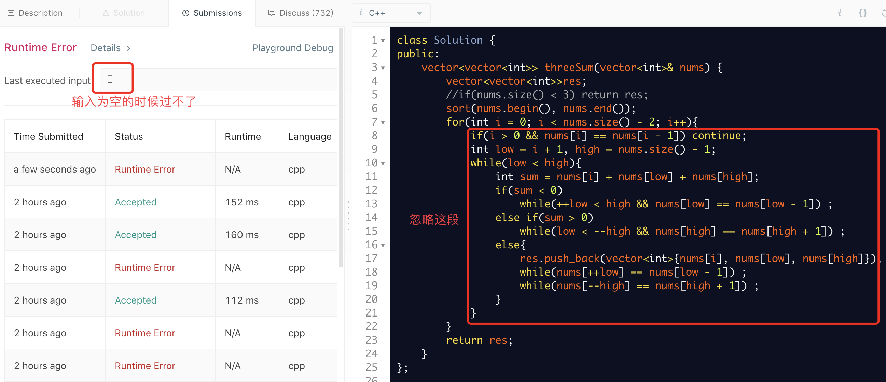
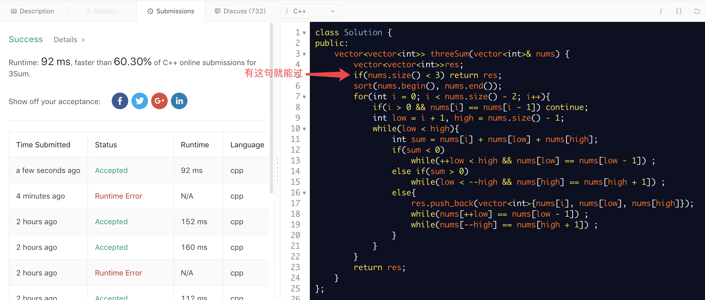

今天在LeetCode上做[3Sum](https://leetcode.com/problems/3sum/)的时候，遇到了一个一开始令我百思不得其解的bug，最后发现还是自己太菜了😭，在此记录一下以加深印象。

<!-- more -->

## 起因
如下图所示，下面这段代码是过不了输入为空的测试样例的。
<center>

</center>


但是如果我加上一个"多余的"提前判断的语句就能过，如下图所示。
<center>

</center>

为什么看似等价的代码一个能过一个不能过呢？

## 分析
考虑这样一段代码:
``` C++
#include <iostream>
#include <typeinfo>
#include<vector>
using namespace std;

int main(){
   vector<int>ar;
   cout << "数组ar的size是" << ar.size()<< endl;
   for(int i = 0; i < ar.size() - 1; i++){
       cout << "进入了for循环！" << endl;
       break;
   }
   cout << "ar.size() - 1: " << ar.size() - 1 << endl;
   return 0;
}
```

运行结果是:
```
数组ar的size是0
进入了for循环！
ar.size() - 1: 18446744073709551615
```
其中 $18446744073709551615 = 2^{64} - 1$。  
仿佛知道问题大概出在哪儿了。

## 结论
这才突然想起C++ primer讲过，size()返回的是一个类型为**size_t**的量，那什么是size_t型呢？
来看[标准库](http://www.cplusplus.com/reference/cstring/size_t/)的定义:
> size_t
Unsigned integral type
Alias of one of the fundamental unsigned integer types.

原来size_t是无符号型的，但是为什么 `ar.size() - 1` 没有自动转换为带符号型的呢？

C++ primer第五版中文版P35还讲过：
> **提示：切勿混用带符号类型和无符号类型**
如果表达式里既有带符号类型又有无符号类型，当带符号类型取值为负时会出现异常结果，这是因为*带符号数会自动转换为无符号数*。

原来在**同时存在无符号型数和有符号型数的表达式中，带符号型数是会自动转换为无符号型的!**

所以，当无符号的ar.size()减去1时，结果自然不是-1而是 $2^{n} - 1$，$n$ 表示size_t型的位数。

值得提一点的是，size_t的位数并不一定等于unsigned的位数的:
> size_t和unsigned int有所不同,size_t的取值range是目标平台下最大可能的数组尺寸。
一些平台下size_t的范围小于int的正数范围,又或者大于unsigned int.最典型的,在x64下,int还是4B,但size_t是8B.这意味着你在x64下最大可能开辟的数组尺寸是2^64.
作者：KE meng
链接：https://www.zhihu.com/question/24773728/answer/28920149
来源：知乎
著作权归作者所有。商业转载请联系作者获得授权，非商业转载请注明出处。

## 总结
以后一定要注意，**size()是返回的无符号型的数！**   
所以对于第一个图中代码，for循环内部是会执行的，结果自然不对了(越界)。以后要用到数组的size时，还是先定义`int len = ar.size()`，这样不仅不会反犯这次这个错误，还能方便多次使用。

