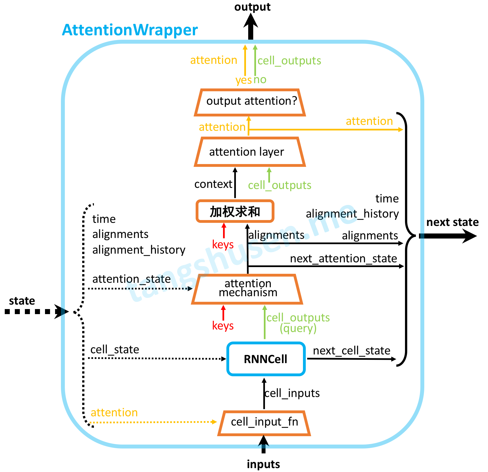

<center>

</center>

Attention在seq2seq模型中是一个很有用的机制，由于TensorFlow烂成翔的官方文档以及网上很少而且晦涩难懂的教程，我在如何正确使用TensorFlow现成attention接口上面费了很大一番功夫。本文用详细图解的方式清晰展现了其源代码构成，方便大家学习使用。本文会先简略的介绍一下seq2seq attention的原理，然后详细剖析TensorFlow相关的源代码，懒得看文字分析的可以直接跳到2.7节看图。

<!-- more -->

# 1. 原理简介
## 1.1 seq2seq

seq2seq是"Sequence to Sequence"的简写，seq2seq模型的核心就是编码器（Encoder）和解码器（Decoder）组成的，该架构相继在论文[1][2]提出，后来[3]又提出了在seq2seq结构中加入Attention机制，使seq2seq的性能大大提升，现在seq2seq被广泛地用于机器翻译、对话生成、人体姿态序列生成等各种任务上，并取得了非常好的效果。

<center>
    
    <br>
    <div style="border-bottom: 1px solid #d9d9d9;
    display: inline-block;
    color: #999;">图1.1 seq2seq基本结构</div>
</center>

未加入attention机制的seq2seq基本模型如上图所示，左侧的RNN编码器将输入编码成一个中间状态c向量，右侧的解码器在每一个时间步都会接收c的输入然后进行解码，得到输出结果。例如如果编码器的输入为“我爱你”，编码器的期望输出为“I love you”，那么seq2seq就实现了翻译任务，以上就是最基本的seq2seq模型原理。

## 1.2 attention
仔细观察图1.1所示的模型就可以发现一个问题，c向量是连接编码器和解码器唯一的桥梁，那么c向量中必须包含了原始序列中的所有信息，当编码器输入序列很长的时候，由于RNN并不能很好地对很长的序列进行建模，c向量就很难囊括输入序列所有信息了，此时解码器也就很难正确地生成了。

Attention机制解决了这个问题，它可以使得在输入序列长的时候精确率也不会有明显下降，它是怎么做的呢？既然一个c向量存不了，那么就引入多个c向量: $c_1, c_2, ...$，称为context vector。

<center>
    
    <br>
    <div style="border-bottom: 1px solid #d9d9d9;
    display: inline-block;
    color: #999;">图1.2 带attention的seq2seq结构</div>
</center>

带attention的seq2seq结构如图1.2所示，attention机制跟人类翻译句子时候的思路有些类似，即将注意力关注于我们翻译词语对应的上下文（context）。而 $c_i$ 就存放了此刻输入的上下文信息，这样当解码器解码到第 $i$ 步的时候通过分析此时输入序列的上下文信息即可精准地进行解码。

下面用公式化的语言叙述一下加入attention与否的seq2seq结构。
在没有引入attention之前，编码器在某个时刻解码的时候实际上是依赖于三个部分的（图1.1没有画出），首先我们知道RNN中，每次输出结果会依赖于隐藏态和输入（在训练过程中这个输入就是ground truth，在测试时这个输入就是上一步的输出），在seq2seq模型中，还需要依赖于c向量，所以这里我们设在 $i$ 时刻，解码器解码的期望输出是 $y_i$，上一次解码结果（的ground truth）是 $y_{i-1}$，此时刻隐藏态是 $h_i'$，所以它们满足这样的关系：
$$
y_i = f(y_{i-1}, h_i', c) \tag{1.1}
$$
即每次的解码输出是上一个隐藏态和上一个输出结果和c向量共同计算得出的。

那么加入attention机制后，将每时刻固定的c向量换成 $c_i$，有
$$
y_i = f(y_{i-1}, h_i', c_i) \tag{1.2}
$$

那么上下文信息 $c_i$ 是怎么计算得来的呢？目前常用的两种方式就是Bahdanau attention[3]和Luong attention[4]，下面就分别来介绍一下。

### 1.2.1 Bahdanau attention

假设编码器的所有时刻的隐藏态（hidden state）为 $h_1, h_2, ..., h_{T_x}$，则有
$$
c_i = \sum_{j = 1}^{T_x} \alpha_{ij}h_j \tag{1.3}
$$
这里 $\alpha_{ij}$ 为每一个编码器输出的隐藏态 $h_j$ 被分配到的权重，它的值越大代表对编码器 $j$ 时刻输入的注意力就越大。而 $\alpha_{ij}$ 的计算法方式如下：
$$
\alpha _ { i j } = \frac { \exp \left( e _ { i j } \right) } { \sum _ { k = 1 } ^ { T _ { x } } \exp \left( e _ { i k } \right) } \tag{1.4}
$$
$$
e _ { i j } = a \left( h_{i-1}' , h _ { j } \right) = v _ { a } ^ { T } \tanh \left( \boldsymbol{W_a} h_{i-1}' + \boldsymbol{U_ a} h _ { j } \right) \tag{1.5}
$$
也就是说，权重 $\alpha_{ij}$ 就是解码器隐藏态 $h_{i-1}'$ 和编码器隐藏态 $h_j$ 计算得到一个数值 $e_{ij}$ （一般称为得分，score）再经过softmax归一化得到的。

### 1.2.2 Luong attention
Luong attention[4]与Bahdanau attention最大的不同就是计算得分的方式不同，论文[4]中给出了一下三种计算方式：
$$
e_{ij} = \text{score} (h_i', h_j) = \begin{cases} \begin{array} { l l } {  h_i'^ { \top } h_j } & { \text { dot } } \\ 
{ h_i'^ { \top } \boldsymbol {W_a} h_j } & { \text { general } } \\ { v_a ^ { \top } \tanh \left( \boldsymbol { W_a } \left[ h_i' ; h_j \right] \right) } & { \text { concat} } \end{array} \end{cases} \tag{1.6}
$$
常用的计算方式就是式 $(1.6)$ 中的"general"，即用 $\boldsymbol { W_a }$ 统一 $h_i$ 和 $h_j$ 的维度再作內积（"dot"相当于是"general"的特殊情况，即 $h_i$ 和 $h_j$ 的维度已经统一了）。

### 1.2.3 小节
综上，attention机制的大致原理就是通过在解码的每一步计算一下此刻应该对编码器每时刻的输入赋予多少注意力，然后再有针对性地进行解码。但除了计算分数的方式有很多方式，attention的具体细节花样还有很多，例如是否将解码器前一步得到的 $c_{i-1}$ 作为此刻解码器的输入，是否将编码器所有隐藏态都参与注意力计算等等。下一节我们通过对TensorFlow的源码进行剖析来看看TensorFlow是怎么实现的。


# 2. TensorFlow源码剖析

## 2.1 概览
在TensorFlow中，Attention 的相关实现代码是在[tensorflow/contrib/seq2seq/python/ops/attention_wrapper.py](https://github.com/tensorflow/tensorflow/blob/r1.13/tensorflow/contrib/seq2seq/python/ops/attention_wrapper.py)文件中，这里面我们需要关注的有如下几个类：
* `AttentionMechanism`: 所有attention机制的父类，内部没有任何实现。
* `_BaseAttentionMechanism`: 继承自`AttentionMechanism`，定义了attention机制的一些公共方法实现和属性。
* `BahdanauAttention`和`LuongAttention`：均继承自`_BaseAttentionMechanism`，分别实现了1.2节所述的两种attention机制。
* `AttentionWrapper`: 用于封装RNNCell的类，继承自`RNNCell`，所以被它封装后依然是一个RNNCell类，只不过是带了attention的功能。
* `AttentionWrapperState`：用来存放计算过程中的state，前面说了`AttentionWrapper`其实也是一个RNNCell，那么它也有隐藏态（hidden state）信息，`AttentionWrapperState`就是这个state。除了RNN cell state，其中还额外存放了一些信息。

此外还有`_BaseMonotonicAttentionMechanism`、`BahdanauMonotonicAttention`、`LuongMonotonicAttention`以实现单调（monotonic）attention机制，以及一些公共的方法，如`_luong_score`、`_bahdanau_score`、`_prepare_memory`等等。

在进一步分析之前，我们先来明确代码中一些术语的意思：
* key & query: Attention的本质可以被描述为一个查询（query）与一系列（键key-值value）对一起映射成一个输出：将query和每个key进行相似度计算得到权重并进行归一化，将权重和相应的键值value进行加权求和得到最后的attention，这里key=value。简单理解就是，query相当于前面说的解码器的隐藏态 $h_i'$ ，而key就是编码器的隐藏态 $h_i$。
* memory: 这个memory其实才是编码器的所有隐藏态，与前面的key区别就是key可能是memory经过处理（例如线性变换）后得到的。
* alignments: 计算得到的每步编码器隐藏态 $h$ 的权重向量，即 $[\alpha_{i1}, \alpha_{i2},..., \alpha_{iT_x}]$。

后面会遇到这些术语，如果现在还不是很懂的可以结合后面再仔细看看。

我们先来分析分析这些类，然后2.7节给出了整个AttentionWrapper的代码流程图。

## 2.2 `_BaseAttentionMechanism`
先来看看最基础的attention类`_BaseAttentionMechanism`。它的初始化方法如下：
``` python
def __init__(self,
            query_layer,
            memory,
            probability_fn,
            memory_sequence_length=None,
            memory_layer=None,
            check_inner_dims_defined=True,
            score_mask_value=None,
            name=None):
```
这里有很多参数，下面一一说明这些参数的作用：
* `query_layer`: 一个`tf.layers.Layer`实例，query会首先经过这一层；
* `memory`: 解码时用到的所有上下文信息，可简单理解为编码器的所有隐藏态，维度一般为[batch, max_time, enc_rnn_size]；
* `probability_fn`: 将score $e_{ij}$ 计算成概率用的函数，默认使用softmax，还可以指定hardmax等函数；
* `memory_sequence_length`: 即memory变量的实际长度信息，类似`dynamic_rnn`中的`sequence_length`，维度为[batch]，这会被用作mask来去除超过实际长度的无用信息；
* `memory_layer`: 类似`query_layer`，也是一个`tf.layers.Layer`实例（或None），memory会经过这一层然后得到keys。需要注意的是，**（经过`memory_layer`处理后得到的）key应该和（经过`query_layer`处理得到的）query的维度相匹配**，用式$(1.5)$为例就是 $W_a h_{i-1}'$ 要和 $U_ah_j$ 的维度要一致，不然没法相加。
* `check_inner_dims_defined`: bool型，是否检查memory除了最外面两维其他维度是否是有定义的。
* `score_mask_value`: 在使用`probability_fn`计算概率之前，对`score`预先进行mask使用的值，默认是负无穷。但这个只有在`memory_sequence_length`参数定义的时候有效。

其构造函数完成的主要功能就是将输入的memory进行mask然后经过`memory_layer`处理称为`keys`方便后面使用，如下面代码所示：
``` python
self._values = _prepare_memory(memory, memory_sequence_length,
          check_inner_dims_defined=check_inner_dims_defined)
self._keys = (self.memory_layer(self._values) if self.memory_layer  else self._values)
```

## 2.3 `BahdanauAttention`
`BahdanauAttention`是继承自2.2节的`_BaseAttentionMechanism`，它的构造函数如下所示：
``` python
def __init__(self,
            num_units,
            memory,
            memory_sequence_length=None,
            normalize=False,
            probability_fn=None,
            score_mask_value=None,
            dtype=None,
            name="BahdanauAttention"):
```
这些参数中，除了`num_units`和`normalize`其他都在`_BaseAttentionMechanism`出现过这里不再赘述。先说一下`num_units`，我们知道在计算式$(1.5)$的时候，需要使用 $h_{i-1}'$ 和 $h_i$ 来进行计算，而二者的维度可能并不是统一的，需要进行变换和统一，所以就有了 $W_a$ 和 $U_a$ 这两个系数，对应在代码中就是用`num_units`来声明了两个全连接 Dense 网络，用于统一二者的维度：
``` python
super(BahdanauAttention, self).__init__(
        query_layer=layers_core.Dense(num_units, name="query_layer", use_bias=False, dtype=dtype),
        memory_layer=layers_core.Dense(num_units, name="memory_layer", use_bias=False, dtype=dtype),
        memory=memory,
        probability_fn=wrapped_probability_fn,
        memory_sequence_length=memory_sequence_length,
        score_mask_value=score_mask_value,
        name=name)
```
即这里的`num_units`设置成任何值都可以，它确定了需要传进其父类`_BaseAttentionMechanism`构造函数的参数`query_layer`和`memory_layer`。

然后`normalize`即是否要在计算分数score时实现标准化，出自论文[5]，默认设为False。这个参数在接下来要说的`__call__`方法中用到。

接下来就是`__call__`方法了:
```python
def __call__(self, query, state):
    with variable_scope.variable_scope(None, "bahdanau_attention", [query]):
        processed_query = self.query_layer(query) if self.query_layer else query
        score = _bahdanau_score(processed_query, self._keys, self._normalize) # 前面定义了query_layer是一个Dense层
    alignments = self._probability_fn(score, state)
    next_state = alignments
    return alignments, next_state
```
输入的是`query`和`state`(先不管这里的state是啥)，然后先把`query`用`query_layer`（即前面说的全连接层）进行处理，然后再按照Bahdanau Attention的规则调用函数`_bahdanau_score`计算分数score，这个计算过程中可设置是否需要标准化。得到分数后再调用`_probability_fn`(这里就是softmax，所以第二个参数`state`没有用到)计算得到权重向量`alignments`，然后最后返回的`next_state`其实也是这个`alignments`，所以`__call__`的参数`state`其实就是上个时间步的`alignments`向量。

总结一下就是，`BahdanauAttention`（调用`__call__`）就是根据此刻的`query`（即 $h_i'$）和每个key根据式 $(1.4)(1.5)$ 计算得到每个key的权重 `alignments`。

## 2.4 `LuongAttention`
`LuongAttention`同样是继承自2.2节的`_BaseAttentionMechanism`，它的构造函数如下所示：
``` python
def __init__(self,
            num_units,
            memory,
            memory_sequence_length=None,
            scale=False,
            probability_fn=None,
            score_mask_value=None,
            dtype=None,
            name="LuongAttention"):
```
出现了一个新参数`scale`，该参数在计算分数的函数`_luong_score`中会用到，代表是否对得到的分数进行scale操作。2.3节中提到`BahdanauAttention`构造函数中参数`num_units`设置成任何值都可以，但是这里并不是这样，因为：
``` python
super(LuongAttention, self).__init__(
        query_layer=None,
        memory_layer=layers_core.Dense(num_units, name="memory_layer", use_bias=False, dtype=dtype),
        memory=memory,
        probability_fn=wrapped_probability_fn,
        memory_sequence_length=memory_sequence_length,
        score_mask_value=score_mask_value,
        name=name)
```
注意这里只传入了`memory_layer`（对应式$(1.6)$中的 $\boldsymbol { W_a }$），所以只对`memory`（即 式子$(1.6)$中的 $h_j$）进行了变换得到 $\boldsymbol {W_a}h_j$，因此**这里`num_units`必须等于`query`的深度（即query.get_shape()[-1]）**。

总结一下，和`BahdanauAttention`类似的，`LuongAttention`（调用`__call__`）就是根据此刻的`query`（即 $h_i'$）和每个key根据式 $(1.6)(1.4)$ 计算得到每个key的权重 `alignments`。和`BahdanauAttention`不同的是这里要合理设置参数 `num_units`否则`query`和`key`维度不匹配。

## 2.5 `AttentionWrapperState`
接下来我们再看下 `AttentionWrapperState` 这个类，这个类其实类似`RNNCell`有隐藏态（hidden state），就是定义了attention计算过程中可能需要保存的变量，如 cell_state（这个cell_state就是被`AttentionWrapper`包裹的内部RNNCell的隐藏态）、attention、time、alignments 等内容，同时也便于后期的可视化呈现，代码实现如下：
``` python
class AttentionWrapperState(
    collections.namedtuple("AttentionWrapperState",
                           ("cell_state", "attention", "time", "alignments",
                            "alignment_history", "attention_state"))):
```
可见它就是继承了`namedtuple`这个数据结构，其实可以把这个 `AttentionWrapperState`看成一个结构体，可以传入需要的字段生成这个对象。

## 2.6 `AttentionWrapper`
为了方便使用了attention，TensorFlow提供了一个wrapper，这和其他的Wrapper例如`DropoutWrapper`、`ResidualWrapper` 等等类似，它们都是 `RNNCell`的实例。即`AttentionWrapper`它对`RNNCell`进行了封装，封装后依然还是`RNNCell`的实例。如果你想给一个普通的RNN模型加入attention功能，只需要在`RNNCell`外面套一层`AttentionWrapper`并指定 `AttentionMechanism`的实例就好了。

我们还是来看看其构造函数：
``` python
class AttentionWrapper(rnn_cell_impl.RNNCell):
  def __init__(self,
               cell,
               attention_mechanism,
               attention_layer_size=None,
               alignment_history=False,
               cell_input_fn=None,
               output_attention=True,
               initial_cell_state=None,
               name=None,
               attention_layer=None):
```
下面对其参数一一说明：
* `cell`: 被包裹的`RNNCell`实例；
* `attention_mechanism`: attention机制实例，例如`BahdanauAttention`，也可以是多个attention实例组成的列表；
* `attention_layer_size`: 是数字或者数字做成的列表，如果是 None（默认），直接使用加权求和得到的上下文向量 $c_i$ 作为输出（详见本小节最后的`_compute_attention`代码），如果不是None，那么将 $c_i$ 和`cell`的输出 `cell_output`进行concat并做线性变换（输出维度为`attention_layer_size`）再输出。
    > 这里所说的"输出"在代码里是用"attention"表示的，见本小节最后的`_compute_attention`函数代码。
* `alignment_history`: 即是否将之前的`alignments`存储到 state 中，以便于后期进行可视化展示，默认False，一般设置为True。
* `cell_input_fn`: 怎样处理输入。默认会将上一步的得到的输出与的实际输入进行concat操作作为输入。代码：
    ``` python
    if cell_input_fn is None:
        cell_input_fn = (lambda inputs, attention: array_ops.concat([inputs, attention], -1))
    ```

* `output_attention`: 默认false，如果为true，则输出不是attention的计算结果，而是`cell`得到的`cell_output`。
* `initial_cell_state`: 初始状态，默认即可。
* `attention_layer`: 这个参数其实是和`attention_layer_size`是互斥的，如果设置了`attention_layer_size`不为None，那么这个参数必须为None。因为他俩功能类似，它也可以是一个`tf.layers.Layer`的列表，定义输出要经过的变换。若为None，直接使用加权求和得到的上下文向量 $c_i$ 作为输出，如果不是None，那么将 $c_i$ 和`cell`的输出 `cell_output`进行concat再经过`attention_layer`后输出。

构造函数中关于`attention_layer`的代码如下：
``` python
if attention_layer_size is not None:
    attention_layer_sizes = tuple(attention_layer_size
        if isinstance(attention_layer_size, (list, tuple)) else (attention_layer_size,))
    
    self._attention_layers = tuple(layers_core.Dense(
            attention_layer_size,
            name="attention_layer",
            use_bias=False,
            dtype=attention_mechanisms[i].dtype)
        for i, attention_layer_size in enumerate(attention_layer_sizes))
    self._attention_layer_size = sum(attention_layer_sizes)
elif attention_layer is not None:
    self._attention_layers = tuple( attention_layer
        if isinstance(attention_layer, (list, tuple))
        else (attention_layer,))
    
    self._attention_layer_size = sum(
        tensor_shape.dimension_value(layer.compute_output_shape(
            [None, cell.output_size + tensor_shape.dimension_value(
                mechanism.values.shape[-1])])[-1])
        for layer, mechanism in zip(
            self._attention_layers, attention_mechanisms))
else:
    self._attention_layers = None
    self._attention_layer_size = sum(
        tensor_shape.dimension_value(attention_mechanism.values.shape[-1])
        for attention_mechanism in attention_mechanisms)
```
可见参数`attention_layer_size`和`attention_layer`都会影响`self._attention_layers`的值，只有在它俩都为`None`（默认）时`self._attention_layers`才为`None`。

接下来看看其`call`方法，其输入输出和`RNNCell`中的`call`其实是类似的，都是通过上一步的`inputs`和`state`计算得到`output`和`next_state`。
``` python
def call(self, inputs, state):
    # Step 1: 根据输入和上一步的输出计算真正的输入
    cell_inputs = self._cell_input_fn(inputs, state.attention) # 默认是concat操作

    # Step 2: 调用内部被包裹的RNNCell得到cell_output和next_cell_state
    cell_state = state.cell_state
    cell_output, next_cell_state = self._cell(cell_inputs, cell_state) 
 
    if self._is_multi:
      previous_attention_state = state.attention_state
      previous_alignment_history = state.alignment_history
    else:
      previous_attention_state = [state.attention_state]
      previous_alignment_history = [state.alignment_history]

    all_alignments = [] # 用列表存放，因为attention_mechanism是列表
    all_attentions = []
    all_attention_states = []
    maybe_all_histories = []

    # Step 3: 根据attention_mechanism计算得到attention, alignments
    for i, attention_mechanism in enumerate(self._attention_mechanisms):
      attention, alignments, next_attention_state = _compute_attention(
          attention_mechanism, cell_output, previous_attention_state[i],
          self._attention_layers[i] if self._attention_layers else None)
      alignment_history = previous_alignment_history[i].write(
          state.time, alignments) if self._alignment_history else ()

      all_attention_states.append(next_attention_state)
      all_alignments.append(alignments)
      all_attentions.append(attention)
      maybe_all_histories.append(alignment_history)

    # Step 4: 组合成 AttentionWrapperState 作为下一步的状态
    attention = array_ops.concat(all_attentions, 1)
    next_state = AttentionWrapperState(
        time=state.time + 1,
        cell_state=next_cell_state,
        attention=attention,
        attention_state=self._item_or_tuple(all_attention_states),
        alignments=self._item_or_tuple(all_alignments),
        alignment_history=self._item_or_tuple(maybe_all_histories))

    # Step 5: 输出
    if self._output_attention:
      return attention, next_state
    else:
      return cell_output, next_state
```
来一步一步地分析：
1. Step 1: 调用了`_cell_input_fn()`方法，对`inputs`和`state.attention`进行处理，默认是使用`concat`函数拼接，作为当前时间步的输入。
2. Step 2: 调用其内部被包裹的`RNNCell`的`call`方法，得到cell的输出和下一状态。
3. Step 3: 这一步就是调用`_compute_attention`进行计算操作，如下面的代码所示，先调用了`attention_mechanism`进行对应类型的注意力计算得到 $\alpha_{ij}$，然后进行加权求和操作得到上下文向量 $c_i$，然后再通过`attention_layer`进行对应的变换操作，最后再返回。
    ``` python
    def _compute_attention(attention_mechanism, cell_output, attention_state, attention_layer):
    """Computes the attention and alignments for a given attention_mechanism."""
    # 这里的(next_)attention_state其实就是alignments, 详见2.3节中的call方法
    alignments, next_attention_state = attention_mechanism(cell_output, state=attention_state)

    # Reshape from [batch_size, memory_time] to [batch_size, 1, memory_time]
    expanded_alignments = array_ops.expand_dims(alignments, 1)
    context = math_ops.matmul(expanded_alignments, attention_mechanism.values) # 加权求和操作, 即式(1.3)
    context = array_ops.squeeze(context, [1])

    if attention_layer is not None:
        attention = attention_layer(array_ops.concat([cell_output, context], 1))
    else:
        attention = context

    return attention, alignments, next_attention_state
    ```
4. Step 4: 根据前面的构建新的state作为`next_state`。
5. Step 5: 若`output_attention`为True，则输出`attention`和`next_state`，否则输出`cell_output`和`next_state`。

综上，`AttentionWrapper`的`call`函数接收input和state然后输出output和下一个state，这就符合`RNNCell`的调用函数，即
``` python
output, next_state = RNNCell(input, state)
```
所以就可以像使用普通`RNNCell`一样使用带注意力机制的`RNNCell`了。

## 2.7 图解 
<center>
    
    <br>
    <div style="border-bottom: 1px solid #d9d9d9;
    display: inline-block;
    color: #999;">图2.1 AttentionWrapper工作流程</div>
</center>

# 参考文献
[1] Cho K, Van Merriënboer B, Gulcehre C, et al. Learning phrase representations using RNN encoder-decoder for statistical machine translation[J]. arXiv preprint arXiv:1406.1078, 2014.

[2] Sutskever I, Vinyals O, Le Q V. Sequence to sequence learning with neural networks[C]//Advances in neural information processing systems. 2014: 3104-3112.

[3] Bahdanau D, Cho K, Bengio Y. Neural machine translation by jointly learning to align and translate[J]. arXiv preprint arXiv:1409.0473, 2014.

[4] Luong M T, Pham H, Manning C D. Effective approaches to attention-based neural machine translation[J]. arXiv preprint arXiv:1508.04025, 2015.

[5] Salimans T, Kingma D P. Weight normalization: A simple reparameterization to accelerate training of deep neural networks[C]//Advances in Neural Information Processing Systems. 2016: 901-909.


