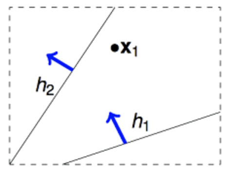
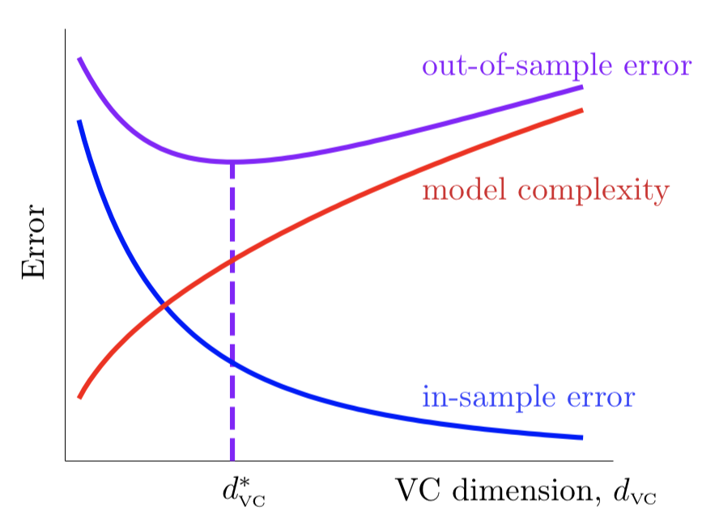

学习机器学习不可避免的会接触到VC维，它在机器学习领域是一个很基础但很重要的概念，它给机器学习提供了坚实的理论基础。但直到在我写这篇博客之前，我对VC的理解还只停留在它能刻画假设空间的复杂度这样浅显的层次。本文就来理一理VC维(Vapnik–Chervonenkis dimension)的来龙去脉，搞清楚其本质。

<!-- more -->

# 1. 可学习的条件
既然说VC维给机器学习提供了坚实的理论基础，那么就有必要来看看机器学习算法可学习的条件是什么。
## 1.1 学习的过程
一个基本的机器学习过程如图1.1所示(本文图片若无特别说明即来自于台大机器学习基石课程课件，[Coursera课程地址](https://www.coursera.org/learn/ntumlone-mathematicalfoundations))。解释一下下图中的一些概念：$\mathcal{A}$ 表示学习算法，$f$ 表示学习的目标假设(可以是一个函数，也可以是一个分布)，$\mathcal{H}$ 表示假设空间，$g$ 表示我们求解的用来预测的假设，$g$ 是属于 $\mathcal{H}$ 的。
机器学习的过程就是：通过算法 $\mathcal{A}$，在假设空间 $\mathcal{H}$ 中，根据训练样本集 $\mathcal{D}$，选择最好的假设作为 $g$ 使 $g$ 近似于 $f$。

    
     
    
图1.1

图1.1中的 $E_{out}(g)$ 和 $E_{in}(g)$ 是两个重要的概念：
* $E_{out}(g)$，学到的假设 $g$ 在除了训练样本外的其他所有样本(out-of-sample)上的损失，称为期望误差，也称泛化误差。
* $E_{in}(g)$，学到的假设 $g$ 在训练样本(in-of-sample)上的损失，称为经验误差。

我们的目标是选择最好的假设作为 $g$ 使 $g$ 近似于 $f$，而 $E_{out}(f) = 0$，也即我们的目标是使 $E_{out}(g) \approx 0$。但我们是没法获得训练样本外的其他所有样本的，那也就没法计算 $E_{out}(g)$ 了，这该怎么办呢？

## 1.2 Hoeffding不等式
在回答1.1最后的问题之前，先来看看Hoeffding不等式。
来看图1.2所述的问题: 设瓶子里的橙色球占比为 $\mu$，从瓶子中随机抽取出N个样本，这N个样本中橙色球占比是 $\nu$。我们可以将 $\mu$ 看作1.1节中的$E_{out}(g)$，将 $\nu$ 看作是 $E_{in}(g)$，我们现在并不知道 $\mu$ 和 $E_{out}(g)$，只知道 $\nu$ 和 $E_{in}(g)$，我们可以从 $\nu$ 推断出关于 $\mu$ 的什么吗？
> 可以将 $\nu$ 看作是样本期望，$\mu$ 则是总体期望。

    
     
    
图1.2

直觉上，如果我们有更多的样本(抽出很多的球)，则 $\nu$ 应该越来越接近总体期望 $\mu$。事实上，这里可以用hoeffding不等式表示如下：
$$
\mathbb{P}[|\nu - \mu| > \epsilon] \leq 2 \exp \left(-2 \epsilon^2 N \right) \tag{1.2.1}
$$

从hoeffding不等式可以看出，当N越来越大时，$\nu$ 和 $\mu$ 之差大于 $\epsilon$ 的概率的上界越来越接近0，所以样本期望 $\nu$ 越来越接近总体期望 $\mu$，即 $\nu$ 和 $\mu$ 概率近似相等(probably approximately correct, PAC)了。

## 1.3 可学习的条件
有了1.2节的铺垫，我们就可以来回答1.1节的问题了。

对于任意固定的假设 $h$，当训练样本量N足够大，类比于1.2节的例子，可以通过样本集上的经验误差 $E_{in}(h)$ 推测总体的期望误差 $E_{out}(h)$。基于hoeffding不等式，我们得到下面式子：
$$
\mathbb{P}[|E_{in}(h) - E_{out}(h)| > \epsilon] \leq 2 \exp(-2 \epsilon^2 N) \tag{1.3.1}
$$

根据上面不等式，我们可以推断，当N足够大时，$E_{in}(h)$ 和 $E_{out}(h)$ 将非常接近。

注意在上面推导中，我们是针对某一个特定的假设 $h$。在我们的假设空间 $\mathcal{H}$ 中，往往有很多个假设(甚至于无穷多个)。那么对于假设空间 $\mathcal{H}$ 中的任意的假设 $h$，$E_{in}(h)$ 和 $E_{out}(h)$ 之差大于 $\epsilon$ 的概率的上界会是什么呢？
> 发生概率很小的事件在很多次实验中发生概率就会变得很大。例如连续丢5次硬币，事件"五次都是正面朝上"的概率是 $\frac 1 {32}$。但是如果100个人做这个实验，事件"五次都是正面朝上"的发生的概率就是 $1 - ({\frac {31} {32}})^{100} > 0.95$。所以对于特定的假设 $h$，$E_{in}(h)$ 和 $E_{out}(h)$ 很接近，但是对于 $\mathcal{H}$ 中任意的假设这就不一定了。

这里假定 $\mathcal{H}$ 中有 $M$ 个假设 $h_1,h_2,...h_M$，则有如下推导:
$$
\mathbb{P}[\mathbf{E}(h_1)> \epsilon \cup \mathbf{E}(h_2)> \epsilon \space ... \cup \mathbf{E}(h_M)> \epsilon] \\
\leq \mathbb{P}[\mathbf{E}(h_1)> \epsilon] + \mathbb{P}[\mathbf{E}(h_2)> \epsilon] \space ... + \mathbb{P}[\mathbf{E}(h_M)> \epsilon] \\
\leq 2M\exp(-2 \epsilon^2 N) \tag{1.3.2}
$$
其中 $\mathbf{E}(h_i) = |E_{in}(h_i) - E_{out}(h_i)|$。

根据式 $(1.3.2)$ 知
$$
\forall g \in \mathcal{H}, \mathbb{P}[|E_{in}(g) - E_{out}(g)| > \epsilon] \leq 2M \exp(-2 \epsilon^2 N) \tag{1.3.3}
$$

上面式子的含义就是：在假设空间 $\mathcal{H}$ 中，对于任意一个假设 $g$，$E_{in}(g)$ 和 $E_{out}(g)$ 之差大于 $\epsilon$ 的概率的上界是 $2M \exp(−2 \epsilon^2 N)$。注意这个上界与训练样本数 $N$ 和假设空间假设数 $M$ 密切相关。
> 本文的所有讨论都是围绕式(1.3.3)进行的!!!

所以，根据式 $(1.3.3)$，我们就知道了可学习的两个核心条件是:
1. 学习算法 $\mathcal{A}$ 能够从 $\mathcal{H}$ 选出的假设 $g$ 满足 $E_{in}(g) \approx 0$。再结合条件2即达到了 $E_{out}(g) \approx 0$ 的目标。
2. 假设空间 $\mathcal{H}$ 中假设数 $M$ 是有限的且训练样本数 $N$ 足够大。此时可保证式(1.3.3)右边上界趋于0，即学习算法 $\mathcal{A}$ 从 $\mathcal{H}$ 选出的任意假设 $g$ 都满足 $E_{in}(g) \approx E_{out}(g)$。

上面这两个核心条件，也正好对应着train和test这两个过程:
1. train过程希望经验误差$E_{in}(g)$ 尽可能小；
2. test过程希望在真实环境中的期望误差$E_{out}(g)$也尽可能小，即$E_{out}(g)$接近于$E_{in}(g)$。

所以我们不应该只关心如何利用学习算法找到使 $E_{in}(g)$ 很小的 $g$。因为如果想让学习可行，也要保证$E_{out}(g)$接近于$E_{in}(g)$。

来分析一下 $M$ 的大小对于两个条件的满足情况：
* 当 $M$ 较小时，由式$(1.3.3)$知条件2很容易满足，但是由于可选的 $g$ 的数目 $M$ 较小，所以条件1不容易满足；
* 当 $M$ 较大时，由于可选的 $g$ 的数目 $M$ 较大，所以条件1很容易满足，但是条件2不容易满足。

由此可见，假设数 $M$ 在这两个核心条件中有着重要作用，应该合理选取。但是往往一个假设空间(如二维平面的所有直线)的假设数是很大的甚至是无穷的，此时式$(1.3.3)$中的上界就成了无穷大没有任何约束意义，也即不满足条件2，学习变得不可行，这该怎么办呢？

# 2. VC维
## 2.1 有效假设数
在式$(1.3.2)$的推导中，我们用到了这样一个概率不等式:
$$
\mathbb{P}(A_1 \cup A_2 \space ... \cup A_M) \leq \sum_{i=1}^M\mathbb{P}(A_i) \tag{2.1.1}
$$
我们知道，当 $A_i$ 相互独立时上式取等号。但事实上，假设空间里的 $h_i$ 之间并不是完全独立的，它们是有很大的重叠的，也就是在 $M$ 个假设中，有很多假设都可以归为同一类。

下面用二维假设空间为例解释一下上述重叠性。我们知道二维假设空间的所有假设数(即直线条数)为 $\infty$，但是如图2.1所示，可以将这些假设分为两类，一类是把x1判断为正例，另一类是把x1判断为负例。

    
     
    
图2.1

那如果在平面上有两个不同的数据点x1,x2，这样的话，假设空间 $\mathcal{H}$ 中的无数条直线可以分为4类。那依次类推，3个数据点情况下，$\mathcal{H}$ 中最多有8类(当三个点在同一直线上时只有6类)。4个数据点时，$\mathcal{H}$ 中最多有14类(注意不是16类)，如下图所示。

    
     
    
图2.2

从上面的分析可知，虽然假设空间假设数 $M$ 一般非常大(甚至无穷)，但在特定的样本集上，有效的假设数目是有限的，也即式$(1.3.3)$中的 $M$ 是有限的，所以可以重写式$(1.3.3)$如下:
$$
\forall g \in \mathcal{H}, \mathbb{P}[|E_{in}(g) - E_{out}(g)| > \epsilon] \leq 2\cdot \text{effective}(M) \exp(-2 \epsilon^2 N) \tag{2.1.2}
$$

## 2.2 对分和增长函数
为了探究式$(2.1.2)$中的 $\text{effective}(M)$ ，先引入**对分(dichotomy)** 的概念:
>对于假设空间 $\mathcal{H} = \lbrace h: \mathcal{X} \to \lbrace+1,-1\rbrace \rbrace$，我们称
$$
h(X_1, X_2,...,X_N) = (h(X_1), h(X_2),...,h(X_n)) \in \lbrace+1,-1 \rbrace ^N
$$
为一个对分，即一个对分表示样本的一种标记结果，$\mathcal{H}(X_1, X_2,...,X_N)$ 表示假设空间 $\mathcal{H}$ 在训练集 $\mathcal{D}$ 上的所有对分。

例如，若 $N = 4$且数据为二维时，参见图2.2，有如下表格:

|    | 假设空间 $\mathcal{H}$  | $\mathcal{H}(X_1, X_2,X_3,X_4)$ |
| --------- | ------------ | --------------------- |
| 所有元素    | 平面上的所有直线| {+1,+1,+1,+1}, {+1,+1,+1,-1}...   |
| 元素个数    | $\infty$             | 最大为14 (不会超过 $2^N$)    |

我们知道， $\mathcal{H}(X_1, X_2,...,X_N)$ 的元素个数(即 $|\mathcal{H}(X_1, X_2,...,X_N)|$ )是取决于具体的数据集 $\mathcal{D}$ 的，例如当 $N=3$ 时且三个点不在一条直线时对分数为8，而在一条直线时对分数是6。为了去掉对具体 $\mathcal{D}$ 的依赖性，我们引入 **增长函数(growth function)**:
> 假设空间 $\mathcal{H}$ 的增长函数 $m_{\mathcal{H}}(N)$ 为
$$
m_{\mathcal{H}}(N) = \underset{X_1,X2,...,X_N \in \mathcal{X}}{max} |\mathcal{H}(X_1, X_2,...,X_N)|
$$
增长函数 $m_{\mathcal{H}}(N)$ 表示假设空间 $\mathcal{H}$ 对个任意 $N$ 个样本所能赋予标记的的最大可能结果数，其上界为 $2^N$ 。

显然，$m_{\mathcal{H}}(N)$ 越大，$\mathcal{H}$ 的表示能力越强。因此，增长函数描述了假设空间 $\mathcal{H}$ 的表示能力，由此反映出假设空间的复杂度。既然如此，那我们可不可以用 $m_{\mathcal{H}}(N)$ 直接替换掉式$(2.1.2)$ 中的 $\text{effective}(M)$ 呢，即
$$
\forall g \in \mathcal{H}, \mathbb{P}[|E_{in}(g) - E_{out}(g)| > \epsilon] \overset{?}{\leq} 2 m_{\mathcal{H}}(N) \exp(-2 \epsilon^2 N) \tag{2.2.1}
$$
我们将在在2.3节回答这个问题。

## 2.3 VC界
### 2.3.1 打散(shatter)
在介绍VC维界(VC bound)之前，先引入打散(shatter)的概念,
> 当假设空间 $\mathcal{H}$ 作用于大小为 $N$ 的样本集 $\mathcal{D}$ 时，产生的对分数量等于 $2^N$ 即 $m_{\mathcal{H}}(N)=2^N$ 时，就称 $\mathcal{D}$ 被 $\mathcal{H}$ 打散了。

shatter的原意是打碎，在此指 $N$ 个点的所有(碎片般的)可能情形都被 $\mathcal{H}$ 产生了。

    
     
    
图2.3

如上图所示，二维空间上的的三个点(不在一条直线上)可以被平面上所有直线这个假设空间打碎,此时 $m_{\mathcal{H}}(3)= 8 = 2^3$。但如下图所示的四个点就不能被这个假设空间打碎了，可知此时 $m_{\mathcal{H}}(4)=14 \neq 2^4$。

    
     
    
图2.4

### 2.3.2 break point
尽管增长函数把假设数从无穷缩小到 $2^N$，但是这个量级还是太大了，很难保证式$(1.3.3)$右边这个上界趋于0，所以能不能把量级再缩小一点?

为了回答这个问题，先给出break point的定义:
>对于假设空间 $\mathcal{H}$ 的增长函数 $m_{\mathcal{H}}(N)$ ，从 $N=1$ 出发逐渐增大，当增大到 $k$ 时，出现 $m_{\mathcal{H}}(N) < 2^N$ 的情形，则我们说 $k$ 是该假设空间的**break point**。换句话说，对于任何大小为 $N(N \ge k)$ 的数据集， $\mathcal{H}$ 都没有办法打碎它。

举例来讲，由2.3.1节知，当假设空间 $\mathcal{H}$ 定义为平面上所有直线时，其break point就为4。

有了break point的概念，再经过一系列归纳证明(详见台大机器学习课程lecture6)，我们有这样一个结论: 
> 设break point存在且为 $k$ 的假设空间的增长函数上界为 $B(N,k)$，则 $B(N,k)$ 满足
$$
m_{\mathcal{H}}(N) \le B(N,k) \le \sum_{i=0}^{k-1}{N \choose i} \le N^{k-1}
$$
注: 上式的证明可见这个[知乎回答](https://www.zhihu.com/question/38607822/answer/157787203)，另外最后一个不等号仅在 $N \ge 2$ 且 $k \ge 2$ 时成立。
即break point存在时增长函数上界是一个多项式，多项式的最高幂次项为 $N^{k–1}$。

所以我们得到结论：如果break point存在，则增长函数 $m_{\mathcal{H}}(N)$ 是多项式的。多项式的量级就比 $2^N$ 小多了，这就很容易保证式$(1.3.3)$右边这个上界很小，学习就可行了!

### 2.3.3 VC界
上一小节提到如果break point存在，学习是可行的。既然如此，我们来回答一下2.2节最后提出的问题: 可不可以用 $m_{\mathcal{H}}(N)$ 直接替换掉式$(2.1.2)$ 中的 $\text{effective}(M)$ 呢，即式$(2.2.1)$是否成立。

答案是不能直接替换,正确的不等式是
$$
\forall g \in \mathcal{H}, \mathbb{P}[|E_{in}(g) - E_{out}(g)| > \epsilon] \leq 4 m_{\mathcal{H}}(2N) \exp(-\frac18 \epsilon^2 N) \tag{2.3.1}
$$
> 上式其实和式 $(2.2.1)$ 差不多，其证明略显复杂我们暂不去探究，可参考[此处](https://nowak.ece.wisc.edu/SLT09/lecture19.pdf)。

式$(2.3.1)$就是**VC界**，这个公式的意义在于：如果假设空间 $\mathcal{H}$ 存在有限的break point $k$，即 $m_{\mathcal{H}}(2N)$ 会被最高幂次为 $k–1$ 的多项式上界给约束住，那么，随着 $N$ 的逐渐增大，指数式 $exp(\cdot)$ 的下降会比多项式 $m_{\mathcal{H}}(2N)$ 的增长速度更快，所以此时可以推断出VC界是有界的。更进一步，当 $N$ 足够大时，对于 $\mathcal{H}$ 中的任意一个假设 $g$ ，$E_{in}(g)$ 都将接近于 $E_{out}(g)$，即学习是可行的。

## 2.4 VC维
现在，我们终于可以定义VC维了:
> 假设空间 $\mathcal{H}$ 的VC维是能被 $\mathcal{H}$ 打散的最大数据集的大小，即
$$
VC(\mathcal{H}) = max \lbrace N: m_{\mathcal{H}}(N) = 2^N\rbrace
$$
根据此定义，有 $VC(\mathcal{H}) = k-1$，其中 $k$ 是 $\mathcal{H}$ 的break point。

$VC(\mathcal{H}) = d$ 表明存在大小为 $d$ 的数据集能被假设空间 $\mathcal{H}$ 打散，需要注意的是这并不意味着所有大小为 $d$ 的数据集都能被 $\mathcal{H}$ 打散，例如二维平面上的所有直线构成的假设空间 $\mathcal{H}$ 的VC维为3，但是它并不能打散位于同一条直线上的三个点。事实上，VC维的定义与数据具体分布是无关的。

因为 $VC(\mathcal{H}) = k-1$，所以由2.3.2节可知当 $N \ge 2$ 且 $k \ge 2$ 时，有
$$
m_{\mathcal{H}}(N)  \le N^{VC(\mathcal{H})} \tag{2.4.1}
$$

将上式代入$(2.3.1)$的右边VC界有
$$
\forall g \in \mathcal{H}, \mathbb{P}[|E_{in}(g) - E_{out}(g)| > \epsilon] \leq 4 (2N)^{VC(\mathcal{H})} \exp(-\frac18 \epsilon^2 N) \tag{2.4.2}
$$

所以，1.3节的可学习的两个核心条件等价于:
1. 学习算法 $\mathcal{A}$ 能够从 $\mathcal{H}$ 选出的假设 $g$ 满足 $E_{in}(g) \approx 0$。再结合条件2即达到了 $E_{out}(g) \approx 0$ 的目标。
2. 假设空间 $\mathcal{H}$ 的VC维 $VC(\mathcal{H})$ 是有限的且训练样本数 $N$ 足够大。此时可保证式(2.4.2)右边上界趋于0，即学习算法 $\mathcal{A}$ 从 $\mathcal{H}$ 选出的任意假设 $g$ 都满足 $E_{in}(g) \approx E_{out}(g)$。

VC维反映了函数集的学习能力，VC维越大，能学到的模型越复杂。根据前面的推导，我们知道VC维的大小与学习算法无关，与数据集的具体分布无关，与我们求解的目标函数也无关，只与模型和假设空间有关。另外，实践中有这样一个规律：一般情况下，假设空间的VC维约等于假设自由变量的数目。

## 2.5 $E_{in}(g)$ 与 $E_{out}(g)$ 的关系
令式$(2.4.2)$右边的 $4 (2N)^{VC(\mathcal{H})} \exp(-\frac18 \epsilon^2 N) = \delta$，即坏事发生的概率
$$
\mathbb{P}[|E_{in}(g) - E_{out}(g)| > \epsilon] \leq \delta \tag{2.5.1}
$$
则可反解出
$$
\epsilon = \sqrt{\frac 8 N \ln \left( \frac {4(2N)^{VC(\mathcal{H})}} \delta \right)} \tag{2.5.2}
$$
由(2.5.1)可得出，有 $1-\delta$ 的概率好事情会发生，好事情即
$$
E_{in}(g) - \sqrt{\frac 8 N \ln \left( \frac {4(2N)^{VC(\mathcal{H})}} \delta \right)} \le E_{out}(g) \le E_{in}(g) + \sqrt{\frac 8 N \ln \left( \frac {4(2N)^{VC(\mathcal{H})}} \delta \right)} \tag{2.5.3}
$$
上式就是 $E_{in}(g)$ 与 $E_{out}(g)$ 的关系。其中，根号部分也可以看做模型的复杂度 $\Omega$，模型越复杂，$E_{in}(g)$ 与 $E_{out}(g)$ 离得越远。如图2.5所示，当固定样本数 $N$ 时，随着VC维的上升，$E_{in}(g)$ 会不断降低，而复杂度 $\Omega$ 会不断上升，其上升与下降的速度在每个阶段都有所不同，因此我们要寻找一个二者兼顾的比较合适的VC维使 $E_{out}(g)$ 最小。

    
     
    
图2.5

此外，由上面的分析易知，样本数 $N$ 也会影响 $E_{out}(g)$。例如，当前有一个 $VC(\mathcal{H})=3$ 的假设空间，要使 $\epsilon=0.1$ 且 $\delta=0.1$，则要想满足式$(2.5.2)$，可计算出理论上样本数 $N$ 需要达到 $10000VC(\mathcal{H})$ 这个量级，但实际应用中我们发现 $N$ 达到 $10VC(\mathcal{H})$ 就够了。这是因为，VC界是一个及其宽松的上界，因为它需要对任何学习算法，对任何数据分布，对任何目标函数都要成立,所以实际应用中的上界要比VC界小很多。

# 3. 总结
总结一下本文的行文思路，
1. 先用Hoeffding不等式说明了可学习的两个条件:
    (1) 学习算法 $\mathcal{A}$ 能够从 $\mathcal{H}$ 选出的假设 $g$ 满足 $E_{in}(g) \approx 0$。
    (2) 假设空间 $\mathcal{H}$ 中假设数 $M$ 是有限的且训练样本数 $N$ 足够大。
2. 但假设空间 $\mathcal{H}$ 中假设数 $M$ 往往是无穷大的。幸运的是，在推导出条件(2)时，我们要求假设空间的所有假设都是独立的，而假设空间 $\mathcal{H}$ 中独立假设数 $\text{effective}(M)$ 却是有限的，增长函数告诉我们 $\text{effective}(M)$ 的上界为 $2^N$ 。
3. $2^N$ 这个上界还是太大了，学习还是很难可行。所以我们又引入了break point的概念，使 $2^N$ 的量级降为 $N^{k-1}$, 由此得到了VC界。
4. 然后我们给出了VC维的定义，可学习的两个条件转变为:
    (1) 学习算法 $\mathcal{A}$ 能够从 $\mathcal{H}$ 选出的假设 $g$ 满足 $E_{in}(g) \approx 0$。
    (2) 假设空间 $\mathcal{H}$ 的VC维 $VC(\mathcal{H})$ 是有限的且训练样本数 $N$ 足够大。
5. 最后我们讨论了 $E_{in}(g)$ 与 $E_{out}(g)$ 的关系，发现为了使学习器更好($E_{out}(g)$更小)，要选择合适的VC维，不能太大也不能太小。

因笔者自身水平实在有限，如果文章有任何的不妥，还请读者告之。此外，VC维可以说是机器学习中的一大核心，并非一篇博客就可以讲解透彻，所以本文也省略了一些复杂的证明，如果想深入理解可以去查阅相关书籍或论文。

# 参考
* 周志华《机器学习》第12章.计算学习理论
* [台大机器学习基石课程](https://www.coursera.org/learn/ntumlone-mathematicalfoundations)
* [ECE 901 Lecture 19: The Proof of the Vapnik-Chervonenkis (VC) Inequality](https://nowak.ece.wisc.edu/SLT09/lecture19.pdf)
* [Computational Learning Theory - VC Dimension](http://www.csuldw.com/2016/08/23/2016-08-23-vc-dimentions/)
* [[陆勤学习]解读机器学习基础概念：VC维的来龙去脉](https://cloud.tencent.com/developer/article/1044419)